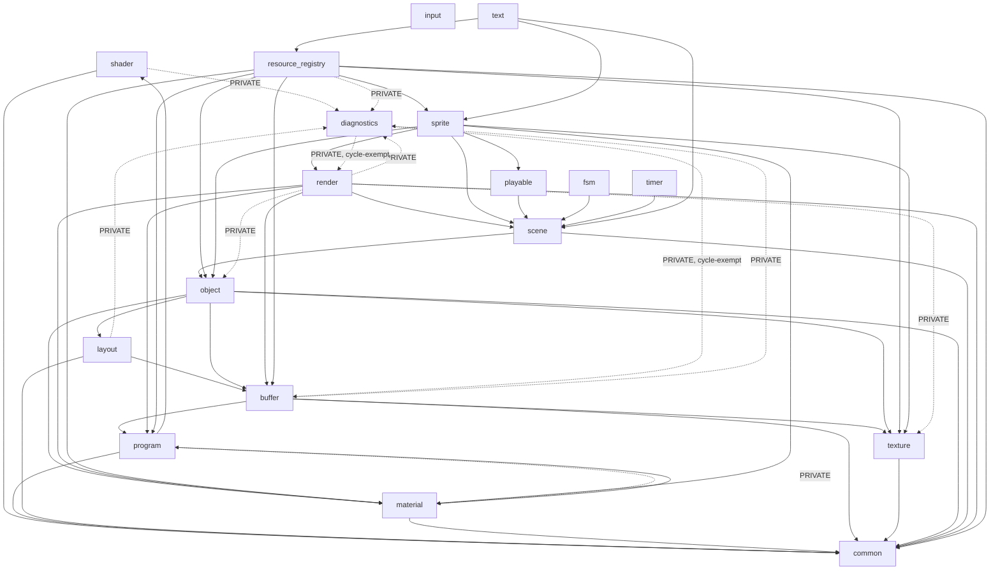

# ARCHITECTURE.md

`src/` 엔진 코어의 **모듈 의존 지도**(무엇이 무엇에 링크되는가)만 다룬다. 설계 원칙·규율("왜 이렇게 나눴는가")은 `.claude/architecture.md` 참조 — 여기서는 다루지 않는다.

Core/Client 분리 + Actor/Component 씬 그래프 + SceneRenderer 로 구성된 엔진이며, `src/` 는 18개 `SJH::<module>` STATIC(+ 일부 INTERFACE) 라이브러리로 나뉜다: `common, diagnostics, buffer, shader, program, layout, material, object, scene, render, resource_registry, sprite, fsm, playable, timer, text, input, texture`. 이 18개를 한 번에 링크할 수 있는 INTERFACE 우산 타겟이 `SJH::engine` (`sjhopengl_engine` ALIAS, `src/CMakeLists.txt`) 이다.

## Module dependency graph

실선 = `PUBLIC`(헤더에 노출되어 소비자에게 전이됨) / 점선 = `PRIVATE`(.cpp 전용, 소비자에게 전이 안 됨).

`common` 과 `input` 은 다른 코어 모듈에 의존하지 않는 leaf(기반) 모듈이다.

## Confirmed cycles

두 쌍의 상호 의존이 실제로 존재하며 둘 다 의도된 것이다 (CMake 는 STATIC lib 순환을 link-line 반복으로 해소한다).

1. **`diagnostics` ↔ `render` / `buffer`** — 공식 예외(cycle-exempt). `diagnostics` 는 진단·에러검증·캡처용 *엔진-독립 관측 모듈*이라, 상위 모듈(`render` 의 `PassIterator`, `buffer` 의 `RenderTarget` 등)을 상향 의존해도 허용된다. `src/diagnostics/CMakeLists.txt` 주석에 "★ cycle-exempt" 로 명시되어 있다. 이 예외는 `diagnostics` 에만 적용 — 다른 모듈에는 무순환 규율이 유지된다.
2. **`material` ↔ `program`** — 의도된 Observer cascade. `material` 은 `PUBLIC` 으로 `program` 을 참조한다(`Material` 이 `Program*` 을 보유). `program.cpp` 는 `PRIVATE` 으로 `material.h` 의 `OnProgramReleased` 를 호출한다(`Program` 소멸 시 소유 `Material` 에 통지). `src/material/CMakeLists.txt` 상단 주석에 설계 의도가 명시되어 있다.

각주 — 과거 2026-06-19 dot 스냅샷(`doc/diagrams/2026-06-19-module-deps-current.dot`)이 서술한 `render → resource_registry → sprite → render` 3-사이클은 **현재 존재하지 않는다** (2026-06-11 D8 절단으로 해소 완료). `render` 는 `resource_registry` 를 링크하지 않고, `sprite` 도 `resource_registry` 를 링크하지 않으며, `resource_registry → sprite` 단방향만 남아 있다.

## What depends on X? (reverse index)

"이 모듈을 바꾸면 어디가 흔들리는가"— 직접 소비자만 나열(PUBLIC + PRIVATE 합산, 전이 소비자는 제외).

| Module | 이 모듈에 의존하는 곳 (바꾸면 흔들리는 곳) |
|---|---|
| common | shader, program, layout, material, buffer, texture, object, scene, render, resource_registry (사실상 전역 기반) |
| diagnostics | program, layout, buffer, shader, render(순환), resource_registry — 전부 PRIVATE(cpp 전용) |
| shader | program |
| program | material, buffer, render, resource_registry |
| layout | object |
| material | object, render, resource_registry, sprite, program(순환, PRIVATE) |
| buffer | layout, object, render, resource_registry, diagnostics(순환, PRIVATE) |
| texture | buffer, object, resource_registry, sprite, render(PRIVATE) |
| object | scene, resource_registry, sprite, render(PRIVATE) |
| scene | render, fsm, playable, timer, sprite, text |
| render | sprite, diagnostics(순환, PRIVATE) |
| resource_registry | text |
| sprite | resource_registry, text |
| playable | sprite |
| fsm | (없음 — 사용처 0, M4 PlayerStateMachine 도입 대기) |
| timer | (src 내부는 없음 — apps/_MyApp_ 클라이언트 코드가 직접 사용) |
| text | (src 내부는 없음 — 앱이 직접 사용) |
| input | (src 내부는 없음 — 앱이 직접 사용) |

## External dependency layers

`cmake/Dependency.cmake` 가 정의하는 두 INTERFACE 집약 타겟.

- **`project_deps`** = sb7 + glfw3 + OpenGL + 플랫폼 프레임워크. 모든 데모 필수이며, 18개 모듈 대부분이 `PUBLIC` 으로 전파한다.
- **`game_deps`** = box2d + EffekseerRendererGL(→Effekseer) + assimp + spdlog + tweeny + stb_extra + 조건부 fmod/fmodstudio. 코어 모듈 중 `resource_registry` 만 `PUBLIC` 으로 링크한다(2026-05-26 M5 — Sound/Effect 캐시가 FMOD/Effekseer 헤더를 노출하기 때문). 따라서 `SJH::engine` 우산을 링크하는 모든 소비자(`apps/_MyApp_`)가 자동으로 game_deps 에 합류한다.
- `apps/_MyApp_` 은 `SJH::engine`(18모듈 INTERFACE 우산) + `project_deps` + `game_deps` 를 명시적으로 링크한다.
- `test/*` 각 타겟은 `Catch2::Catch2WithMain` + 해당 단일 모듈만 링크한다(우산 미사용 — 격리 단위테스트가 목적).

## Module responsibilities

| Module | 책임 (1줄 요약) |
|---|---|
| common | 공통 유틸, GL 로더 비의존 기반 모듈 |
| diagnostics | GL 호출/셰이더/uniform/상태/캡처 진단 (cycle-exempt 관측자) |
| buffer | VBO/EBO/RenderTarget RAII 통합 |
| shader | 셰이더 컴파일 + InfoLog |
| program | 프로그램 링킹 + uniform 핸들/캐시 |
| layout | Vertex 레이아웃(VAO + attribute) 정의 |
| material | Phong/PBR Material 값 클래스 + Texture*/Program* 보관 |
| texture | GPU 텍스처 leaf 자원 (2026-06-11 resource_registry 에서 분리) |
| object | Mesh + Geometry 생성기(Box/Plane/Cone/...) |
| scene | Actor + Component + Scene 그래프 |
| render | DeviceContext + SceneRenderer + MeshPassProcessor |
| resource_registry | Texture/Material/Model/Program/Mesh/Framebuffer/UniformAtlas/Sound/Effect 캐시 레지스트리 |
| sprite | 2D 스프라이트 atlas + SpriteSequencePlayable |
| fsm | StateMachine\<TState, TOwner\> + IFsmState\<TOwner\> |
| playable | IPlayable + PlayableBase + Sequence/ParallelPlayable Composite |
| timer | 게임플레이 타이머 (Timer / MultipleTimer) |
| text | 월드 공간 텍스트 렌더링 (BitmapFont + TextRenderer) |
| input | KeyboardInput\<TAction\> / MouseInput 등 입력 디스패치 |
| **SJH::engine** | 위 18개 모듈을 묶는 INTERFACE 우산 (`sjhopengl_engine` ALIAS) |
