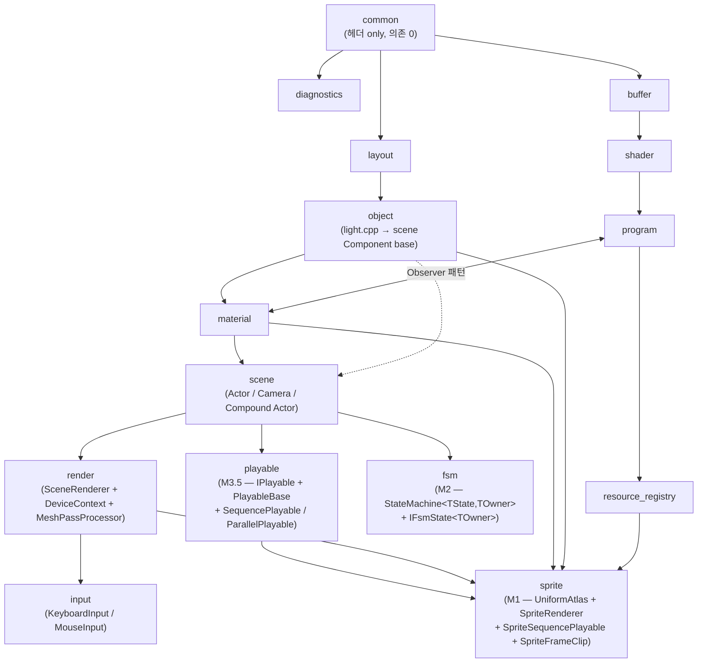

# SJH Engine — Core API Reference

> **대상 독자**: 본 프로젝트에 *참여하는 다른 AI 에이전트* + *프로젝트 개발자*.
> **목적**: 코어 라이브러리 (`src/<module>/`) 의 *공개 API* 와 *사용 컨벤션* 을 한 곳에 모음.

---

## 목차

1. [엔진 철학](#1-엔진-철학)
2. [모듈 맵 + 의존 그래프](#2-모듈-맵--의존-그래프)
3. [코어 API — 모듈별](#3-코어-api--모듈별)
   - 3.1 [`SJH::common`](#31-sjhcommon)
   - 3.2 [`SJH::diagnostics`](#32-sjhdiagnostics)
   - 3.3 [`SJH::buffer`](#33-sjhbuffer)
   - 3.4 [`SJH::shader`](#34-sjhshader)
   - 3.5 [`SJH::program`](#35-sjhprogram)
   - 3.6 [`SJH::layout`](#36-sjhlayout)
   - 3.7 [`SJH::material`](#37-sjhmaterial)
   - 3.8 [`SJH::object`](#38-sjhobject)
   - 3.9 [`SJH::scene`](#39-sjhscene)
   - 3.10 [`SJH::render`](#310-sjhrender)
   - 3.11 [`SJH::input`](#311-sjhinput)
   - 3.12 [`SJH::resource_registry`](#312-sjhresource_registry)
   - 3.13 [`SJH::sprite`](#313-sjhsprite) *(M1 추가)*
   - 3.14 [`SJH::fsm`](#314-sjhfsm) *(M2 추가)*
   - 3.15 [`SJH::playable`](#315-sjhplayable) *(M3.5 추가)*
4. [컨벤션](#4-컨벤션)
   - 4.1 [Compound Actor](#41-compound-actor)
   - 4.2 [Builder Pattern (Components)](#42-builder-pattern-components)
   - 4.3 [Material 셋업](#43-material-셋업)
   - 4.4 [Camera 모드 (Free / TargetLock)](#44-camera-모드-free--targetlock)
   - 4.5 [Uniform 송신의 두 layer](#45-uniform-송신의-두-layer--material-한정-vs-씬-전역)
   - 4.6 [Lighting 셰이더 schema](#46-lighting-셰이더-schema)
   - 4.7 [Pass 컨벤션 — Material 의도 선언](#47-pass-컨벤션--material-의도-선언)
   - 4.8 [Retina HiDPI / Resize 호환](#48-retina-hidpi--resize-호환)
5. [빠른 시작 — 새 챕터](#5-빠른-시작--새-챕터)
6. [빌드 시스템](#6-빌드-시스템)
7. [클라이언트 게임 아키텍처 — TopdownShooter (`_MyApp_`)](#7-클라이언트-게임-아키텍처--topdownshooter-_myapp_) *(2026-06-03 Entity facade)*

---

## 1. 엔진 철학

### Core / Client 분리 (Cocos2d-x `libcocos2d` / Unreal `Runtime` 정통)

- **Core** = `src/<module>/` 의 15 모듈. *재사용 가능한 엔진 코어*.
- **Client** = `apps/<chapter>/` 의 데모/챕터. *특정 시나리오의 양산형 코드*.
- 단일 `SJH::engine` INTERFACE 우산이 15 코어 모듈을 한 번에 link 노출.

### Actor + Component (Unity / Cocos2d-x 정통)

- **Actor 는 비상속**. `class XxxActor : public Actor` 형태 **금지**.
- 특수 속성은 *오직 Component 부착* 으로만 부여 — ECS Bundle (Bevy) 정신.
- Actor 의 정체성은 *어떤 Component 가 부착됐는지* 로만 결정.
- Compound Actor 컨벤션 — 자주 쓰이는 조합은 [`src/scene/compound_actor.h`](../src/scene/compound_actor.h) 의 free factory.

### 책임 분리 — 데이터 vs 송신

| 책임 | 담당 | 위치 |
|---|---|---|
| 셰이더 *schema* | `UniformCache` | `Program` 소유, `Material` 참조 |
| Material *값* (properties bag) | `MaterialPropertyBlock` (Material `Properties` 멤버) | `Floats / Ints / Vec3s / Vec4s / Mat4s / Textures` typed maps |
| Material *송신* | `PropertyBlockSetter::Set` | Cache outer + PropertyBlock lookup inner |
| **GL state (Depth/Cull/Blend/Stencil)** | `Material::SetPass(Pass::Kind)` (SSoT) | `Pass::DefaultPipelineStateOf` 자동 도출, `PipelineStateSetter::Set` 적용 |
| Material *인스턴스 lifecycle* | `ResourceRegistry` (singleton owner) | `CreateSharedMaterial` / `CreateMaterialInstanceFrom`. `Clone()` 은 private + friend |
| Light *값* | Component (DirLight/PointLight/SpotLight) | `src/object/light.h` |
| Light *송신* | `SceneRenderer::SendLightUniforms` | 매 프레임 모든 Program 에 자동 |
| Camera view 행렬 | Camera 의 owner Actor Transform | `src/scene/camera.cpp` |

### Uniform 송신의 두 layer — Material 한정 vs 씬 전역 transient

Unity 의 *material.SetFloat* (instance) vs *Shader.SetGlobalFloat* (씬 전역) 분리 정통.

| 자유함수 family | 헤더 | 인자 | 동작 시점 | 용도 |
|---|---|---|---|---|
| `Uniforms::Set*(Material&, ...)` | [`material_uniforms.h`](../src/material/material_uniforms.h) | `Material&` | properties bag 에 **store 만** (GL 호출 없음) | Material instance 자기 슬롯 — color/texture/shininess 등 사용자 컨텐츠 |
| `Uniforms::Set*(const Program&, ...)` | [`program_uniforms.h`](../src/program/program_uniforms.h) | `const Program&` | **즉시 GL `glUniform*` 호출** | 씬 전역 transient — uModel/uView/uProj / 광원 / viewPos / PropertyBlockSetter 의 내부 송신 경로 |

**왜 Material 만으로 모든 uniform 송신 안 되나** — `uModel` 은 *DrawCommand 마다 다른 값* (Actor.WorldMatrix). Material 에 store 하면 N draw call 마다 N×(Material 변경 + Apply 재호출) 비효율 + 동일 Material 을 여러 Actor 가 공유 시 마지막 transform 만 적용되는 의미 깨짐. 광원도 *씬 전역* 이라 모든 Material 공통 — Material 자기 데이터 아님. 따라서 *transient state* 는 MeshPassProcessor/SceneRenderer 이 *Material 우회* 로 Program 에 직접 송신.

Unity 의 `Camera` 가 매 프레임 자동 송신하는 builtin uniform 들 — 우리는 SceneRenderer 이 명시 송신 (`SendLightUniforms`).

---

## 2. 모듈 맵 + 의존 그래프



| 모듈 | 종류 | 책임 (요약) |
|---|---|---|
| `SJH::common` | STATIC | 공통 상수 + 유틸 (`Const::SHADER_PROPERTIE_*` 등 셰이더 schema suffix) |
| `SJH::diagnostics` | STATIC | GL 호출 / 셰이더 / uniform / 상태 / 엔진 단위 진단 |
| `SJH::buffer` | STATIC | VBO/EBO RAII (`Buffer`) + Framebuffer |
| `SJH::shader` | STATIC | 셰이더 컴파일 + InfoLog |
| `SJH::program` | STATIC | 프로그램 링크 + `UniformCache` + Material Observer 등록 |
| `SJH::layout` | STATIC | `Vertex` 구조체 + VAO + attribute setter |
| `SJH::material` | STATIC | Material (PropertyBlock + Pass.Kind SSoT + Instance metadata) + `Uniforms::Set*` 자유함수 |
| `SJH::object` | STATIC | Mesh + Geometry + Transform + Light Components |
| `SJH::scene` | STATIC | Actor + Component + Director + Camera + Compound Actor + MeshRenderer |
| `SJH::render` | STATIC | SceneRenderer + DeviceContext + MeshPassProcessor + **PropertyBlockSetter** (Material->Program 송신) + **PipelineStateSetter** (Pass->GL state 적용) |
| `SJH::input` | STATIC | `KeyboardInput<TAction>` + `MouseInput` |
| `SJH::resource_registry` | STATIC | Texture/Material/Model/Program/Mesh 캐시 (싱글톤) |
| `SJH::sprite` *(M1)* | STATIC | 등간격 N×M atlas (`UniformAtlas`) + `SpriteRenderer` (MeshRenderer 상속, billboard 자동) + `SpriteFrameClip` POD + `SpriteSequencePlayable` (PlayableBase 상속, atlas frame index 시퀀스). spec §1.6 의 sprite_sequence 별도 모듈 안 되고 본 모듈 안에 통합 정착 |
| `SJH::fsm` *(M2)* | STATIC | `StateMachine<TState, TOwner>` (Aggregate Root, Component 상속) + `IFsmState<TOwner>` (State Entity — self-identifying `GetStateFlag`/`GetTransitFlag`). Stage 4 — TTransit template parameter 폐기, 그래프 응집 |
| `SJH::playable` *(M3.5)* | STATIC | `IPlayable` pure interface (Play/Pause/Stop/GetIsLoop/IsFinished) + `PlayableBase : IPlayable, Component` abstract (다중 상속) + `SequencePlayable` / `ParallelPlayable` Composite (`vector<unique_ptr<IPlayable>>` + DOTween 정통 fluent Builder Append/Insert/Join + 무제한 계층 중첩) + **`IntervalPlayable`** *(M4-D3)* N초 대기 leaf (core, game_deps 의존 0). leaf Playable (FmodPlayable/EffekseerPlayable) 은 *Client 거주* |
| `SJH::engine` | **INTERFACE** | **위 15 모듈 우산** — `target_link_libraries(... PRIVATE SJH::engine)` 한 줄 |

---

## 3. 코어 API — 모듈별

### 3.1 `SJH::common`

[`src/common/constants.h`](../src/common/constants.h) — 셰이더 schema 매크로 + UI 라벨.

**핵심 컨벤션**:
- `Const::SHADER_PROPERTIE_DIRECTION = ".direction"` 등 *uniform 멤버 suffix* — `program_uniforms.cpp` 가 prefix 와 결합.
- `Const::UNI_POINT_LIGHTS_PREFIX = "pointLights["` 등 *배열 uniform prefix*.

---

### 3.2 `SJH::diagnostics`

GL 진단 4종 분담 (네임스페이스 `SJH::Diagnostics`):

| 헤더 | 책임 |
|---|---|
| `diagnostics/gl_log.h` (`GLDebug` / `GLObjectLog`) | GL 호출 직후 `glGetError`, 셰이더 컴파일/링크/검증 |
| `diagnostics/uniform_diagnostics.h` | 누락 uniform warn-once / 타입 불일치 |
| `diagnostics/gl_state_log.h` | 현재 GL 상태 한 줄 덤프 + KHR_debug 콜백 |
| `diagnostics/engine_diagnostics.h` | interleaved VBO 검증, 텍스처 채널↔포맷 정합성, 라이팅 uniform 집합, Transform 부모 사이클 가드 |

**주의**: `stb_image` 정의는 *데모 main.cpp* 가 책임 — diagnostics 는 정의 안 함.

---

### 3.3 `SJH::buffer`

#### `Buffer` ([buffer.h](../src/buffer/buffer.h))
```cpp
static BufferUPtr Buffer::CreateWithData(GLuint bufferType, GLuint usage,
                                         const void* data, size_t stride, size_t count);
GLuint  Buffer::Get() const;
bool    Buffer::Bind() const;
```

#### `Framebuffer` ([framebuffer.h](../src/buffer/framebuffer.h))
```cpp
static FramebufferUPtr Framebuffer::Create(int width, int height);          // FBO + color/depth attachment
static FramebufferUPtr Framebuffer::Create(const TexturePtr colorAttachment);
void     Framebuffer::Bind() override;
const TexturePtr Framebuffer::GetColorAttachment() const;
```

**사용 패턴 (multi-pass)**: `Camera::SetTargetFramebuffer(fb)` -> SceneRenderer 이 `BeginFrame` 시 자동 사용.

---

### 3.4 `SJH::shader`

```cpp
static ShaderUPtr Shader::CreateFromFile(const std::string& filename, GLenum shaderType);
static ShaderUPtr Shader::CreateFromSource(const std::string& source, GLenum shaderType);
GLuint  Shader::GetShaderAddr() const;
```

**컨벤션**: 모든 셰이더 `#version 410 core` (메모리: `glsl_410_project_policy`).

---

### 3.5 `SJH::program`

#### `Program` ([program.h](../src/program/program.h))
```cpp
static ProgramUPtr Program::Create(const std::vector<ShaderPtr>& shaders);
static ProgramUPtr Program::CreateWithVSFS(const std::string& vsFile, const std::string& fsFile);

GLuint              Program::GetProgramAddr() const;
GLint               Program::GetLocation(const char* name) const;   // UniformCache 위임
GLenum              Program::GetType(const char* name) const;
const UniformCache& Program::GetUniformCache() const;

// Observer 패턴 — Material 이 SetProgram(p) 시 자동 호출 (외부 직접 호출 비권장).
void Program::RegisterMaterial(Material*) const;
void Program::UnregisterMaterial(Material*) const;
```

**Observer cascade**: `Program::~Program` 가 등록된 모든 `Material` 의 `OnProgramReleased(this)` 호출 -> `Material::mProgram = nullptr`. **dangling 구조적 차단**.

#### `UniformCache` ([uniform_cache.h](../src/program/uniform_cache.h))
```cpp
struct Entry { GLint Location; GLenum Type; };
void   UniformCache::Build(const Program& prog);             // glGetActiveUniform enumerate
GLint  UniformCache::GetLocation(const char* name) const;     // 미존재 -1
GLenum UniformCache::GetType(const char* name) const;
std::size_t UniformCache::Size() const;
const std::unordered_map<std::string, Entry>& UniformCache::Entries() const;   // PropertyBlockSetter outer iteration 용
```

#### `Uniforms::Set*(Program&, ...)` ([program_uniforms.h](../src/program/program_uniforms.h)) — 씬 전역 transient 송신

```cpp
namespace SJH::Uniforms {
    // Basic setter — 즉시 glUniform* 호출. UniformCache 경유 + Diagnostics warn-once.
    void SetMat4 (const Program&, const char* name, const vmath::mat4&);
    void SetVec4 (const Program&, const char* name, const vmath::vec4&);
    void SetVec3 (const Program&, const char* name, const vmath::vec3&);
    void SetVec2 (const Program&, const char* name, const vmath::vec2&);
    void SetFloat(const Program&, const char* name, float);
    void SetInt  (const Program&, const char* name, int);

    // Light struct helper — `<prefix>.{direction,ambient,diffuse,specular,...}` 일괄 송신.
    void SetDirLight  (const Program&, const char* prefix, const DirLight&,   const vmath::vec3& worldDir);
    void SetPointLight(const Program&, const char* prefix, const PointLight&, const vmath::vec3& worldPos);
    void SetSpotLight (const Program&, const char* prefix, const SpotLight&,  const vmath::vec3& worldPos, const vmath::vec3& worldDir);
}
```

**용도** — *Material 의 properties 가 아닌* 송신 경로:
- **per-draw transient** (`uModel`) — `MeshPassProcessor::Process` 가 DrawCommand 마다 호출.
- **per-pass transient** (`uView` / `uProj` / `viewPos`) — `MeshPassProcessor::Process` 가 카메라 패스 시작 시 호출.
- **씬 전역 광원** (`dirLight.*` / `pointLights[i].*` / `spotLight.*` / `*Enabled`) — `SceneRenderer::SendLightUniforms` 가 모든 program 에 1 회 송신.
- **`PropertyBlockSetter::Set` 의 내부 구현** — Material properties bag 의 값을 *결국 Program 에 송신* 하는 마지막 단계.

§1 의 *Uniform 송신의 두 layer* 표 참조 — Unity `Shader.SetGlobalFloat` 정통.

---

### 3.6 `SJH::layout`

#### `VertexLayout` ([vertex_layout.h](../src/layout/vertex_layout.h))
```cpp
static VertexLayoutUPtr VertexLayout::Create();
GLuint VertexLayout::GetVAO() const;
bool   VertexLayout::Bind() const;
bool   VertexLayout::TrySetAttrib(GLuint attribIdx, int count, GLuint type,
                                   bool normalized, GLsizei stride, uint64_t offset);
```

**SJH `Vertex` 레이아웃** (모든 Mesh 동일):
- `location 0` : `vec3 aPos`
- `location 1` : `vec3 aNormal`
- `location 2` : `vec2 aTexCoord`

---

### 3.7 `SJH::material`

#### `Material` ([material.h](../src/material/material.h)) — Unity `material.SetXxx` + Unreal `UMaterialInstanceDynamic` 정통

```cpp
// ── Factory (private ctor — `Create()` 만 진입점) ──
static MaterialUPtr Material::Create();

// ── Program 참조 (Observer 등록) ──
Material& Material::SetProgram(const Program* p);    // fluent — Observer 등록 + UniformCache 참조
const Program*      Material::GetProgram() const;
const UniformCache* Material::GetCache()   const;

// ── Properties bag (MaterialPropertyBlock — 외부 접근 `mat.Properties.Floats["..."]`) ──
MaterialPropertyBlock Properties;
//   .Floats / .Ints / .Vec3s / .Vec4s / .Mat4s / .Textures   (6 typed map)

// ── Pass.Kind (GL state SSoT — Cocos technique / Unity SurfaceType 정통) ──
Material& Material::SetPass(Pass::Kind k);          // fluent — Transparent 등 한 줄로 depth/blend/queue 자동
Pass::Kind Material::GetPass()       const;
int        Material::GetQueueLayer() const;          // = Pass::QueueOf(mPassKind), alias 도출

// ── Instance metadata (Unreal `UMaterialInstanceDynamic::Parent` 정통, 읽기 전용) ──
bool                       IsInstance       = false;     // `Create()` = false, `Clone()` 결과 = true
mutable const Material*    OriginalMaterial = nullptr;   // direct parent (mutable — GetRootOriginal path-compression cache)
const Material* Material::GetRootOriginal() const;       // chain 최상위 root — 첫 호출에 cache, 다음 호출 O(1)

// ── Clone (private — SSoT 강제) ──
// private MaterialUPtr Clone() const;   // friend class ResourceRegistry — 외부 직접 호출 컴파일 차단.
```

**SSoT 강제** — Material 인스턴스 생성의 *유일한 진입점*:
- `Material::Create()` — 공유 원본 (`ResourceRegistry::CreateSharedMaterial` 이 owner)
- `ResourceRegistry::CreateMaterialInstanceFrom(key, template)` — *유일한 Clone 호출자*
- `Clone()` 은 **private + friend ResourceRegistry** — 외부 직접 호출 시 컴파일 차단 (책임 분산 방지)

**정통 매핑**:

| 우리 | Unity | Unreal |
|---|---|---|
| `CreateSharedMaterial` | `sharedMaterial` getter | `UMaterialInterface` |
| `CreateMaterialInstanceFrom` + auto Clone | `material` getter (자동 Clone) | `CreateDynamicMaterialInstance` |
| `IsInstance` / `OriginalMaterial` | Inspector "(Instance)" 표시 | `Parent` 멤버 |

#### Properties Setter — 자유함수 family ([material_uniforms.h](../src/material/material_uniforms.h))

```cpp
namespace SJH::Uniforms {
    void SetFloat  (Material& mat, const char* name, float v);
    void SetInt    (Material& mat, const char* name, int v);
    void SetVec3   (Material& mat, const char* name, const vmath::vec3& v);
    void SetVec4   (Material& mat, const char* name, const vmath::vec4& v);
    void SetMat4   (Material& mat, const char* name, const vmath::mat4& v);
    void SetTexture(Material& mat, const char* name, const Texture* tex, GLint unit);
}
```

**의미**: `mat.Properties` (PropertyBlock) 에 *store 만*. 실제 GL 호출은 `PropertyBlockSetter::Set` 시점.

#### `PropertyBlockSetter::Set` ([property_block_setter.h](../src/render/property_block_setter.h))

```cpp
void SJH::PropertyBlockSetter::Set(DeviceContext& rc,
                                   const MaterialPropertyBlock& block,
                                   const Program& prog);
```

**알고리즘** (Cache outer + Type dispatch + PropertyBlock lookup inner):
1. `prog.GetUniformCache().Entries()` 순회 — 셰이더 schema 가 진실의 원천.
2. `entry.Type` 으로 어떤 typed map 에서 가져올지 분기 (`switch(GL_FLOAT / GL_INT / GL_FLOAT_VEC3 / ... / GL_SAMPLER_2D)`).
3. `block.<TypedMap>.find(name)` — 없으면 silent skip.

**전제** (호출자 책임): `rc.UseProgram(prog)` 이 이미 호출됨.

#### `PipelineStateSetter::Set` ([pipeline_state_setter.h](../src/render/pipeline_state_setter.h))

```cpp
void SJH::PipelineStateSetter::Set(DeviceContext& rc, const Pass::PipelineState& want);
```

**책임**: `Pass::DefaultPipelineStateOf(material.GetPass())` 가 도출한 PipelineState 를 GL 호출로 적용
(`glDepthMask`, `glDepthFunc`, `glCullFace`, `glBlendFunc`, `glStencilFunc` + `glStencilOp` 등). 직전 호출의 redundancy 제거는 DeviceContext 가 담당.

---

### 3.8 `SJH::object`

#### `Transform` ([transform.h](../src/object/transform.h)) — POD-like 값 객체
```cpp
vmath::vec3 Translate = (0,0,0);
vmath::vec3 EulerRot  = (0,0,0);   // degree, X=pitch, Y=yaw, Z=roll, ZYX 합성
vmath::vec3 Scale     = (1,1,1);

vmath::mat4 GetLocalMatrix()    const;   // T · Rz · Ry · Rx · S
vmath::mat4 GetRotationMatrix() const;   // Rz · Ry · Rx (Translate/Scale 무시)

// ── 6 방향 vector (OpenGL 오른손 정통) ──
// EulerRot=(0,0,0) 기본: Right=(+1,0,0), Up=(0,+1,0), Forward=(0,0,-1)
vmath::vec3 GetRight()   const;
vmath::vec3 GetUp()      const;
vmath::vec3 GetForward() const;
vmath::vec3 GetLeft()    const;   // -GetRight
vmath::vec3 GetDown()    const;   // -GetUp
vmath::vec3 GetBack()    const;   // -GetForward
```

#### `Mesh` ([mesh.h](../src/object/mesh.h))
```cpp
static MeshUPtr Mesh::Create(const std::vector<Vertex>& v, const std::vector<GLuint>& i, GLuint primitiveType);
static MeshUPtr Mesh::CreateBox();
static MeshUPtr Mesh::CreatePlane();
static MeshUPtr Mesh::CreateScreenQuad();
GLuint Mesh::GetVAO() const;
GLuint Mesh::GetPrimitiveType() const;
```

#### `Geometry` ([geometry.h](../src/object/geometry.h)) — 정점 데이터 생성기 (Mesh 의 빌더 단계)
- Box / Plane / ScreenQuad / Sphere / Cone / Cylinder 등.

#### Light Components ([light.h](../src/object/light.h)) — Component 상속

```cpp
class DirLight : public Scene::Component {
public:
    vmath::vec3 Ambient, Diffuse, Specular;
    vmath::vec3 GetWorldDirection() const;   // owner.WorldMatrix 의 -Z 컬럼 (OpenGL forward)
};

class PointLight : public Scene::Component {
public:
    float Distance = 32.0f;          // 거리 감쇠 산출 기준
    vmath::vec3 Ambient, Diffuse, Specular;
    vmath::vec3 GetWorldPosition() const;
};

class SpotLight : public Scene::Component {
public:
    float CutoffAngleDeg      = 12.5f;
    float OuterCutoffAngleDeg = 17.5f;
    float Distance            = 32.0f;
    vmath::vec3 Ambient, Diffuse, Specular;
    vmath::vec3 GetWorldPosition()  const;
    vmath::vec3 GetWorldDirection() const;
};

// 단일 점광원 데이터 컨테이너 (Component 아님 — 레거시) — `Light` 클래스.
```

**Actor 가 컴포넌트를 `type_index` 로 저장** — 같은 Actor 에 *PointLight 두 개 부착 불가*. 복수 광원은 Actor 인스턴스를 분리해 구성.

#### `GetAttenuationCoeff(distance)`
PointLight/SpotLight 의 도달 거리 -> `(Kc, Kl, Kq)` 거리 감쇠 다항식 도출 (Ogre3D / LearnOpenGL 회귀).

#### `Model` ([model.h](../src/object/model.h)) — Assimp 로드
```cpp
bool LoadByAssimp(const std::string& filename);
const std::vector<RenderUnit>& GetRenderUnits() const;
// RenderUnit = { MeshUPtr mesh; Material* material; }
```

---

### 3.9 `SJH::scene`

#### `Component` ([actor.h](../src/scene/actor.h))
```cpp
class Component {
public:
    virtual ~Component() = default;
    virtual void OnEnter() = 0;
    virtual void OnExit()  = 0;
    virtual void Update(float dt) = 0;
    bool   IsEnabled() const;
    void   SetEnabled(bool e);
    Actor* GetOwner() const;
};
```

#### `Actor` ([actor.h](../src/scene/actor.h))
```cpp
explicit Actor(std::string name = "");

// Tree
Actor* AddChild(std::unique_ptr<Actor> child);   // entered 부모면 child OnEnter() 자동
void   RemoveChild(Actor*);
Actor* GetParent() const;
const std::vector<std::unique_ptr<Actor>>& GetChildren() const;

// Components — Single-Call Contract: ctor + insert + OnEnter 한 호출
template<typename T, typename... Args>
T* AddComponent(Args&&... args);                  // T must derive from Component
template<typename T> T*   GetComponent() const;
template<typename T> void RemoveComponent();
void RemoveAllComponents();

// Identity / Transform / Active / Layer
const std::string& GetName() const;
Transform&         GetTransform();
vmath::mat4        GetWorldMatrix() const;        // 부모 Transform 합성
void               SetLayer(uint32_t);            // Camera::CullingMask 와 AND 검사
uint32_t           GetLayer() const;

// Lifecycle (Cocos 정통)
void OnEnter();
void OnExit();
void Update(float dt);                            // 자기 enabled components -> 자식 Actor 재귀
```

**중복 컴포넌트 가드** (assert): `AddComponent<T>` 를 같은 type 으로 두 번 호출 시 디버그 빌드 abort.

#### `Director` ([scene.h](../src/scene/scene.h)) — Cocos `cc::Director` 정통 싱글톤
```cpp
static Director& Director::Get();
Actor&  Director::Root();          // mutable — AddChild 등
void    Director::Enter();
void    Director::Exit();
void    Director::Update(float dt);
void    Director::SetActiveCamera(Camera*);     // Unity Camera.main 정통
Camera* Director::GetActiveCamera() const;
```

#### `Camera` ([camera.h](../src/scene/camera.h)) — **Transform 강제 의존**

```cpp
class Camera : public Component {
public:
    // Public projection — POD-like.
    float FovYDeg = 45.0f, Aspect = 16/9, NearZ = 0.1f, FarZ = 100.0f;
    int      Depth        = 0;       // Unity Camera.depth — 작은 값 먼저
    uint32_t CullingMask  = ~0u;     // Unity Camera.cullingMask

    Camera() = default;
    Camera(float fovY, float aspect, float near, float far);

    vmath::mat4 GetViewMatrix() const;        // owner 미부착 시 assert (Compound Actor 컨벤션)
    vmath::mat4 GetProjectionMatrix() const;

    // TargetLock — Unity Cinemachine Composer / Unreal SpringArm 정통
    void TargetLock(const Actor* target);
    void TargetRelease();
    bool IsLocked() const;
    const Actor* GetLockTarget() const;

    void SetTargetFramebuffer(Framebuffer*);   // multi-pass — nullptr = backbuffer
    Framebuffer* GetTargetFramebuffer() const;
};
```

**중요**: Camera 는 *반드시 Actor 에 부착*. [`Scene::CreateCameraActor()`](../src/scene/compound_actor.h) 가 유일한 정상 생성 경로. owner Transform 의 EulerRot/Translate 가 view 의 진실의 원천. forward = `owner.WorldMatrix` 의 -Z 컬럼.

#### `MeshRenderer` ([mesh_renderer.h](../src/render/mesh_renderer.h)) — Unity MeshRenderer 정통 통합 컴포넌트
```cpp
class MeshRenderer : public Component {
public:
    MeshRenderer() = default;
    MeshRenderer(SJH::Mesh* mesh, SJH::Material* material, int queueOffset = 0);
    SJH::Mesh*     const Mesh;
    SJH::Material* const Material;
    bool                 Visible     = true;
    int                  QueueOffset = 0;   // Unity Renderer.sortingOrder — 같은 Pass.Kind 안 미세 순서
};
```

**SSoT 강제 — Stencil/Depth/Cull/Blend override 멤버 *전부 폐기*** (SP-MaterialSSoT):
- *이전*: MeshRenderer 가 `Stencil` / `DepthTest` / `DepthWrite` 부분 override (비대칭/모호)
- *현재*: GL state 는 *오직 `Material::SetPass(Kind)`* 가 결정 — Unity/Unreal/Cocos 정통
- *변형*: `reg.CreateMaterialInstanceFrom(key, template)` 으로 *별도 Material 인스턴스* 생성 (Unreal MID)

**Queue 결정 모델** (직교 축, Unity 정통):
- 절대 queue = `Material.PassKind` (Material — "어떤 종류" 의도 선언)
- per-renderer 미세 조정 = `MeshRenderer.QueueOffset` (Renderer — "같은 종류 안 순서")
- 최종 queue = `Material->GetQueueLayer() + QueueOffset`

| 예 | Material.SetPass | QueueOffset | 최종 queue |
|---|---|---|---|
| Box | Opaque | 0 | 2000 |
| Outline (Box 직후) | OutlineVisible (별도 인스턴스) | 5 | 4005 |
| Window | Transparent | 0 | 3000 |
| Skybox | Skybox | 0 | 2500 |

#### Compound Actor ([compound_actor.h](../src/scene/compound_actor.h)) — free factory

```cpp
namespace SJH::Scene {
    std::unique_ptr<Actor> CreateCameraActor(
        std::string name,
        float fovYDeg = 45.0f, float aspect = 16.0f/9.0f,
        float nearZ = 0.1f, float farZ = 100.0f);

    std::unique_ptr<Actor> CreateDirLightActor(
        std::string name,
        vmath::vec3 direction = (0,-1,0));

    std::unique_ptr<Actor> CreatePointLightActor(
        std::string name,
        vmath::vec3 position,
        float distance = 32.0f);

    std::unique_ptr<Actor> CreateSpotLightActor(
        std::string name,
        vmath::vec3 position,
        vmath::vec3 direction = (0,-1,0),
        float innerCutoffDeg = 12.5f,
        float outerCutoffDeg = 17.5f);
}
```

**direction -> EulerRot 변환**: pitch = asin(d.y), yaw = atan2(d.x, -d.z), roll = 0. EulerRot=(0,0,0) 기본 forward = (0,0,-1) 와 일관.

#### `ModelSpawner` ([model_spawner.h](../src/scene/model_spawner.h))
```cpp
namespace SJH::Scene {
    std::vector<Actor*> SpawnEntities(Actor& parent, const Model& model);
}
```
Model 의 RenderUnit 들을 Actor 트리로 펼침.

---

### 3.10 `SJH::render`

#### `SceneRenderer` ([scene_renderer.h](../src/render/scene_renderer.h))
```cpp
class SceneRenderer {
public:
    void Render(RenderTarget& defaultTarget);                          // 모든 Camera 자동 직렬 렌더
    void RenderWithCamera(Camera& cam, RenderTarget& defaultTarget);   // 단일 카메라
};
```

**`Render(defaultTarget)` 동작**:
1. Director 의 모든 Actor 트리 traversal — `Camera` 컴포넌트 수집.
2. `Camera::Depth` 정렬 (작은 값 먼저).
3. 각 Camera 별 `RenderWithCamera`:
   - **Bind target** — `cam.GetTargetFramebuffer()` 또는 *defaultTarget* (Application 보유 `DefaultRenderTarget` — backbuffer).
   - **viewPos** 도출 — owner.WorldMatrix 의 translate 컬럼.
   - **Light 수집** — Actor 트리 DFS 로 DirLight 첫 1 / PointLight 모두 / SpotLight 첫 1.
   - **Program 수집** — 모든 MeshRenderer.Material.Program 의 unique set.
   - **SendLightUniforms** — 모든 unique program 에 viewPos + Light uniform + enabled int 일괄 송신.
   - **DrawCommand 수집** — `cullingMask & actor.Layer` AND 통과만.
   - **MeshPassProcessor.Process** — Cache outer (Pipeline state apply -> Property block set -> glDraw).

#### `RenderTarget` / `DefaultRenderTarget` / `Framebuffer` ([render_target.h](../src/render/render_target.h))

```cpp
struct RenderTarget {                       // abstract
    virtual void Bind() = 0;
    int GetWidth()  const;
    int GetHeight() const;
};

class DefaultRenderTarget : public RenderTarget {   // window backbuffer — Application 보유
    DefaultRenderTarget(int w, int h);
    void Resize(int w, int h);
    void Bind() override;                            // glBindFramebuffer(0)
};

// Framebuffer (FBO) 는 ResourceRegistry 가 owner — `reg.CreateFramebuffer(key, w, h)`.
```

**SP-RTOwnership** (오너십 분리):
- *Application* — `DefaultRenderTarget` (window 크기 ↔ resize 콜백 연계)
- *ResourceRegistry* — `Framebuffer` (FBO/off-screen, 리소스 lifecycle)
- *DeviceContext* — *명령 발행자* (오너 아님)

#### `DeviceContext` ([device_context.h](../src/render/device_context.h)) — 싱글톤
```cpp
static DeviceContext& DeviceContext::Get();

void UseProgram(const Program&);                  // SP2 — glUseProgram owner
void BindVAO(GLuint);
void BindTexture(GLuint unit, GLuint tex);
void BindTarget(RenderTarget&);
void Clear(GLbitfield);
void SetDepthTest(bool, GLenum func = GL_LESS);
void SetDepthMask(bool);
void SetCullMode(GLenum mode);                    // 0 = cull off
void SetBlend(bool, GLenum src = GL_SRC_ALPHA, GLenum dst = GL_ONE_MINUS_SRC_ALPHA);
void SetStencilTest(bool);
void SetStencilFunc(GLenum func, GLint ref, GLuint mask);
void SetStencilOp  (GLenum sfail, GLenum dpfail, GLenum dppass);
void SetStencilMask(GLuint writeMask);
void DrawIndexed(GLsizei count);
void DrawArrays(GLenum mode, GLsizei count);
void BeginFrame(RenderTarget&);                   // BindTarget + Clear + SetDepthTest(true)
```

DeviceContext 는 redundancy 제거 (이전 호출과 동일하면 GL 호출 생략) — `PipelineStateSetter` 가 매 DrawCommand 마다 호출해도 실제 GL traffic 은 최소.

#### `MeshPassProcessor` + `DrawCommand` ([mesh_pass_processor.h](../src/render/mesh_pass_processor.h))
```cpp
struct DrawCommand {
    const Program*  program;
    const Mesh*     mesh;
    const Material* material;     // ← GL state SSoT — material->GetPass() 가 PipelineState 결정
    vmath::mat4     modelMatrix = identity;
    int             queueLayer  = 2000;
    const Actor*    actor;
    float           depth = 0.0f; // view-space z (Transparent back-to-front 정렬용)
};

void MeshPassProcessor::Submit(const DrawCommand&);
void MeshPassProcessor::SortMultiStage();              // Layer -> Program -> Material -> Depth (stable_sort)
void MeshPassProcessor::Process(DeviceContext&, const vmath::mat4& view, const vmath::mat4& proj);
```

**SP-MaterialSSoT** — `DrawCommand` 의 stencil/depthTest/depthWrite override 필드 *전부 폐기*. `Process` 가 `material->GetPass()` 만 보고 `Pass::DefaultPipelineStateOf` 로 PipelineState 도출 -> `PipelineStateSetter::Set` 호출.

**Stable sort 사용 이유 (3 가치)**:
- *결정성* — 같은 queue/program/material/depth 의 객체들이 *씬에 등록된 순서* 그대로 유지 -> 골든 이미지 안정성
- *Z-fighting 회피* — float depth 가 동률일 때 swap 으로 발생하는 *프레임 간 깜박임* 차단
- *디버깅 가시성* — 의도된 순서 (Outline=Box 직후 등) 가 `QueueOffset` 만으로 보장됨

---

### 3.11 `SJH::input`

#### `KeyboardInput<TAction>` ([keyboard_input.h](../src/input/keyboard_input.h)) — 2단 디스패처

```cpp
template<typename TAction>
class KeyboardInput {
public:
    // 1단: 물리 키 ↔ 논리 액션
    void BindKey(TAction action, int glfwKey);
    void UnbindKey(int glfwKey);

    // 2단: 액션 ↔ 핸들러
    void BindHeldHandler   (TAction action, std::function<void()> handler);   // 매 프레임 (held)
    void BindPressHandler  (TAction action, std::function<void()> handler);   // 1회 (key down)
    void BindReleaseHandler(TAction action, std::function<void()> handler);   // 1회 (key up)

    // GLFW 콜백 위임
    void PollHeld (GLFWwindow*);            // 매 프레임 호출 — 누른 키의 held handler 발화
    void Dispatch(int glfwKey, int glfwAction);   // GLFW key callback -> press/release
};
```

`TAction` 은 *소비자가 정의* — 입력 모듈은 액션의 의미를 모름 (Cocos `cc.Action` 정신).

#### `MouseInput` ([mouse_input.h](../src/input/mouse_input.h))
```cpp
void BindLookHandler(std::function<void(double dx, double dy)> handler);   // 드래그 중 (dx, dy)
void UnbindLook();
void HandleButton(int button, int action, double x, double y);   // GLFW mouse button 위임
void HandleMove  (double x, double y);                            // GLFW cursor pos 위임
void CancelDrag();
bool IsDragging() const;
```

기본 드래그 버튼 = `GLFW_MOUSE_BUTTON_RIGHT`.

---

### 3.12 `SJH::resource_registry`

#### `ResourceRegistry` ([resource_registry.h](../src/resource_registry/resource_registry.h)) — 싱글톤

```cpp
static ResourceRegistry& Get();

Texture*  CreateTexture (const std::string& key, const Image* image);
Texture*  FindTexture   (const std::string& key);

// Material — Shared (공유 원본) / Instance (Clone) 분리. Unity sharedMaterial vs material 정통.
Material* CreateSharedMaterial      (const std::string& key);                                  // Unity `sharedMaterial`
Material* FindSharedMaterial        (const std::string& key);
Material* CreateMaterialInstanceFrom(const std::string& key, const Material* template_);       // Unreal `CreateDynamicMaterialInstance` — 유일한 Clone 진입점
Material* FindMaterialInstance      (const std::string& key);

Program*  CreateProgram (const std::string& key,
                         const std::string& vsFile,
                         const std::string& fsFile);
Program*  FindProgram   (const std::string& key);

Mesh*     RegisterMesh  (const std::string& key, MeshUPtr mesh);
Mesh*     FindMesh      (const std::string& key);

Model*    CreateModel   (const std::string& key, const std::string& filename);
Model*    FindModel     (const std::string& key);

// Framebuffer (FBO) — SP-RTRegistry. `DefaultRenderTarget` 은 Application 책임 (본 매니저 대상 아님).
Framebuffer* CreateFramebuffer(const std::string& key, int width, int height);
Framebuffer* FindFramebuffer  (const std::string& key);

void Clear();
```

**책임**: `Texture / Material(Shared+Instance) / Model / Program / Mesh / Framebuffer` 의 lifetime owner. 데모 main.cpp 가 모든 자원을 *이 레지스트리에 위탁*. `Find*` 는 non-owning 관찰자 포인터 반환.

**Material 인스턴스 lifecycle 안전**:
- `CreateMaterialInstanceFrom` 가 *유일한* Clone 호출자 (Material::Clone 은 private + friend). 호출자가 `MaterialUPtr` 을 *지역 변수로 보유* 하는 dangling 실수 차단.
- `Clear()` 순서: `mMaterialInstances.clear()` -> `mSharedMaterials.clear()` — Instance 가 *항상 Shared 보다 먼저* 소멸 -> `OriginalMaterial` dangling 차단 (Unreal `UMaterialInstanceDynamic::Parent` 안전).

#### `Image` ([image.h](../src/resource_registry/image.h))
```cpp
static ImageUPtr Image::Create(const std::string& name, int w, int h, int channels = 4);
static ImageUPtr Image::Load  (const std::string& name, const std::string& filepath);

// Procedural 이미지 (테스트용)
void SetCheckImage(int gridX, int gridY);
void SetWhiteImage();
void SetSingleColorImage(const vmath::vec4& color);
```

**stb_image 정의 책임**: 데모 `main.cpp` 가 *정확히 한 곳에서* `#define STB_IMAGE_IMPLEMENTATION` 후 `#include "stb_image.h"` 해야 link 심볼 생성.

#### `Texture` ([texture.h](../src/resource_registry/texture.h))
```cpp
static TextureUPtr Texture::Create       (int w, int h, uint32_t format);   // 빈 GL 텍스처 (FBO 어태치먼트)
static TextureUPtr Texture::CreateTexture(const Image* image);              // CPU -> GPU 업로드

GLuint Texture::GetTextureID() const;
void   Texture::Bind() const;
void   Texture::SetFilter(GLuint min, GLuint mag) const;
void   Texture::SetWrap  (GLuint s, GLuint t) const;
```

---

### 3.13 `SJH::sprite` *(M1 추가)*

2D 스프라이트 atlas + 빌보드 렌더링 + sprite frame 시퀀스 (Playable 통합). spec [`2026-05-24-topdown-shooter-design.md`](../docs/superpowers/specs/2026-05-24-topdown-shooter-design.md) §1.4 + IPlayable spec §3.4 정착. ※ spec §1.6 의 `SJH::sprite_sequence` 별도 모듈 안 되고 본 모듈 안에 통합 (sprite_sequence_playable + sprite_frame_clip).

#### `UniformAtlas` ([uniform_atlas.h](../src/sprite/uniform_atlas.h)) — N×M 등간격 atlas Fluent Builder
```cpp
UniformAtlas& LoadFromPNG(const std::string& path);   // SJH::Image::Load 위임 (stb_image 직접 호출 금지)
UniformAtlas& SetGrid(int cols, int rows);            // tile 수
UniformAtlas& SetFilter(GLuint min, GLuint mag);      // 픽셀아트 NEAREST 권장
int           FrameCount() const;                     // cols * rows
SJH::Texture* GetTexture() const;
vmath::vec4   ComputeUVRect(int frameIdx) const;      // 좌하단(0,0)부터 row-major (PNG V-flip 적용)
```

#### `SpriteRenderer` ([sprite_component.h](../src/sprite/sprite_component.h)) — Unity SpriteRenderer 정통 (MeshRenderer 상속)

`_sprite_plane` / `_sprite_billboard_program` / `_sprite_billboard` / `_sprite_inst_<N>` 자원을 `ResourceRegistry` 에 lazy 자동 해결.

```cpp
explicit SpriteRenderer(UniformAtlas* atlas = nullptr);
// public data (POD-ish)
UniformAtlas* atlas;
int           frameIdx;
vmath::vec2   size;     // 월드 단위 (현재 미사용 — Transform.Scale 우선)
vmath::vec4   tint;
bool          flipX;
// per-Update 마다 uniform (uUvRect/uTint/uFlipX) 자동 송신 → main render() 무동작
```

#### `SpriteFrameClip` POD ([sprite_frame_clip.h](../src/sprite/sprite_frame_clip.h))
```cpp
namespace SJH::SpriteSequence {
    struct SpriteFrameClip {
        int   startFrame;     // atlas 의 시작 frame index
        int   frameCount;     // 이 clip 의 frame 수 (1 이상)
        float fps;            // 초당 frame (0보다 큰 양수)
        // ※ loop 필드 폐기 — PlayableBase.isLoop_ 가 흡수 (IPlayable spec §1 결정 2)
    };
}
```

#### `SpriteSequencePlayable` ([sprite_sequence_playable.h](../src/sprite/sprite_sequence_playable.h)) — PlayableBase 상속

M4 기준 *다중 클립(multi-clip)* 지원 정착 — `RegisterClip` 으로 int key → `SpriteFrameClip*` 테이블 등록, `PlayClip(int)` 으로 런타임 전환.

```cpp
class SpriteSequencePlayable : public SJH::Playable::PlayableBase {
  public:
    // ctor — defaultClip 은 clip_ 에 저장 (clips_ 에 clipIdx=0 으로 RegisterClip 안 된 경우 fallback)
    SpriteSequencePlayable(SpriteRenderer* spriteRef, const SpriteFrameClip* defaultClip);

    // === 다중 클립 Builder (M4 추가) ===
    // fluent: RegisterClip(...).RegisterClip(...) 체이닝 가능
    SpriteSequencePlayable& RegisterClip(int clipIdx, const SpriteFrameClip* clip);
    // 클립 진입 시 side-effect Playable 연결 (SFX/VFX 시작 등) — 1:N 지원
    SpriteSequencePlayable& RegisterOnClipEnter(int clipIdx, SJH::Playable::IPlayable* sideEffect);
    // 런타임 전환 — 같은 clip 재호출 no-op, 전환 시 elapsed_=0 리셋 + onClipEnter_ side-effects Play
    void PlayClip(int clipIdx);
    int  CurrentClip() const;

    bool IsFinished() const;   // 현재 active clip 의 finished_ 상태 반영

    // OnUpdate(dt): clips_[currentClipIdx_] 우선, fallback = clip_ (생성자 주입 default)
    // → elapsed_ → frameIdx 계산 + isLoop wrap / finished_=true
};
```

**사용 예 — 단일 클립** (단순 sweep):
```cpp
SJH::SpriteSequence::SpriteFrameClip clip{0, atlas->FrameCount(), 4.0f};
auto* seq = actor->AddComponent<SJH::SpriteSequence::SpriteSequencePlayable>(spriteRef, &clip);
seq->SetIsLoop(true);
seq->Play();
```

**사용 예 — 다중 클립** (`_MyApp_` M4 — Idle/Move/Attack/Hit):
```cpp
// 멤버 생존 필수 (playable 은 raw ptr 참조)
SJH::SpriteSequence::SpriteFrameClip clipIdle  { 0, 4,  4.0f};
SJH::SpriteSequence::SpriteFrameClip clipMove  { 4, 4,  8.0f};
SJH::SpriteSequence::SpriteFrameClip clipAttack{ 8, 4, 12.0f};
SJH::SpriteSequence::SpriteFrameClip clipHit   {12, 4, 12.0f};

auto* seq = actor->AddComponent<SJH::SpriteSequence::SpriteSequencePlayable>(spriteRef, &clipIdle);
seq->RegisterClip(static_cast<int>(EPlayerClip::Idle),   &clipIdle)
   .RegisterClip(static_cast<int>(EPlayerClip::Move),   &clipMove)
   .RegisterClip(static_cast<int>(EPlayerClip::Attack), &clipAttack)
   .RegisterClip(static_cast<int>(EPlayerClip::Hit),    &clipHit);
seq->SetIsLoop(true);
seq->Play();

// 런타임 전환 (PlayerBehavior 가 내부에서 호출)
seq->PlayClip(static_cast<int>(EPlayerClip::Attack));   // elapsed_ 리셋 + onClipEnter_ fire
```

※ 과거 `SpriteAnimator` 는 2026-05-26 폐기 — `SpriteSequencePlayable` 가 상위 호환 (clip 의 부분 구간 + 다중 클립 + Composite 결합 가능).

---

### 3.14 `SJH::fsm` *(M2 추가)*

상태머신 추상 — Stage 4 정착 (TTransit template parameter 폐기, 그래프 응집). 4 엔진 정통 흡수 (Unity StateMachine / Unreal AnimGraph / Godot State / Cocos2d FiniteStateMachine). 정본 spec [`2026-05-25-fsm-object-state-machine-design.md`](../docs/superpowers/specs/2026-05-25-fsm-object-state-machine-design.md).

#### `IFsmState<TOwner>` ([fsm_state.h](../src/fsm/fsm_state.h)) — State Entity (DDD)
```cpp
template <typename TOwner>
class IFsmState {
  public:
    virtual ~IFsmState() = default;
    virtual uint64_t GetStateFlag()   const = 0;   // 내가 누구 (단일 비트)
    virtual uint64_t GetTransitFlag() const = 0;   // 내가 갈 수 있는 곳들의 OR (그래프 응집)
    virtual void OnEnter (TOwner& owner)           = 0;
    virtual void OnUpdate(TOwner& owner, float dt) = 0;
    virtual void OnExit  (TOwner& owner)           = 0;
};
```

**컨벤션**: `TState` 는 `enum class : uint64_t` 각 enumerator 가 *유일한 비트* (NONE=0 약속). 동일 ID 비트 두 번 등록 시 silently overwrite.

#### `StateMachine<TState, TOwner>` ([state_machine.h](../src/fsm/state_machine.h)) — Aggregate Root, Component 상속
```cpp
template <typename TState /* enum class : uint64_t, NONE=0 약속 */, typename TOwner>
class StateMachine : public SJH::Scene::Component {
  public:
    StateMachine(TOwner& owner, TState startup = TState::NONE);

    void   RegisterState(std::unique_ptr<IFsmState<TOwner>> state);   // id 자동 (state->GetStateFlag())
    bool   TryTransit(TState target);       // 런타임 가드 — (current.GetTransitFlag() & target) 검사
    void   ForceTransit(TState target);     // 계약 위반 시 std::abort
    TState State() const;

    // Component override — current state 의 hook 위임
    void OnEnter() override;            // current.OnEnter(owner)
    void OnExit()  override;            // current.OnExit(owner)
    void Update(float dt) override;     // current.OnUpdate(owner, dt)
};
```

**불변식 (Aggregate Root 책임)**:
- **I1**: current ∈ Registered ∪ {NONE}; NONE 에서는 전이 차단
- **I2**: TryTransit 성공 ⟺ `(current.GetTransitFlag() & target) == target` AND target 등록됨
- **I3**: 전이 시 항상 `OnExit(current) → current=target → OnEnter(current)` 순서

**M4 PlayerStateMachine 사용 예** (예정):
```cpp
enum class PlayerState : uint64_t { NONE=0, Idle=1<<0, Move=1<<1, Attack=1<<2, Die=1<<3 };

class IdleState : public IFsmState<PlayerActor> {
    uint64_t GetStateFlag()   const override { return (uint64_t)PlayerState::Idle; }
    uint64_t GetTransitFlag() const override { return (uint64_t)(PlayerState::Move | PlayerState::Attack | PlayerState::Die); }
    void OnEnter (PlayerActor&) override   { /* idle anim Play */ }
    void OnUpdate(PlayerActor&, float) override { /* 입력 감지 → TryTransit */ }
    void OnExit  (PlayerActor&) override   { /* idle anim Stop */ }
};

auto* fsm = playerActor->AddComponent<StateMachine<PlayerState, PlayerActor>>(*playerActor, PlayerState::Idle);
fsm->RegisterState(std::make_unique<IdleState>());
// ... Move/Attack/Die 등록 ...
```

---

### 3.15 `SJH::playable` *(M3.5 추가)*

시간축 추상화 — Unity Playable + DOTween Sequence 정통. Client 우선 4-method (Play/Pause/Stop/GetIsLoop) + 2급 IsFinished. 정본 spec [`2026-05-26-playable-component-interface-design.md`](../docs/superpowers/specs/2026-05-26-playable-component-interface-design.md) (7 결정).

#### `IPlayable` pure interface ([iplayable.h](../src/playable/iplayable.h)) — 저장소 `I*` 컨벤션 준수
```cpp
class IPlayable {
  protected: IPlayable() = default;
  public:
    virtual ~IPlayable() = default;
    // delete copy/move boilerplate

    // === Client 우선 4-method ===
    virtual void Play()  = 0;        // 재생 시작 / Pause 후 재개 / Stop 후 첫 프레임부터
    virtual void Pause() = 0;        // 일시정지 (상태 보존, Play 로 재개)
    virtual void Stop()  = 0;        // 리셋 후 정지 (재사용 대기, 다음 Play 는 첫 프레임)
    virtual bool GetIsLoop() const = 0;

    // === 2급 공개 — Composite child 종료 감지 + 외부 despawn ===
    virtual bool IsFinished() const = 0;
};
```

#### `PlayableBase : IPlayable, Component` abstract ([playable_base.h](../src/playable/playable_base.h)) — 다중 상속
공통 상태 (paused_/finished_/elapsed_/isLoop_) + Play/Pause/Stop trivial impl + Update → OnUpdate hook.

```cpp
class PlayableBase : public IPlayable, public SJH::Scene::Component {
  public:
    // === IPlayable 4-method + IsFinished default impl ===
    void Play()  override { paused_=false; finished_=false; OnPlay(); }
    void Pause() override { paused_=true; }
    void Stop()  override { paused_=false; finished_=false; elapsed_=0; OnStop(); }
    bool GetIsLoop()  const override { return isLoop_; }
    bool IsFinished() const override { return finished_; }

    // === IPlayable 외 추가 setter (Builder/세팅 단계 속성) ===
    void SetIsLoop(bool v) { isLoop_ = v; }

    // === Component override — Update 는 final (파생은 OnUpdate hook) ===
    void Update(float dt) final {
        if (!IsEnabled() || paused_ || finished_) return;
        elapsed_ += dt;
        OnUpdate(dt);
    }

  protected:
    virtual void OnPlay()   {}
    virtual void OnStop()   {}
    virtual void OnUpdate(float dt) = 0;   // 유일 필수 hook

    bool paused_, finished_, isLoop_;
    float elapsed_;
};
```

#### `SequencePlayable` / `ParallelPlayable` Composite ([composite_playable.h](../src/playable/composite_playable.h))

DOTween 정통 fluent Builder — derived 타입 `*this` 반환 → 체이닝 + IPlayable 다형으로 무제한 계층 중첩 (*Sequence 안 Parallel 안 Sequence ...*).

```cpp
class SequencePlayable : public PlayableBase {
  public:
    SequencePlayable& Append(std::unique_ptr<IPlayable> child);     // DOTween Append 정통
    SequencePlayable& Insert(std::size_t pos, std::unique_ptr<IPlayable> child);
    SequencePlayable& AppendInterval(float seconds);               // DOTween AppendInterval 정통 — IntervalPlayable 내부 생성
  protected:
    void OnPlay()   override;     // cursor=0 + children_[0]->Play()
    void OnStop()   override;     // 모든 children.Stop() + cursor=0 (재귀 reset)
    void OnUpdate(float dt) override;   // cursor child Update + 종료 시 다음 child + loop=true 시 cursor 0 재시작
  private:
    std::vector<std::unique_ptr<IPlayable>> children_;
    std::size_t cursor_ = 0;
};

class ParallelPlayable : public PlayableBase {
  public:
    ParallelPlayable& Join(std::unique_ptr<IPlayable> child);       // DOTween Join 정통
  protected:
    void OnPlay()   override;     // for c in children_ : c->Play()
    void OnStop()   override;     // for c in children_ : c->Stop() (재귀 reset)
    void OnUpdate(float dt) override;   // 모든 children Update + 모두 IsFinished 시 자기 finished_=true (loop=true 면 재시작)
  private:
    std::vector<std::unique_ptr<IPlayable>> children_;
};

/// @brief N초 대기 Leaf (core, game_deps 의존 0) — SequencePlayable::AppendInterval 이 내부 생성.
///        PlayableBase::Update 가 elapsed_ 누적 후 OnUpdate 호출 → elapsed_ >= duration_ 시 finished_=true.
class IntervalPlayable : public PlayableBase {
  public:
    explicit IntervalPlayable(float duration);
    void OnEnter() override {}
    void OnExit()  override {}
  protected:
    void OnUpdate(float dt) override;   // elapsed_ >= duration_ 시 finished_=true
  private:
    float duration_;
};
```

**사용 — 계층 중첩** (Sequence 안 Parallel 안 leaf):
```cpp
auto par = std::make_unique<ParallelPlayable>();
(*par).Join(std::make_unique<myapp::FmodPlayable>("shot.wav"))
      .Join(std::make_unique<SpriteSequencePlayable>(spriteRef, &attackClip));

auto root = std::make_unique<SequencePlayable>();
(*root).Append(std::make_unique<myapp::EffekseerPlayable>(muzzleEffect))
       .Append(std::move(par))                                     // ← Composite 가 child
       .Append(std::make_unique<SpriteSequencePlayable>(spriteRef, &idleClip));

auto* mounted = actor->AddComponent(std::move(root));
mounted->SetIsLoop(false);
mounted->Play();
```

**leaf Playable 거주 정책** (spec §1.5):
- *코어* (`src/playable/`) 는 `game_deps` 의존 0 유지 — `IntervalPlayable` *(M4-D3)* 이 코어 leaf 첫 번째 예
- `game_deps` 의존 leaf (Effekseer/FMOD/Tweeny) 는 **Client 거주** — `apps/<chapter>/src/Audio/`, `apps/<chapter>/src/VFX/`, `apps/<chapter>/src/Tween/`
- **M5 완료 (2026-05-26)**: `FmodStudioPlayable` / `FmodPlayable` / `EffekseerPlayable` / `TweenPlayable<T>` 4종 + `BulletSpawnPlayable` (leaf — OnPlay = bullet spawn + finished_=true)

**FSM 결합 패턴** (Enemy/Stage FSM — M7):
- **Player 는 FSM 미사용** (M4-D1 arch-correction) — `PlayerBehavior : PlayableBase` 에 flat 메서드 (Idle/Move/Attack/Hit/Dash/Die). `SJH::fsm` 은 Enemy/Stage 전용
- Enemy/Stage 에서 StateMachine 과 결합 시: `unordered_map<TState, unique_ptr<IPlayable>>` container — OnEnter=Play(), OnExit=Stop()
- Composite (Sequence/Parallel) 도 children 으로 활용

---

## 4. 컨벤션

### 4.1 Compound Actor

**Actor 는 *비상속*. 특수 속성은 *Component* 부착으로만 부여.**

새 PreBuilt 추가 시 `compound_actor.h` 에 free factory 추가:
```cpp
std::unique_ptr<Actor> CreatePlayerActor(std::string name, KeyboardInput<X>*, MouseInput*);
```

**금지**:
```cpp
class PlayerActor : public Actor { ... };   // ❌ Actor 서브클래싱 금지
```

---

### 4.2 Builder Pattern (Components)

자주 쓰이는 Component 는 *fluent setter + SetUp 마무리* 패턴:
```cpp
auto* ctrl = actor->AddComponent<CameraController>();
ctrl->SetKeyboardInput(&kb)
    .SetMouseInput(&mouse)
    .SetCamera(cam)
    .SetUp();    // 의존 검증 + 등록 — 누락 시 spdlog::error + return false
```

- Setter 는 *멱등* (이미 set 됐으면 no-op) — `SetUp` 한 곳에서만 nullptr 검증.
- `OnExit` 에서 `UnregisterBindings` + 멤버 nullptr 화 (재활성화 가능).

---

### 4.3 Material 셋업

```cpp
// 1. Program 생성 (ResourceRegistry)
auto* prog = reg.CreateProgram("phong", "vs.glsl", "fs.glsl");

// 2. Shared Material 생성 + Program 주입 (Observer 등록)
auto* mat = reg.CreateSharedMaterial("mat_box");   // Unity `sharedMaterial` 정통
mat->SetProgram(prog);

// 3. Pass.Kind 선언 — *GL state SSoT* (Depth/Cull/Blend/Stencil + Queue 자동 도출)
mat->SetPass(SJH::Pass::Kind::Opaque);   // 기본값 = Opaque (이 줄 생략 가능)

// 4. Properties bag 에 store (Unity material.SetFloat 정통, MaterialPropertyBlock 에 저장)
SJH::Uniforms::SetVec3 (*mat, "material.diffuse",   vmath::vec3(0.8f, 0.3f, 0.3f));
SJH::Uniforms::SetVec3 (*mat, "material.specular",  vmath::vec3(0.5f));
SJH::Uniforms::SetFloat(*mat, "material.shininess", 32.0f);
SJH::Uniforms::SetTexture(*mat, "uMainTex", tex, 0);

// 5. (자동) PropertyBlockSetter::Set + PipelineStateSetter::Set 가 매 DrawCommand 마다 GL 송신
//    , 셰이더에 없는 properties 는 silent skip — UniformCache 교집합
//    , Pass.Kind 기반 GL state 는 PipelineStateSetter 가 redundancy 제거 후 적용
```

**송신 안 되는 uniform** (transient state — Material 책임 아님):
- `uModel / uView / uProj` — `MeshPassProcessor::Process` 가 자동 송신
- `dirLight.* / pointLights[i].* / spotLight.* / viewPos` — `SceneRenderer::SendLightUniforms` 가 자동 송신

Material 에는 *셰이더에 정의된 sampler / 사용자 컨텐츠 properties* 만 store. transform/light/viewPos 같은 builtin 은 SceneRenderer 이 책임 (Unity `Camera`/`Light` 가 자동 송신하는 builtin uniform 과 동일 정통).

**Material Instance 패턴** (Unreal `UMaterialInstanceDynamic` 정통):

```cpp
// shared 원본 (a) 와 별도로 *Outline 변형* 인스턴스 (b) 생성 — Clone 자동.
auto* a = reg.CreateSharedMaterial("mat_box");
a->SetProgram(prog);
SJH::Uniforms::SetVec3(*a, "baseColor", vmath::vec3(0.8f));

auto* b = reg.CreateMaterialInstanceFrom("mat_box_outline", a);
b->SetPass(SJH::Pass::Kind::OutlineVisible);                          // (b) 만 OutlineVisible 로 변형.
SJH::Uniforms::SetVec3(*b, "baseColor", vmath::vec3(1.0f, 1.0f, 0.0f));

assert(b->IsInstance);                          // true
assert(b->OriginalMaterial == a);               // direct parent
assert(b->GetRootOriginal() == a);              // chain root (a 가 자체로 shared 라 == a)
```

**금기**: `mat->Clone()` 직접 호출 — `Clone()` 은 *private + friend ResourceRegistry* 라 컴파일 차단. 책임 분산 방지 (Owner = ResourceRegistry 단일화).

---

### 4.4 Camera 모드 (Free / TargetLock)

**Free 모드** (기본): owner Transform 의 EulerRot/Translate 가 view 도출.
```cpp
auto camActor = Scene::CreateCameraActor("MainCam", 45.0f, aspect, 0.1f, 100.0f);
// CameraController 가 owner Transform 갱신
```

**TargetLock 모드** (Cinemachine Composer / Unreal SpringArm):
```cpp
auto* cam = camActor->GetComponent<Camera>();
cam->TargetLock(playerActor);   // owner.Translate -> playerActor.WorldPos 로 lookat
// -> 카메라 위치(owner.Translate)는 유지, 시선만 target 추적.

cam->TargetRelease();   // 자유 시점 복귀 (마지막 EulerRot 으로)
```

Lock 중 CameraController 의 yaw/pitch 갱신은 *상태로만 보존* — 시각 효과는 lock 동안 무효.

---

### 4.5 Uniform 송신의 두 layer — Material 한정 vs 씬 전역

> Unity `material.SetFloat / SetTexture` vs `Shader.SetGlobalFloat / Camera builtin uniform` 분리 정통.

**규칙** — uniform 의 *데이터 소유자* 가 누구인가로 layer 선택:

| 데이터 종류 | layer | 사용 |
|---|---|---|
| Material 자기 컨텐츠 (color/texture/shininess/사용자 properties) | **Material 한정** | `SJH::Uniforms::Set*(Material&, name, value)` — `material_uniforms.h` |
| per-draw transient (`uModel`) | **씬 전역** | `MeshPassProcessor::Process` 가 자동 — `program_uniforms.h` |
| per-camera-pass transient (`uView` / `uProj` / `viewPos`) | **씬 전역** | `MeshPassProcessor::Process` + `SceneRenderer` 자동 |
| 광원 (DirLight/PointLight/SpotLight + enabled int) | **씬 전역** | `SceneRenderer::SendLightUniforms` 자동 — 모든 Program 에 1 회 |
| Apply 내부 송신 | **씬 전역 layer 의 내부 호출** | `PropertyBlockSetter::Set` 가 `Uniforms::Set*(*prog, ...)` 호출 |

**판정 기준**:
- *DrawCommand 마다 변화하는가* -> 씬 전역 (Material 에 store 시 N×Apply 비효율)
- *모든 Material 에 동일하게 적용되는가* -> 씬 전역 (Material 에 N개 복사 = SSoT 위반)
- *Material 자기 슬롯의 컨텐츠인가* -> Material 한정

**ddd OCP 함의** — 새 셰이더 추가 시:
- Material properties bag 은 *자동 흡수* (셋업 코드만 `SetFloat / SetTexture` 호출 추가).
- builtin transient (transform/light) 는 SceneRenderer 이 *이미 모든 program 에 송신* — 추가 작업 0.

### 4.6 Lighting 셰이더 schema

**`SceneRenderer::SendLightUniforms`** 가 매 프레임 모든 Program 에 송신하는 uniform:

```glsl
// DirLight
uniform struct { vec3 direction; vec3 ambient; vec3 diffuse; vec3 specular; } dirLight;
uniform int dirLightEnabled;

// PointLight × 2
uniform struct {
    vec3 position; vec3 attenuation;   // (Kc, Kl, Kq)
    vec3 ambient; vec3 diffuse; vec3 specular;
} pointLights[2];
uniform int pointLightsEnabled[2];

// SpotLight × 1
uniform struct {
    vec3 position; vec3 direction;
    float cutoff;      // cos(inner)
    float outerCutoff; // cos(outer)
    vec3 attenuation;
    vec3 ambient; vec3 diffuse; vec3 specular;
} spotLight;
uniform int spotLightEnabled;

// 카메라
uniform vec3 viewPos;

// 변환
uniform mat4 uModel, uView, uProj;
```

셰이더 schema 가 cache 에 없는 uniform 은 송신 안 됨 — *silent skip*. 셰이더가 raster 만 하면 light 무시 가능.

**Light 부족 슬롯**: enabled = 0 으로 강제 (SceneRenderer 이 자동).

---

### 4.7 Pass 컨벤션 — Material 의도 선언

**핵심 철학**: Material 은 *"어떤 종류의 렌더링인가"* 를 한 줄로 선언한다. 그 한 줄이 *queue 정수 + 7 GL state* 의 **진실의 원천**.

#### `Pass::Kind` enum — Unity Render Queue 정통

```cpp
// src/material/pass.h
namespace Pass {
    enum class Kind : int {
        Opaque         = 2000,   // 일반 불투명
        AlphaTest      = 2450,   // discard 사용 — Unity Cutout
        Skybox         = 2500,   // depthFunc LEQUAL + cullFront 강제
        Transparent    = 3000,   // alpha blend + depth write off + cull off
        OutlineVisible = 4000,   // Stencil-masked outline — DepthFunc=LEQUAL (가려질 수 있음)
        OutlineXRay    = 4001,   // Stencil-masked outline — DepthFunc=GREATER (벽 뒤만 — wallhack)
    };

    // GPU 파이프라인 고정 단계 설정값 묶음 — DirectX12 PIPELINE_STATE_DESC / Vulkan VkPipeline*StateCreateInfo 정통.
    // (GoF State Pattern 의 행위 클래스와 무관 — 데이터 구조)
    struct PipelineState {
        bool   DepthTest;     // GL_DEPTH_TEST on/off
        bool   DepthWrite;    // glDepthMask
        GLenum DepthFunc;     // GL_LESS / GL_LEQUAL / GL_GREATER ...
        GLenum CullMode;      // 0 = cull off, GL_BACK / GL_FRONT
        bool   BlendEnable;
        GLenum BlendSrc, BlendDst;
        int    QueueLayer;    // = (int)Kind, MeshPassProcessor sort 키

        // Stencil (StencilEnable=false 면 나머지 무시 — Outline 등 특수 효과 전용)
        bool   StencilEnable;
        GLenum StencilFunc;       // GL_NOTEQUAL 이 Outline 정통
        GLint  StencilRef;
        GLuint StencilReadMask;
        GLenum StencilOpSFail, StencilOpDPFail, StencilOpDPPass;
        GLuint StencilWriteMask;  // 0x00 = 읽기 전용
    };

    PipelineState DefaultPipelineStateOf(Kind);   // Kind 별 GL state 자동 (Depth 4 + Cull 1 + Blend 3 + Stencil 8)
    int   QueueOf(Kind, int offset = 0); // 도출형
    constexpr int TRANSPARENT_THRESHOLD = 2500;
    bool  IsTransparentQueue(int q);     // q >= 2500
}
```

#### `Material` — 진실의 원천 단일화

```cpp
class Material {
    Pass::Kind mPassKind = Pass::Kind::Opaque;   // private — 진실의 원천
public:
    Material& SetPass(Pass::Kind k);   // fluent setter
    Pass::Kind GetPass() const;
    int  GetQueueLayer() const;        // = Pass::QueueOf(mPassKind), alias 도출
    // ... QueueLayer 멤버 / SetQueueLayer 없음 — public 조작 금지
};
```

**금기**: Material 에 `int QueueLayer` 멤버를 두지 말 것. `GetPass()` 와 `GetQueueLayer()` 가 *분리* 되면 두 진실의 원천 충돌 (e.g., `SetPass(Transparent)` 했는데 `QueueLayer=2000` 인 상태 가능).

#### `MeshRenderer::QueueOffset` — Renderer 인스턴스 미세 조정 (Unity 정통)

```cpp
struct MeshRenderer : public Scene::Component {
    Material* Material = nullptr;
    int       QueueOffset = 0;   // Material.GetQueueLayer() 에 더해질 offset
    // Unity Renderer.sortingOrder 정통 — 같은 Material 의 인스턴스 간 미세 순서
};
```

**SceneRenderer 에서**:
```cpp
cmd.queueLayer = mr->Material->GetQueueLayer() + mr->QueueOffset;
```

**사용 예** — Outline 이 Box 다음 그려져야 할 때 (같은 Material 다중 인스턴스):
```cpp
outline.Get<MeshRenderer>().QueueOffset = 5;   // Box 의 자연 순서 + 5 = 늦게
```

#### 직교 축 분리 (Material 의도 vs Renderer 인스턴스)

| 축 | 결정자 | 의미 | 예 |
|---|---|---|---|
| Pass.Kind | Material | *"어떤 종류"* (queue 큰 분류 + GL state) | Opaque / Transparent / Skybox |
| QueueOffset | MeshRenderer | *"같은 종류 안에서 인스턴스 순서"* | +5 (Outline 후행) |

#### 정통 엔진 비교

| 엔진 | 변수 수 | 컨벤션 |
|---|---|---|
| Unity | 3 (Pass + Queue + sortingOrder) | 분리 (Material.renderQueue 직접 조작 가능) |
| Unreal / Filament / Cocos | 2 (BlendMode + sortBias) | 통합 (BlendMode -> queue 자동) |
| Bevy | 1 (alpha_mode) | 완전 도출 |

**우리 선택**: 2변수 (`Material.PassKind` private + `MeshRenderer.QueueOffset`) — Filament/Unreal/Cocos 정통.

#### `MeshPassProcessor` — Pass.Kind 별 sort 방향 분기

```cpp
// SortMultiStage
if (cmd.queueLayer < Pass::TRANSPARENT_THRESHOLD)
    // Opaque: program -> material -> depth front-to-back (캐시 효율)
else
    // Transparent: depth back-to-front (overdraw 정렬)
```

Unity TransparencySortMode 정통 — queue 2500 이 분기 기준.

#### 자동 적용 GL state — `Pass::DefaultPipelineStateOf` 표

| Kind | DepthTest | DepthWrite | DepthFunc | CullMode | Blend (Src/Dst) | Stencil |
|---|---|---|---|---|---|---|
| Opaque | on | on | GL_LEQUAL | GL_BACK | off | off |
| AlphaTest | on | on | GL_LEQUAL | GL_BACK | off | off |
| Skybox | on | off | **GL_LEQUAL** | **GL_FRONT** | off | off |
| Transparent | on | **off** | GL_LEQUAL | **0 (off)** | **on** (SRC_ALPHA / ONE_MINUS_SRC_ALPHA) | off |
| **OutlineVisible** | on | **off** | GL_LEQUAL | GL_BACK | off | **NOTEQUAL, ref=1, WriteMask=0x00 (read-only)** |
| **OutlineXRay** | on | off | **GL_GREATER** | GL_BACK | off | NOTEQUAL, ref=1, WriteMask=0x00 |

**기본값의 무게** — Pass.Kind 가 *대부분의 정상 사용 case 를 기본값으로 흡수* 한다. Transparent 의 `CullMode = 0` 은 Window 뒷면도 알파 블렌딩 되도록 (정면/뒷면 직교).

#### Outline 의 2-Pass 컨벤션

`OutlineVisible` / `OutlineXRay` 는 **outline draw pass** 의 state. 정통 stencil outline 의 *완전한 2-pass* 는 앞에 *stencil write pass* 가 필요:

| Pass | Kind | StencilOpDPPass | StencilFunc | WriteMask | 역할 |
|---|---|---|---|---|---|
| 1. Stencil Write | (미정착 — *future* `Pass::Kind::StencilMaskWrite`) | `GL_REPLACE` | `GL_ALWAYS, 1` | `0xFF` | 원래 mesh 를 그리며 stencil=1 기록 |
| 2. Outline Draw | `OutlineVisible` 또는 `OutlineXRay` | `GL_KEEP` (default) | `GL_NOTEQUAL, 1` | `0x00` | scale-up 한 mesh 를 stencil != 1 인 곳에만 |

**현 구현 상태** (SP-MaterialSSoT 이후):
- Pass 1 의 *stencil write* 는 아직 `Pass::Kind` 로 표현되지 않음 — MeshRenderer 의 stencil override 멤버가 SSoT 위반으로 폐기됐기 때문.
- 그래서 *완전한 stencil outline* 은 현재 표현 불가. 대안:
  - **shell-scale 트릭** — outline 자식 Actor 에 `OutlineVisible` Pass + `Transform.Scale = 1.05` + scale-up mesh.
    Box 가 먼저 depth 를 채우면, shell 의 LEQUAL depth test 가 rim 부분만 통과 -> outline 효과 (stencil 없이).
    (`migrate_demo` Scene.Warmup.h Box2 가 이 패턴)
- *future work* — `Pass::Kind::StencilMaskWrite` 추가 시 정통 2-pass 복원.

**X-Ray 하이브리드** (FPS 정통, future):
```cpp
// StencilMaskWrite Pass 가 도입되면:
auto* maskMat = reg.CreateMaterialInstanceFrom("mat_player_mask", playerMat);
maskMat->SetPass(SJH::Pass::Kind::StencilMaskWrite);   // stencil=1 도장
auto* outlineNormal = reg.CreateMaterialInstanceFrom("mat_outline_cyan", baseOutline);
outlineNormal->SetPass(SJH::Pass::Kind::OutlineVisible);    // 벽 앞: cyan
auto* outlineXRay = reg.CreateMaterialInstanceFrom("mat_outline_red", baseOutline);
outlineXRay->SetPass(SJH::Pass::Kind::OutlineXRay);        // 벽 뒤: red (월핵)
```

**주의 — QueueLayer 4000+ 의 정렬 방향**: `IsTransparentQueue(4000) = true` 라 *back-to-front* 정렬됨. Outline 끼리만 영향 (Outline 간 z 순서는 거의 의미 없음). 필요하면 future tune 으로 QueueLayer 2100/2101 로 옮겨 front-to-back 정렬 회복 가능 (Unity Render Queue Geometry+1 정통).

#### MeshRenderer 의 GL state override — **폐기됨 (SP-MaterialSSoT)**

이전 (Phase 9 이전):
```cpp
// ❌ DEPRECATED — 컴파일 차단
struct MeshRenderer {
    StencilState Stencil;     // Outline 등 stencil 사용 시
    bool DepthTest;           // Pass 기본값 override
    bool DepthWrite;          // 同
};
```

**현재** (Material SSoT — Unity/Unreal/Cocos 정통):
- GL state 는 *오직 `Material::SetPass(Kind)`* 가 결정. MeshRenderer 는 더 이상 Stencil/Depth override 멤버를 *보유하지 않음* — 모순 상태 표현 자체가 컴파일 차단.
- *변형 사용* — `reg.CreateMaterialInstanceFrom(key, template)` 로 *별도 Material 인스턴스* 생성 후 `SetPass` 로 의도 변경 (Unreal MID 정통).
- *왜* — 같은 정보 (Pass.Kind ↔ MeshRenderer.Stencil) 가 두 곳에 분산되면 어느 쪽이 우선인지 모호하고, `MergeBool(a, b)` 같은 조정 로직이 누적된다. SSoT 단일화로 모든 GL state 는 "Material 만 보면 결정된다" 보장.

---

### 4.8 Retina HiDPI / Resize 호환

**문제**: macOS Retina 에서 *logical size ≠ physical framebuffer size*.

- `glfwSetWindowSizeCallback` (sb7 의 `onResize`) -> **logical size** 전달 (e.g., 1600×1200 -> 800×600)
- `glViewport` / FBO 크기 / Camera.Aspect -> **physical framebuffer size** 가 정답

**증상**: resize 후 화면이 *좌하단 작게 표시* (800×600 만 그려지고 나머지 black).

**fix 패턴** — sb7 onResize 안에서 `glfwGetFramebufferSize` 로 physical 변환:

```cpp
void onResize(int /*logicalW*/, int /*logicalH*/) override {
    int w = 0, h = 0;
    glfwGetFramebufferSize(window, &w, &h);
    if (w <= 0 || h <= 0) return;
    sb7::application::onResize(w, h);          // sb7 의 info.windowWidth 갱신
    glViewport(0, 0, w, h);

    // 모든 카메라 aspect 재계산
    for (auto* cam : mCameras) cam->Aspect = float(w) / float(h);
    // SceneFB / PostFX chain 재생성
    RecreateFramebuffers(w, h);
}
```

**`render()` 에서 매 프레임 갱신** (resize 콜백 누락 가드):

```cpp
void render(double /*t*/) override {
    int w, h; glfwGetFramebufferSize(window, &w, &h);
    DeviceContext::Get().SetDefaultTargetSize(w, h);
    // ...
}
```

**금기**: `info.windowWidth/Height` 를 그대로 `glViewport` 에 넘기지 말 것 (logical 이라 Retina 에서 1/4 영역만 그림).

**근거** — sb7 의 한계 (`extern/sb7code` 절대 수정 금지) 를 *챕터 측 패턴* 으로 우회. `glfwGetFramebufferSize` 는 GLFW 가 보장하는 cross-platform physical 사이즈.

---

## 5. 빠른 시작 — 새 챕터

`apps/<chapter>/` 디렉토리에:

1. **`main.cpp`** — sb7 application 상속:
```cpp
#include <sb7.h>   // 반드시 *맨 앞* (gl3w + glcorearb typedef 순서)
#include "scene/compound_actor.h"
#include "render/scene_renderer.h"
// ...

class my_app : public sb7::application {
    void init() override {
        sb7::application::init();
        info.majorVersion = 4; info.minorVersion = 1;   // GLSL 410 정통
    }
    void startup() override { /* Actor/Material 셋업 */ }
    void render(double t) override {
        int w, h; glfwGetFramebufferSize(window, &w, &h);
        mDefaultTarget->Resize(w, h);
        SJH::Scene::Director::Get().Update(dt);
        mRenderSys.Render(*mDefaultTarget);
    }
    void shutdown() override { Director::Get().Exit(); }
    void onResize(int w, int h) override { /* glViewport + Camera.Aspect 갱신 */ }
    std::unique_ptr<SJH::DefaultRenderTarget> mDefaultTarget;   // Application 보유 (SP-RTOwnership)
    SJH::SceneRenderer mRenderSys;
};
DECLARE_MAIN(my_app);
```

2. **`CMakeLists.txt`**:
```cmake
get_filename_component(CHAPTER_NAME ${CMAKE_CURRENT_SOURCE_DIR} NAME)
add_executable(${CHAPTER_NAME} main.cpp)
target_link_libraries(${CHAPTER_NAME} PRIVATE project_deps game_deps SJH::engine)

if(EXISTS ${CMAKE_CURRENT_SOURCE_DIR}/resources)
    add_custom_command(TARGET ${CHAPTER_NAME} POST_BUILD
        COMMAND ${CMAKE_COMMAND} -E copy_directory
        ${CMAKE_CURRENT_SOURCE_DIR}/resources $<TARGET_FILE_DIR:${CHAPTER_NAME}>/resources)
endif()
```

3. **`apps/CMakeLists.txt`** 에 `add_subdirectory(<chapter>)` 추가.

4. **`resources/shaders/*.vs / *.fs`** — `#version 410 core` 필수.

빌드:
```bash
cmake --build --preset ninja --target <chapter>
cd build_ninja/apps/<chapter> && ./<chapter>
```

---

## 6. 빌드 시스템

### Dependency layer (`cmake/Dependency.cmake`)

| INTERFACE 타겟 | 포함 | 사용 시점 |
|---|---|---|
| `project_deps` | sb7 + glfw3 + OpenGL + 플랫폼 프레임워크 (Cocoa/Win32) | *모든 챕터* |
| `game_deps` | Box2D + Effekseer + assimp + spdlog + Tweeny + stb + (조건부 FMOD) | 게임/엔진 챕터만 |
| `SJH::engine` | **12 코어 모듈 우산** | *모든 챕터* |

```cmake
target_link_libraries(my_chapter PRIVATE project_deps SJH::engine)            # 일반 챕터
target_link_libraries(my_chapter PRIVATE project_deps game_deps SJH::engine)  # 게임 챕터
```

### 모듈 의존 선언 컨벤션

- 헤더에 노출되는 의존 -> `PUBLIC`
- `.cpp` 내부 전용 -> `PRIVATE`
- INTERFACE 모듈 (`SJH::material`) -> `INTERFACE`

### 빌드 명령 (macOS/Linux)

```bash
cmake --preset ninja                                # Debug configure
cmake --preset ninja -DENABLE_TESTING=ON            # 테스트 빌드 활성화
cmake --build --preset ninja --target <chapter>     # 단일 챕터 빌드
ctest --test-dir build_ninja -V                     # 테스트 실행 (ENABLE_TESTING 필요)
./build_ninja/test/test_material                    # 직접 실행
```

### Windows (MSVC)

```bash
cmake --preset msvc-2022 -A x64                                # ARM64 호스트에서 x64 강제
cmake --build --preset msvc-2022 --target <chapter>
```

---

## 7. 클라이언트 게임 아키텍처 — TopdownShooter (`_MyApp_`)

> **범위**: `apps/_MyApp_/src/` (코어 `src/` 아님 — *클라이언트* 게임 코드). 다른 AI 에이전트/개발자 인수인계용.
> **반영**: 2026-06-03 *Entity Accessor-facade* + *Physics body 컴포넌트화* + *적 넉백(Impulse/Carrier)* 리팩토링.
> 정본 spec: [`docs/superpowers/specs/2026-06-03-entity-accessor-facade-design.md`](../docs/superpowers/specs/2026-06-03-entity-accessor-facade-design.md) (gitignore 로컬).

### 7.0 좌표계 (필독 — 모든 물리/이동 버그의 근원)

| 공간 | 축 | 변환 |
|---|---|---|
| **World** (렌더) | XZ 평면, Y=up, **forward = −Z** (W키) | — |
| **Box2D** (물리) | XY 평면 | `box2d.x = world.x`, `box2d.y = −world.z` |

- world XZ `(x, z)` ↔ box2d `(x, −z)`. 왕복 시 **Z 부호 한 번만** 뒤집어야 한다 (이중 적용 = Z 반전 버그).
- `IMovable::DoForward` / `IImpulsable::DoImpulse` 의 **계약 = world XZ 입력** → 컴포넌트 내부가 box2d 로 변환(`SetLinearVelocity(x, -z)`). **호출자는 world XZ 를 넘긴다** (box2d 로 미리 변환 금지).

### 7.1 Entity Accessor-facade (`BaseEntity` ← `PlayerEntity` / `EnemyEntity`)

**동기**: 외부(적 AI / HUD / `Carrier` / 디버그)가 엔티티 능력에 `actor->GetComponent<각각>()` 으로 *상시 접근* → 장황 + O(N) dynamic_cast 반복. → **facade 1개를 1회 resolve** 해 캐시된 형제에 cheap accessor/verb 로 접근.

```
외부 → GetComponent<PlayerEntity|EnemyEntity>() 1회 → cheap accessor/verb
PlayerEntity : BaseEntity, IMovable      EnemyEntity : BaseEntity  (header-only, 추가 멤버 0)
  +GetMovement()/GetWeapon()
  +Dash()/Attack()
            └─ is-a ─┐
BaseEntity (공유) : Component, ILivable, IDieable, IDamageable, IImpulsable
  OnEnter() 에서 형제 4개 비소유 캐시: Life / Physics / PlayableDirector / Impulse
  IsAlive/GetHp/GetMaxHp/DoDamaged/DoDie(→Life) · DoImpulse/IsImpulseActive(→Impulse)
  GetPhysics()(→Physics body) · GetDirector()/Play(key)(→연출+Audio)
```

facade 는 **로직 0** — `OnEnter` 캐시 + 위임/노출만. Cocos `cc.Component` / Unity `[SerializeField]+GetComponent` 캐싱 정통. C# 레퍼런스(ProjectLamb_Sophia): `Entity`(base) ↔ `BaseEntity`, `Player`/`Monster` ↔ `PlayerEntity`/`EnemyEntity`, `entityRigidbody/Collider` ↔ `GetPhysics()`.

```cpp
// Entity/BaseEntity.h  — 공유 facade (Player·Enemy 공통)
class BaseEntity : public SJH::Scene::Component,
                   public ILivable, public IDieable, public IDamageable, public IImpulsable {
  protected:                                  // 모두 비소유 포인터 (헤더는 fwd-decl)
    Components::Life*                    mLife;
    Physics::Components::Physics*        mPhysics;    // = entityRigidbody/Collider
    Playable::PlayableDirector*         mDirector;   // 연출+Audio (named playable)
    Physics::Impulse*                   mImpulse;    // 넉백/대시 (없으면 null → no-op)
  public:
    void OnEnter() override;  // 4캐시 (.cpp — GetComponent/FindPhysics 완전형 필요)
    bool IsAlive() const override; int GetHp() const override; int GetMaxHp() const override;
    void DoDamaged(int) override; void DoDie() override;        // → Life (i-frame 은 Life 내부)
    void DoImpulse(vmath::vec2 worldXZ) override;               // → Impulse
    bool IsImpulseActive() const;                              // 버스트 활성 창 = 이동 suppress 게이트
    Physics::Components::Physics* GetPhysics() const;
    Playable::PlayableDirector*  GetDirector() const;
    void Play(const std::string& key);                         // → director->Play
};

// Entity/Player/PlayerEntity.h — 얇음
class PlayerEntity : public BaseEntity, public IMovable {
    IMovable* mMovement; Components::Weapon* mWeapon;          // OnEnter 에서 캐시
  public:
    IMovable* GetMovement() const; Components::Weapon* GetWeapon() const;
    void DoForward(vmath::vec2 worldXZ, float dt) override;    // → mMovement
    void Dash(vmath::vec2 worldXZ);                            // → DoImpulse (BaseEntity)
    void Attack(vmath::vec2 box2dAim);                         // → Weapon::UseWeapon
};

// Entity/Enemy/EnemyEntity.h — 베이스만으로 충분 (header-only)
class EnemyEntity : public TopdownShooter::Entity::BaseEntity {};
```

**부착**: `CreatePlayerActor`/`CreateEnemyActor` 의 **끝**(모든 형제 부착 후)에서 `AddComponent<PlayerEntity>()` / `AddComponent<EnemyEntity>()`. OnEnter 캐싱은 액터가 씬 진입 시 일괄 발화.

**⚠ 함정 — 인터페이스 자기매칭**: `PlayerEntity` 자신이 `IMovable` 라 `GetComponent<IMovable>()` 는 자기를 매칭할 위험. **구체 타입** `GetComponent<Physics::PhysicsMovement>()` 로 캐시(typeid fast-path → 자기 배제). 동일 원리로 BaseEntity 는 `GetComponent<Life/PlayableDirector/Impulse>()`(구체) + `FindPhysics`(dynamic_cast, base 안전) 사용.

**중복 인터페이스(무해)**: `Life` 도 `IDamageable`, facade 도 `IDamageable`(→Life 위임). 한 액터에 2개지만 `Carrier` 의 `GetComponent<IDamageable>` 가 어느 쪽을 찾아도 결국 Life 로 흘러 동일. (적 Impulse 도 동일 — facade `IImpulsable` ∥ `Physics::Impulse` 둘 다 같은 Impulse 로 수렴.)

**Before/After**:
```cpp
// Before — GetComponent 산재
auto* life=a->GetComponent<Components::Life>(); if(life&&life->IsAlive()){...}
auto* mv  =a->GetComponent<Physics::PhysicsMovement>(); if(mv) mv->DoForward(d,dt);
// After — facade 1회
auto* pe=a->GetComponent<PlayerEntity>();   // 또는 BaseEntity (Player/Enemy 공통)
if(pe->IsAlive()){...}  pe->GetMovement()->DoForward(d,dt);  pe->Attack(aim);
```

### 7.2 Physics body 컴포넌트화 (`BodyConfig` + `BoxBody`/`CircleBody`)

b2Body 생성을 **인라인 외부 생성 + `SetBody()` 주입** → **컴포넌트 ctor(eager) 내부**로 이관. (= C# `entityRigidbody`/`entityCollider` 가 컴포넌트인 것과 동형.)

```cpp
// Physics/PhysicsComponent.h
struct BodyConfig {                  // 5 call-site 모두 커버
    b2World*    world;
    b2BodyType  bodyType = b2_dynamicBody;   // Wall/Pickup=static, Bullet=kinematic→dynamic
    vmath::vec2 startPosition, linearVelocity;
    float       linearDamping=0, density=1, friction=0.2; // friction 0.2 = b2 기본(미설정 site 보존)
    bool        isSensor=false;
    uint16_t    categoryBits, maskBits;  float heightOffset=0;
};
class Physics : public Component, public IContactable {   // abstract base (b2Body* 비소유 — b2World 소유)
  protected:
    b2Body* MakeBody(const BodyConfig&);     // b2BodyDef→CreateBody (owner 무관)
    void    InitBody(b2Body*, const BodyConfig&);
  public:
    void OnEnter() override;  // ⬅ owner userdata 등록 (ctor 엔 GetOwner=null → 여기서). contact 콜백은 런타임에만 읽음
    b2Body* GetBody() const;  bool IsSensor() const; ...
};
class BoxBody : public Physics    { BoxBody(const BodyConfig&, vmath::vec2 size); };   // ctor 에서 SetAsBox+fixture
class CircleBody : public Physics { CircleBody(const BodyConfig&, float radius); };
```

**불변식**: body 는 **eager(ctor) 생성** — `SimplePursueAI` 가 ctor 에서 `b2Body*` 수령, 형제가 `OnEnter` 에서 `FindPhysics`. owner userdata 등록만 `OnEnter` 로 지연(런타임 contact 전).

**5 call-site** (전부 BodyConfig+ctor 로 전환): `PlayerActor.cpp`(Box,dynamic) / `EnemyFactory.h`(Circle,dynamic) / `wall_factory.h`(Box,**static**) / `pickup_factory.h`(Box,static+sensor) / `bullet_factory.h`(Circle,**kinematic→dynamic+sensor**).

> ⚠ **총알 = dynamic+sensor**: 구 kinematic 은 **static 벽과 접촉 0**(Box2D `ShouldCollide`: 최소 한쪽 dynamic 필요) → 벽 명중 despawn 안 됨. dynamic(중력 0 라 안 떨어짐)+sensor(밀어내기 없이 trigger) 로 벽/적 모두 `OnTriggerEnter`.

### 7.3 `Impulse` (SJH::Timer) + `IsImpulseActive` 이동 게이트

```cpp
// Physics/PhysicsImpulse.h — 넉백(적)/대시(플레이어) 공용
class Impulse : public Component, public Entity::IImpulsable {
    Algebraic::Numeric::Stat mImpulseForce;  // 힘 (DashForce 7.5)
    SJH::Timer::Timer mActiveTimer{0.3f}, mCooldownTimer{0.8f};  // arm-inactive (ctor 에서 Tick(base)→finished)
  public:
    void DoImpulse(vmath::vec2 worldXZ) override;  // 게이트(쿨다운/active) → SetLinearVelocity + 타이머 Reset
    bool IsActive() const;                         // = !mActiveTimer.IsTimesUp()  (버스트 0.3s 창)
};
```

**공통 패턴 (이동 덮어쓰기 방지)** — C# `Player.MoveTick(): if(GetIsDashState()) return;` 정통:
- 이동 로직(`SimplePursueAI`/`PlayerController`)이 매 프레임 `entity->IsImpulseActive()` 를 게이트로 **자유이동 skip**(`return`) → 버스트 0.3s 가 덮어쓰이지 않음.
- **적 넉백 = live**: 총알 명중 → `Impulse` 활성 → `SimplePursueAI` 0.3s 추적 멈춤 → 밀려난 뒤 재개.
- **플레이어 대시 = dormant**: `PlayerController` 가 같은 게이트를 *미리 박아둠*. dash 입력 미배선이라 발화 0(행동 변화 0). dash 입력 도입 시 즉시 동작.
- ⚠ 입력 0 이어도 `DoForward(0)` 이 속도를 0 으로 만들어 버스트를 죽이므로 **게이트는 DoForward 호출 자체를 skip**(0 설정 아님).

### 7.4 `Carrier` 데미지 배달 + 넉백 방향 (`Spawns/Carrier.h`)

```cpp
class CarrierBase : Component, Physics::IContactable {
  protected:
    void Deliver(Actor* target, vmath::vec2 knockbackWorldXZ);  // IDamageable→DoDamaged + IImpulsable→DoImpulse + onHitFx
};
class Projectile : CarrierBase, Entity::IDieable {   // 총알 (bullet_factory)
    void SetLaunchDir(vmath::vec2 box2dDir);          // 넉백 방향 소스
    // OnTrigger/CollisionEnter → HandleHit → Deliver(other, 비행방향) → DoDie(지연 despawn)
};
class ContactCarrier : CarrierBase {};               // 적 접촉 (EnemyFactory) — Deliver(other, 0)
```

**⚠ 넉백 방향 = 총알 비행방향**(`SetLaunchDir(cfg.dir)`, box2d XY) → `HandleHit` 이 world XZ `(x, -y)` 로 변환해 `Deliver`. **위치차분(enemy−bullet) 금지** — 접촉 시 관통 깊이로 부호가 뒤집혀 "플레이어 쪽 돌진/무작위" 버그 유발(2026-06-03 수정). 비행방향은 안정 + "플레이어로부터 멀어짐" 의미와 일치.

### 7.5 파일 맵 + 빌드 주의

| 파일 | 책임 |
|---|---|
| `Entity/BaseEntity.{h,cpp}` | 공유 facade (4캐시 + 인터페이스 포워딩) |
| `Entity/Player/PlayerEntity.{h,cpp}` / `Entity/Enemy/EnemyEntity.h` | Player(얇음) / Enemy(베이스만) facade |
| `Entity/Player/PlayerActor.cpp` / `Entity/Enemy/EnemyFactory.h` | 도메인 factory (Life/Physics/Movement/Weapon/AI + facade 부착) |
| `Physics/PhysicsComponent.{h,Imp.h}` | `BodyConfig` + `Physics`/`BoxBody`/`CircleBody` |
| `Physics/PhysicsImpulse.h` / `PhysicsMovement.h` | Impulse(Timer) / 연속이동 (둘 다 `IImpulsable`/`IMovable`, world XZ 계약) |
| `Spawns/Carrier.h` | 데미지 배달 + 넉백 |
| `Bootstrap/{PlayerBuilder,EnemyBuilder}.cpp` | Composition Root — factory + 연출(Director)/HUD/Audio/Camera 와이어링 |

> ⚠ **CMake 순환 회피 (Entity ↔ Playable)**: `BaseEntity.cpp` 가 `PlayableDirector`(MyApp::Playable) 사용 → `myapp_entity → MyApp::Playable` 링크 필요. 한편 `MyApp::Playable` 의 `IActorPresentation`(Entity 헤더) 의존은 **헤더-only(컴파일 심볼 0)** 라 Playable 의 `..` include 경로로 해소됨 → **`Playable/CMakeLists.txt` 에서 `MyApp::Entity` 링크 제거** + `Entity/CMakeLists.txt` 에 `MyApp::Playable` **PRIVATE**(.cpp 전용) 추가 = 단방향. 빌드로 검증됨.

---

## 부록: 변경 이력 (Sprint 단위)

| Sprint | 핵심 변경 |
|---|---|
| SP1 | Shader/Program 리소스 통합 |
| SP2 | DeviceContext — `glUseProgram` 단일 owner |
| SP3 | Actor + Component + Scene Graph + SceneRenderer + MeshPassProcessor |
| SP3.5 | Director::ActiveCamera + Camera::InverseAffine + Aspect setter |
| SP4 | Multi-pass — Camera::TargetFramebuffer + Depth + CullingMask + Layer / postfx_demo |
| SP5 | Light Component 화 (DirLight/PointLight/SpotLight) + SceneRenderer 의 light 수집/송신 |
| SP6 | UniformCache 분리 + Program Observer 패턴 + Material properties bag + Uniforms 자유함수 family + PropertyBlockSetter 알고리즘 단일화 (Cache outer + Type dispatch + Material lookup) |
| SP7 | KeyboardInput<T> + MouseInput + CameraController (Transform-based + Builder Pattern) |
| SP8 | Compound Actor 컨벤션 (`compound_actor.h` free factory) + Camera Transform 강제 의존 + TargetLock (Cinemachine Composer 정통) + Transform 6 방향 vector + Light 컨벤션 통일 (-Z forward) + migrate_demo 통합 챕터 |
| SP-Pass | `Pass::Kind` enum (Opaque/AlphaTest/Skybox/Transparent — Unity Render Queue 정수) + `Pass::PipelineState` 7 GL state 자동 적용 + `Material.PassKind` private (진실의 원천 단일화) + `MeshRenderer.QueueOffset` 직교 축 분리 (Unity Renderer.sortingOrder 정통) + `MeshPassProcessor` Pass.Kind 별 sort 방향 분기 (queue 2500 이 Opaque/Transparent 경계) |
| SP-Retina | sb7 onResize -> `glfwGetFramebufferSize` 로 physical FB 변환 패턴 + `render()` 매 프레임 갱신 (resize 콜백 누락 가드) — macOS Retina 800×600 좌하단 버그 해결 |
| SP-Pass2 | `Pass::Kind` 확장 — `OutlineVisible` (DepthFunc=LEQUAL, stencil NOTEQUAL ref=1) + `OutlineXRay` (DepthFunc=GREATER 월핵). `PipelineState` 에 Stencil 8 필드 추가 (Enable/Func/Ref/ReadMask/OpSFail/OpDPFail/OpDPPass/WriteMask). `PipelineStateSetter` 가 redundancy 제거 후 적용 |
| SP-Applier | `MaterialApplier` -> `PropertyBlockSetter` (Material->Program 송신) + `PipelineStateSetter` (Pass->GL state 적용) 책임 분리. `MaterialPropertyBlock` 으로 Material 의 6 typed map 캡슐화 (Material.`Properties` 멤버) |
| SP-Rename | `RenderSystem` -> `SceneRenderer` / `RenderContext` -> `DeviceContext` / `RenderQueue` -> `MeshPassProcessor` 일괄 개명 (DX12 PSO + Vulkan DeviceContext 정통 명명) |
| SP-RTOwnership | RenderTarget 오너십 3 분할 — *Application* 이 `DefaultRenderTarget` (backbuffer + resize 연계), *ResourceRegistry* 가 `Framebuffer` (FBO/off-screen, `CreateFramebuffer`/`FindFramebuffer`), *DeviceContext* 는 명령 발행자 (오너 아님). `SceneRenderer::Render(defaultTarget)` 인자로 명시 전달 |
| SP-MaterialSSoT | **Material SSoT 완성** — MeshRenderer 의 Stencil/DepthTest/DepthWrite override 필드 *전부 폐기* (모순 상태 표현 자체 차단). GL state 결정자 = `Material::SetPass(Pass::Kind)` 단일. 변형 사용은 `ResourceRegistry::CreateMaterialInstanceFrom` 으로 별도 인스턴스 생성. `Material::Clone` 은 *private + friend ResourceRegistry* — 외부 직접 호출 컴파일 차단. `Material::IsInstance` + `OriginalMaterial` + `GetRootOriginal` (path-compression cache) Unreal MID 정통 메타. `ResourceRegistry` 가 `CreateSharedMaterial` / `CreateMaterialInstanceFrom` 분리, `Clear()` 가 instance->shared 순서로 dangling 차단 |
| M1 (2026-05-24) | **`SJH::sprite` 모듈 신설** — 등간격 N×M `UniformAtlas` Fluent Builder (`LoadFromPNG().SetGrid()`) + `SpriteRenderer` (MeshRenderer 상속 billboard + per-instance Material 자동 셋업, `_sprite_*` 공유 자원 lazy 해결) + `SpriteComponent` POD. stb_image 직접 호출 금지 (`SJH::Image::Load` 위임). 모듈 카운트 12 → 13 |
| M2 (2026-05-25) | **`SJH::fsm` 모듈 신설** — 4 stage 진화 후 `StateMachine<TState, TOwner>` (Aggregate Root + Component 상속) + `IFsmState<TOwner>` (Entity, self-identifying `GetStateFlag`/`GetTransitFlag`) 그래프 응집 패턴 정착. TTransit template parameter 폐기. spec `2026-05-25-fsm-object-state-machine-design.md`. 모듈 카운트 13 → 14 |
| M3.5 (2026-05-26) | **`SJH::playable` 모듈 신설 + `sprite_sequence` 통합** — IPlayable spec 7 결정 정착. `IPlayable` pure interface + `PlayableBase : IPlayable, Component` abstract (다중 상속) + `SequencePlayable`/`ParallelPlayable` Composite (`vector<unique_ptr<IPlayable>>` + Tweeny/DOTween 정통 fluent Builder Append/Insert/Join + 무제한 계층 중첩). spec §1.6 `SJH::sprite_sequence` 별도 모듈 안 되고 **`SJH::sprite` 안에 통합** (`sprite_sequence_playable` + `sprite_frame_clip`). spec §1.5 `PlayablePlayerComponent` + `PlayableTickSystem` 자유함수 폐기 (Component 시스템이 동일 역할). `SpriteAnimator` 폐기 → `SpriteSequencePlayable` 상위 호환. spec `2026-05-26-playable-component-interface-design.md`. 모듈 카운트 14 → 15 |
| Entity facade (2026-06-03) | **클라이언트(`_MyApp_`) Entity Accessor-facade** (§7) — `BaseEntity`(공유 4캐시 Life/Physics/Director/Impulse + 인터페이스 포워딩) ← `PlayerEntity`(Movement/Weapon + Dash/Attack) / `EnemyEntity`(베이스만, header-only). **Physics body 컴포넌트화** (`BodyConfig` + `BoxBody`/`CircleBody` ctor eager 생성 + `Physics::OnEnter` owner 등록, 5 call-site 전환). **적 넉백 활성화** (`Impulse` SJH::Timer 化 + 적 Impulse 부착 + `SimplePursueAI`/`PlayerController` `IsImpulseActive` 이동 게이트 = C# `MoveTick(GetIsDashState)` 정통; 넉백 방향 = 총알 비행방향). 총알 kinematic→**dynamic+sensor** (벽 명중 despawn — kinematic-static 무접촉 fix). Entity↔Playable CMake 순환 회피(Playable→Entity 링크 제거 + Entity→Playable PRIVATE). spec `2026-06-03-entity-accessor-facade-design.md` |

---

## 부록: 컨벤션

| 메모리 | 요약 |
|---|---|
| `glsl_410_project_policy` | 모든 셰이더 `#version 410 core` 강제 |
| `sb7code_immutable` | `extern/sb7code` 절대 수정 금지 |
| `vmath_radians_int_trap` | `radians(120)` 같은 정수 리터럴은 T=int 추론 0. `120.0f` 사용 |
| `entt_removed` | entt 사용 폐기 (OOP Actor + Component 선호) |
| `fmod_game_deps_auto_join` | FMOD 는 `game_deps` 자동 합류. dynamic dll 은 챕터 POST_BUILD copy |
| `compound_actor_pattern` | PreBuilt = `compound_actor.h` free factory. Actor 비상속 |
| `pessimizing_move_intentional` | `return std::move(local)` 은 의도된 패턴. 자발 fix 금지 |

---

**문서 끝**. 누락된 API / 컨벤션 발견 시 본 문서 갱신 + 메모리 동기화.
