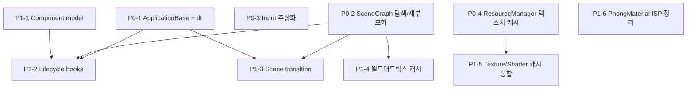

# Engine Design — 학습용 미니 게임엔진 분석 + 로드맵

> ⚠ 2026-05 초기 구상 문서 (archival) — 아래 경로들은 당시 계획 기준이며 현재 구조와 다름. 현행 구조는 [ARCHITECTURE.md](../../ARCHITECTURE.md) 참조.

> 🛑 **역사적 스냅샷 — 실행 기준 문서 아님 (2026-06-18 확인).** 본 문서가 인용하는 `src/engine/*` 경로(material.h / model_base.h / shader_program.h / transform.h …)는 **현재 디렉토리 구조에 더 이상 존재하지 않는다** (17모듈 `src/<module>/` 분리로 폐기됨). 평가 결과·file:line 은 *당시 코드* 기준이다. 5렌즈 평가 *방법*은 `code-design-review-lenses` Skill, 벤치마크 *방법*은 `benchmark-research-method` Skill 로 추출됨. **현 구조는 [architecture.md](../../.claude/architecture.md) / [CLAUDE.md](../../.claude/CLAUDE.md) 참조.** 이 파일은 학습 기록으로만 제자리 보존한다.

> **작성일** 2026-05-16 — **구버전 스냅샷** (SP1 이전, `src/engine/` 11 헤더 시점)
> **브랜치** `feature/engine-extraction` (현재 `game/main` 기준이 아님)
> **대상 코드** [src/engine/](../../src/engine/) — 11 헤더 + 6 `.cpp`, 총 2062 라인
> **독자** 본인 (학습 노트 + 다음 작업 우선순위 결정용)
>
> **갱신 안내 (2026-05-22)**: 본 문서는 SP1 (Shader/Program 통합) ~ SP-Pass 진행 *전* 의 스냅샷이다. 현재 엔진은 12 모듈 (`SJH::<module>`) + INTERFACE 우산 (`SJH::engine`) + Actor/Component + SceneRenderer + Pass 컨벤션으로 진화. 최신 상태는 다음 문서를 참고:
> - [`doc/api/EngineAPI.md`](../api/EngineAPI.md) — 현재 코어 API 레퍼런스
> - [`.claude/architecture.md`](../../.claude/architecture.md) — 모듈 패턴 + §11.5 진실의 원천 단일화 (Pass.Kind) + §11.6 Retina HiDPI
> - [`.claude/architecture-design-agent.md`](../../.claude/architecture-design-agent.md) §12 — 13 가지 암묵적 합의 (SP-Pass 까지 누적)
> - [`doc/api/EngineAPI.md`](../api/EngineAPI.md) §4.7~§4.8 — Pass 컨벤션 + Retina/Resize 호환
>
> 본 문서의 §5 로드맵은 P0/P1 항목 중 상당수가 이미 완료됨 (게임루프, SceneGraph, ResourceManager, Component 모델). 학습 노트로만 보존.

이 문서는 chapter7~9 의 인라인 엔진 코드를 [src/engine/](../../src/engine/) 로 추출한 현 시점의 상태를 정리하고, Unity / Godot / Cocos2D 와의 갭을 기반으로 다음 짤 것을 우선순위화한다. 검증 가능한 사실은 본문에 인용 위치를 명시했고, 주관적 평가는 "💭" 표식으로 분리했다.

---

## §0. TL;DR

- 본 엔진은 **렌더-only 미니 코어**다. Transform / Camera / Material / Lighting / Geometry / Model / ShaderProgram + (얇은) SceneGraph + (얇은) ResourceManagement 의 9 영역.
- 의존 그래프는 단방향이고 깨끗하다 (cycle 없음). `constants → transform → camera / material / lighting → uniforms / geometry → model_base → shader_program` + 컨테이너 두 개.
- 디자인은 "최소한의 정합성" 수준에서 잘 짜여 있다. 소유권 모델(`unique_ptr` 보유 + raw `*` 참조)이 일관적이고, Material → Program 단방향 의존 규약도 분명하다.
- 그러나 **게임엔진** 의 관점에서는 빠진 게 많다 — 입력/시간/게임루프 / 씬 활성화 / 리소스 캐시·핫리로드 / 컴포넌트 모델 / 라이프사이클 훅 / UI / 오디오 / 물리 / 애니메이션.
- 다음 짜야 할 것 (P0): ① 게임루프 추상화 (Application 베이스 + 델타타임), ② SceneGraph 트리 탐색·재부모화, ③ ResourceManager 텍스처 캐시 (경로 키 중복 로드 방지). 이 셋이 학습용 미니 게임엔진의 "최소 기능 게임" 을 만들기 위한 임계점.

---

## §1. Engine API 인벤토리

### 1.1 모듈 일람 (11개 헤더 + 6 cpp)

| # | 파일 | 네임스페이스 | 책임 | 공개 심볼 | LOC |
|---|------|----------|------|---------|-----|
| 1 | [constants.h](../../src/engine/constants.h) | `Engine::Constants::{GEOMETRY,UNIFORM}` | 정점 레이아웃 상수 + 도형 기본 위치/인덱스 + uniform 이름 문자열 | `VERTEX_LEN=13`, `CUBE_BASE_POSITIONS`, `UNIFORM_MODEL_MAT` 등 | 143 |
| 2 | [transform.h](../../src/engine/transform.h) | `Engine::Transform` | TRS + 부모-자식 포인터 트리. `GetModelMatrix()` 가 부모를 재귀로 곱함 | `Transform` (POD-스타일 클래스) | 37 |
| 3 | [camera.h](../../src/engine/camera.h) | `Engine::Camera` | 카메라 = Transform + Target/Up + Fov/Aspect/Near/Far. `GetViewMatrix/GetProjMatrix` | `Camera` | 34 |
| 4 | [lighting.h](../../src/engine/lighting.h) | `Engine::Lighting` | 광원 데이터 컨테이너 (Dir/Point/Spot + 레거시 `Light`) | `LightChannels`, `DirLight`, `PointLight`, `SpotLight`, `Light` | 60 |
| 5 | [material.h](../../src/engine/material.h) / [.cpp](../../src/engine/material.cpp) | `Engine::Material` | 다중 슬롯 텍스처 머티리얼 + `PhongMaterial` (specific) | `TextureSlot`, `TextureParams`, `Material`, `PhongMaterial` | 91+91 |
| 6 | [uniforms.h](../../src/engine/uniforms.h) | `Engine::Uniforms` | 광원/머티리얼 → GL uniform 푸시 자유함수 + `UniformLoc` (누락 진단 포함) | `Apply`, `ApplyDisabled`, `UniformsSetDirLight/PointLight/SpotLight/Material`, `UniformLoc` | 118 |
| 7 | [geometry.h](../../src/engine/geometry.h) / [.cpp](../../src/engine/geometry.cpp) | `Engine::Model` | 비-인덱스/인덱스 빌더 (Triangle, Quad, Cube, Cone, Tetrahedron, Octahedron, Disk, Cylinder, HemiSphere) | `BuildCube`, `BuildHemiSphereIndexed` 등 18개 | 156+712 |
| 8 | [model_base.h](../../src/engine/model_base.h) / [.cpp](../../src/engine/model_base.cpp) | `Engine::Model` | VAO/VBO/EBO 소유 + Transform + Material* + `Draw()` | `ModelBase` | 70+117 |
| 9 | [shader_program.h](../../src/engine/shader_program.h) / [.cpp](../../src/engine/shader_program.cpp) | `Engine::Program` | GL Program lifecycle + per-frame uniform setup. base + Default/Texture 구체 | `ShaderProgram`, `DefaultShaderProgram`, `TextureShaderProgram`, `ModelMap` | 82+102 |
| 10 | [scene_graph.h](../../src/engine/scene_graph.h) / [.cpp](../../src/engine/scene_graph.cpp) | `Engine::SceneGraph` | Transform 트리 소유 컨테이너 (현재는 root 생성/Clear 만) | `SceneGraph` | 61+19 |
| 11 | [resource_management.h](../../src/engine/resource_management.h) / [.cpp](../../src/engine/resource_management.cpp) | `Engine::ResourceManagement` | `Models` / `Materials` 두 `unordered_map<string, unique_ptr<...>>` 소유 | `ResourceManagement` | 85+85 |

> CMake 등록 ([src/engine/CMakeLists.txt](../../src/engine/CMakeLists.txt)) : `material.cpp`, `geometry.cpp`, `model_base.cpp`, `shader_program.cpp`, `scene_graph.cpp`, `resource_management.cpp` 6개 .cpp 가 `SJH::engine` STATIC 으로 묶임. PUBLIC 의존 = `project_deps` + `SJH::diagnostics`.

### 1.2 두 가지 머티리얼 패러다임 공존

[CLAUDE.md](../../.claude/CLAUDE.md) 에 명시된 대로 두 라이팅 / 머티리얼 패러다임이 공존한다:

| 패러다임 | 셰이더 | 머티리얼 | 광원 | uniform 함수 |
|---|---|---|---|---|
| chapter7 단일 Phong | `texture_fs.glsl` | `Material` (base, 4-slot texture) | `Lighting::Light` (단일, 스칼라 Ambient/Specular) | `Apply(progAddr, light, viewPos)` |
| chapter9 multi-light | `basic_lighting_fs.glsl` | `PhongMaterial` (diffuse/specular sampler) | `DirLight + PointLight[] + SpotLight` | `UniformsSetDirLight/PointLight/SpotLight/Material` |

`PhongMaterial : Material` 상속 + `TextureShaderProgram : ShaderProgram` 상속의 "base + specific" 패턴이 정확히 대칭이다 — 셰이더 의존 멤버(diffuseUnit, AttachedLight) 가 specific 쪽으로 격리됨.

### 1.3 소유권 모델 (전체 엔진의 일관된 규약)

| 자원 | 소유자 | 참조자 |
|------|-------|--------|
| GL 텍스처 핸들 (`GLuint`) | `Material` 의 `TextureSlot::TexAddr` (소멸자에서 `glDeleteTextures`) | 없음 (Material 이 단독 소유 + 복사 금지) |
| `ModelBase` (VAO/VBO/EBO) | `ResourceManagement::Models` (`unique_ptr`) | 없음 (raw 포인터 `GetModel()` 반환만) |
| `Material` | `ResourceManagement::Materials` (`unique_ptr`) | `ModelBase::mMaterial` (raw `*`, 비소유) |
| `ShaderProgram` | chapter `main.cpp` 의 `Engine::Context::program` (외부 보관, 추출 안 됨) | `Material::program` (raw `*`, 비소유) |
| `Transform` (root) | `SceneGraph::hierarchies` (`unique_ptr`) | `Transform::Parent`/`Children` (raw `*`) |
| `Transform` (child) | `ModelBase::mTransform` (값) | `SceneGraph` 의 root 가 raw `*` 로 children 보유 |
| `Lighting::Light` | chapter `main.cpp` (외부) | `TextureShaderProgram::AttachedLight` (raw `*`) |

> 규약: **GPU 핸들과 컨테이너는 `unique_ptr`/값 으로 단일 소유, 다른 모듈은 raw `*` 로만 참조한다.** 복사·이동을 명시적으로 막은 곳 = `Material`, `ShaderProgram`. `ModelBase` 는 명시 삭제 없음 (💭 추가하는 게 안전).

---

## §2. 모듈 의존성 그래프

### 2.1 정적 `#include` 그래프

```mermaid
graph LR
    constants[constants.h]
    transform[transform.h]
    camera[camera.h]
    material[material.h]
    lighting[lighting.h]
    uniforms[uniforms.h]
    geometry[geometry.h]
    model_base[model_base.h]
    shader_program[shader_program.h]
    scene_graph[scene_graph.h]
    resource_mgmt[resource_management.h]

    transform --> camera
    transform --> model_base
    transform --> scene_graph
    transform --> resource_mgmt

    constants --> geometry
    constants --> uniforms

    lighting --> uniforms
    lighting --> shader_program

    material --> uniforms
    material --> model_base
    material --> resource_mgmt
    material -.fwd.-> shader_program

    geometry --> shader_program

    model_base --> shader_program
    model_base --> resource_mgmt

    shader_program -.via .cpp.-> material
    shader_program -.via .cpp.-> uniforms
```

> 실선 = 헤더가 헤더를 include. 점선 = forward declaration 또는 .cpp 에서만 include.

### 2.2 의존 분류표

| 의존 종류 | 위치 | 의도 |
|---------|------|------|
| **헤더 → 헤더 (단방향)** | 위 그래프의 실선 전부 | 컴파일 시 타입 가시성 확보 |
| **Forward declaration** | [material.h:11-12](../../src/engine/material.h#L11-L12) `namespace Engine::Program { class ShaderProgram; }` | Material → Program 의 헤더 사이클 방지. Material 은 `program*` 만 보유 |
| **.cpp 만 include** | [material.cpp:5](../../src/engine/material.cpp#L5), [model_base.cpp:6](../../src/engine/model_base.cpp#L6), [shader_program.cpp:3](../../src/engine/shader_program.cpp#L3) | 실제 멤버 접근(`->ProgAddr`) 시점에만 완전 타입 필요 |
| **외부 진단 의존** | `SJH::Diagnostics::{EngineDiagnostics, GLDebug, GLObjectLog, UniformDiagnostics}` | engine 헤더가 PUBLIC 으로 진단을 끌고 옴 (`uniforms.h:8`, `shader_program.cpp:6-8` 등). `SJH::diagnostics` 가 PUBLIC link 인 이유 |
| **외부 시스템 의존** | `GL/gl3w.h`, `vmath.h`, `sb7.h`, `shader.h`, `stb_image.h` | gl3w + vmath = engine 헤더에서 직접 사용 (PUBLIC). sb7/shader/stb_image = `.cpp` 에서만 |

### 2.3 사이클 / 역의존 검증

- 헤더 사이클: **없음**. Material ↔ Program 만 잠재 cycle 후보였으나 forward declaration 으로 차단.
- 레이어 역행: **없음**. 저수준(constants) → 데이터(transform/lighting) → GPU 자원(material/model/shader) → 컨테이너(scene_graph/resource_mgmt) 순서가 일관됨.
- 💭 단, `geometry.h` 가 `model_base.h` 와 동일 네임스페이스(`Engine::Model`) 인데 자유함수 빌더만 모은 게 어색하다. `Engine::Geometry` 로 분리하는 게 더 깔끔.

### 2.4 외부 ↔ 엔진 경계

이 엔진을 들이는 챕터는 다음만 알면 된다:

```cpp
// 외부에서 보이는 엔진 API 최소 셋
#include "<engine>/transform.h"
#include "<engine>/camera.h"
#include "<engine>/material.h"
#include "<engine>/model_base.h"
#include "<engine>/shader_program.h"
#include "<engine>/scene_graph.h"
#include "<engine>/resource_management.h"
// 보조 - 도형 빌더가 필요할 때
#include "<engine>/geometry.h"
// 보조 - 멀티 라이팅을 쓸 때
#include "<engine>/lighting.h"
#include "<engine>/uniforms.h"
```

11개 헤더 중 `constants.h` 는 다른 헤더가 끌고 오므로 외부가 직접 include 할 일은 거의 없다.

---

## §3. 클래스 디자인 평가

5가지 렌즈로 평가한다. 객관 사실(인용 가능)과 💭주관 평가를 분리.

### 3.1 렌즈 ① 소유권 모델

**객관**: §1.3 표 그대로 모든 자원이 단일 소유자를 갖고, 다른 모듈은 raw 포인터로만 참조한다. `Material` ([material.h:57-58](../../src/engine/material.h#L57-L58)) 와 `ShaderProgram` ([shader_program.h:38-39](../../src/engine/shader_program.h#L38-L39)) 은 복사/대입 삭제.

**평가**:
- 💚 **좋음**: 학습용 코드 치고는 소유권이 명확하다. 보통 학생 코드에서 자주 보이는 "shared_ptr 남발" 이나 "raw new" 가 없다. `unique_ptr` 컨테이너 + raw 참조 패턴은 게임엔진 업계 표준에 가깝다 (Unity 내부의 `m_GameObject : weak ref`, Godot 의 `Ref<T> + Object*` 패턴과 유사한 발상).
- 💛 **약점**: `ModelBase` 가 복사/대입 삭제를 안 했다 ([model_base.h:54-55](../../src/engine/model_base.h#L54-L55)). VAO 핸들 단일 소유라 복사되면 double-`glDelete` 인데 컴파일러가 막아주지 않음. 추가 권장: `ModelBase(const ModelBase&) = delete;`.
- 💭 **고민거리**: `Transform` 이 부모 raw 포인터를 들고 있는데, `SceneGraph::hierarchies` 가 unique_ptr 로 root 만 잡고 자식 Transform 은 `ModelBase::mTransform` 안의 값으로 산재한다. 부모-자식 일관성을 강제하는 코드(추가/제거 시 `Children` 갱신)는 `ResourceManagement::AddModel` 한 군데에만 있고 (`resource_management.cpp:27-33`), 다른 경로에서 Transform 을 손대면 깨질 여지가 있다. SceneGraph 가 통합 게이트가 되어야 한다.

### 3.2 렌즈 ② 결합도 (coupling)

**객관**:
- Material → Program 단방향 (forward declaration). [material.h:8-13](../../src/engine/material.h#L8-L13).
- ModelBase → Material 단방향 (Material 이 셰이더를 안다, ModelBase 는 머티리얼이 어느 셰이더를 쓰는지만 알면 됨). [model_base.cpp:94-97](../../src/engine/model_base.cpp#L94-L97).
- ShaderProgram → ModelMap 의존 ([shader_program.h:16](../../src/engine/shader_program.h#L16)). `ShaderProgram::Render` 가 모델 컨테이너를 받아 순회.

**평가**:
- 💚 **좋음**: "Material → Program" 의 단방향 의존 결정은 결정적이다. 셰이더가 머티리얼을 모르게 함으로써 동일 셰이더로 여러 머티리얼을 쓸 수 있고, multi-program 씬에서 `mat->program != this` 면 skip 하는 안전망 ([shader_program.cpp:67-69](../../src/engine/shader_program.cpp#L67-L69)) 까지 있다.
- 💛 **약점 1**: `ShaderProgram::Render` 가 `ModelMap` 을 받는다. 의도는 "셰이더가 자기 모델을 그린다" 인데, 셰이더가 컨테이너 타입까지 알아버린 것이다. 💭 더 깔끔한 형태는 `Renderer` 라는 별도 클래스가 셰이더 + 모델을 외부에서 묶는 것. 지금은 그 책임이 ShaderProgram 으로 흘러간 상태.
- 💛 **약점 2**: `material.h:8-13` 의 forward declaration 은 `Engine::Program::ShaderProgram` 을 `Material` 멤버로 들기 위한 것인데, 의존 방향상 셰이더 객체보다 머티리얼이 더 추상적인 게 자연스럽다 (Unity 의 `Material.shader` 와 동일 발상). 현재는 의존이 잘 짜여 있지만, 향후 `Texture` / `Shader` / `Material` 자원을 ResourceManager 에서 캐싱하기 시작하면 이 결합이 재검토 대상이다.

### 3.3 렌즈 ③ ODR / 헤더 위생

**객관**:
- 헤더 가드: `__ENGINE_XXX_H__` 형식 일관 (CLAUDE.md 컨벤션 준수). 단 [constants.h:144](../../src/engine/constants.h#L144) 의 endif 코멘트는 `__ENGINE_UNIFORMS_H__` 로 잘못 적혀 있음. **타이포**.
- 헤더-only 상수: `inline constexpr` ([constants.h:13-18](../../src/engine/constants.h#L13-L18)) 와 `const std::vector<...>` ([constants.h:21-113](../../src/engine/constants.h#L21)) 가 섞여 있음. `const` 글로벌 `vector` 는 헤더에 정의해도 internal linkage 가 안 보장된다 (C++17 이전 규칙). 다행히 C++17 부터 `const` 변수는 implicit internal linkage 라서 ODR 위반은 아님 — 단, `inline` 키워드를 명시하는 게 의도 표명상 더 정확하다.
- `uniforms.h` 가 `inline` 자유함수 전체를 헤더에 보유 ([uniforms.h:21-115](../../src/engine/uniforms.h#L21)). `Engine::Uniforms` 네임스페이스의 모든 함수가 `inline` 으로 표기되어 ODR 안전.

**평가**:
- 💚 **좋음**: `uniforms.h` 의 헤더-only inline 결정은 적절. 각 함수가 짧고 `glUniformXX` 직접 호출이라 link-time 분리할 이유가 없다.
- 💛 **약점**: `constants.h` 의 `const std::vector<vmath::vec4> CUBE_BASE_POSITIONS = {...};` 같은 헤더 정의는 **번역 단위마다 vector 가 새로 생성**된다 (`const` 의 implicit internal linkage 효과). 컴파일 시간 / 바이너리 크기 둘 다 손해. `inline const std::vector<...>` 로 바꾸거나 `.cpp` 로 옮기는 게 정석.
- 🚨 **타이포**: `constants.h` endif 주석 수정 필요.

### 3.4 렌즈 ④ SOLID / 책임 분리

| 원칙 | 평가 | 근거 |
|------|------|------|
| **S** Single Responsibility | 💚 | 모듈별 책임이 좁고 명확. `Transform` = TRS 만, `Camera` = 뷰/투영만, `Material` = 텍스처+셰이더 바인딩만 |
| **O** Open/Closed | 💛 | `Material` / `ShaderProgram` 은 base + specific 으로 확장 가능 (PhongMaterial / TextureShaderProgram). `ModelBase` 는 virtual 메서드가 없어 확장 포인트 부재 — 💭 `Draw()` 가 virtual 이 아닌 것이 의도된 건지 의문 |
| **L** Liskov | 💚 | `PhongMaterial`, `TextureShaderProgram` 모두 base 의 계약을 깨지 않음 (base 는 nullptr-가드, specific 은 추가 멤버만) |
| **I** Interface Segregation | 💛 | `Engine::Uniforms` 자유함수가 너무 많이 노출됨. 사용 측이 어떤 함수를 부를지 알아야 함. 💭 `IUniformWriter` 인터페이스로 추상화하면 셰이더별 setter 가 일관됨 |
| **D** Dependency Inversion | 💛 | `Material` 이 `ShaderProgram` 구체 클래스에 직접 의존. 💭 추상 인터페이스가 없어서 mock/test 가 어려움 — 다만 학습용 코드라 이게 꼭 문제인지는 트레이드오프 |

### 3.5 렌즈 ⑤ 일관성 (네이밍 / 컨벤션 / 패턴)

**객관**:
- 헤더 가드 컨벤션: 거의 일관 (constants.h 타이포 제외).
- 네이밍: 클래스명 PascalCase, 자유함수 PascalCase (`Apply`, `BuildCube`), 멤버 PascalCase (`Translate`, `EulerRot`) — Unity-스타일.
- 네임스페이스 패턴: `Engine::<모듈명>` 단일 일관.
- "base + specific" 패턴 두 번 등장: `Material/PhongMaterial`, `ShaderProgram/Default,Texture` ([material.h:80-88](../../src/engine/material.h#L80-L88), [shader_program.h:56-79](../../src/engine/shader_program.h#L56)).
- 진단 통합: 거의 모든 `.cpp` 가 `SJH::Diagnostics` 를 사용 (Material, Model, ShaderProgram, ResourceManagement 전부).

**평가**:
- 💚 **매우 좋음**: 일관성 점수는 높다. base + specific 패턴이 두 번 반복되면서 의도가 분명해졌다 (셰이더-의존 멤버는 specific 에 격리).
- 💚 진단을 PUBLIC 의존으로 끌어와서 엔진 외부에서도 진단 시그널을 받을 수 있게 한 결정 ([CMakeLists.txt:24](../../src/engine/CMakeLists.txt#L24)) 은 학습용 엔진에서 특히 가치 있다.
- 💛 **약점**: `Engine::Model` 네임스페이스가 도형 빌더 + ModelBase 클래스 둘 다 보유. 후자가 명사적 책임 (모델 객체) 이고 전자가 자유함수 (geometry generation) 라 책임 단위가 다름.

### 3.6 평가 종합

> 💭 학습용 코드 치고는 매우 잘 짜여 있다. 4학년 학부생 수준에서 흔히 보이는 "VAO 핸들이 여러 곳에 떠다닌다" 거나 "Material 이 자기 셰이더 컴파일까지 다 한다" 거나 하는 결합 사고가 없다. **추출 자체는 깔끔하게 끝났다.** 다만 지금까지는 "chapter 코드의 인라인을 빼냈을 뿐" 이고, 게임엔진으로 가려면 *추가* 가 필요하다 — 그게 §4·§5 의 주제.

---

## §4. Unity / Godot / Cocos2D Must-Have 비교

### 4.1 비교 방법론

- Unity / Godot / Cocos2D 세 엔진 모두에 존재하는 서브시스템 = "must-have"
- 두 엔진에만 있으면 "common"
- 한 엔진에만 있으면 "선택적"
- 출처는 context7 MCP 로 조회한 공식 문서 인용. 검증 못한 항목은 명시.

### 4.2 검증된 must-have 카테고리

| # | 서브시스템 | Unity | Godot | Cocos2D | 본 엔진 |
|---|----------|-------|-------|---------|---------|
| 1 | **씬 그래프 / 노드 트리** | GameObject + Transform 트리 [^unity1] | SceneTree + Node 계층 [^godot1] | Director → Scene → Node 트리 [^cocos1] | ⚠️ 부분 (SceneGraph 가 root 등록 + Clear 만, 탐색/재부모화 없음) |
| 2 | **컴포넌트 모델** | GameObject + Component (Transform, MeshFilter, MeshRenderer, Camera, Rigidbody, Collider) [^unity1] | Node 자체가 컴포넌트 역할 (다중 상속 X, 명시 노드 타입) | Node + Component (`addComponent`) [^cocos2] | ❌ **없음** — Transform 만 있고 그 외 컴포넌트화 X |
| 3 | **Transform (TRS)** | `Transform` 컴포넌트 [^unity1] | `Node3D.transform` | `Node` 자체에 position/rotation/scale | ✅ `Engine::Transform` 동일 책임 |
| 4 | **Camera** | `Camera` 컴포넌트 (FOV, near/far, viewport) [^unity1] | `Camera3D` 노드 | `Camera` (2D 중심) | ✅ `Engine::Camera` 동일 책임 |
| 5 | **Mesh / Sprite 렌더링** | `MeshFilter + MeshRenderer` [^unity1] | `MeshInstance3D` [^godot2] | `Sprite::create("img.png")` [^cocos1] | ✅ `ModelBase` (3D 한정, sprite 없음) |
| 6 | **Material / Shader** | `Material` + `Shader` [^unity1] | `BaseMaterial3D` + `Shader` (spatial type) [^godot2] | `GLProgramState`, `GLProgram` (구버전) | ✅ `Material` + `ShaderProgram` |
| 7 | **Lighting** | Directional / Point / Spot Light 컴포넌트 | DirectionalLight3D / OmniLight3D / SpotLight3D | (2D 중심, 제한적) | ✅ `Engine::Lighting` (3종 + 레거시) |
| 8 | **리소스 / 에셋 시스템** | AssetDatabase, `Resources.Load`, addressables | `ResourceLoader.load()`, Resource 타입 시스템 | `TextureCache::addImage` (경로 기반 캐시) | ⚠️ 부분 (ResourceManagement 가 Models/Materials 만, **캐시 없음, Texture/Shader 미분리**) |
| 9 | **Input 시스템** | `Input.mousePosition`, `Input.GetKey` [^unity1] | `Input` 싱글톤 + `InputEventKey` | `EventDispatcher` + `EventListenerTouch` [^cocos3] | ❌ **없음** (sb7 의 GLFW 콜백을 chapter 가 직접 받음) |
| 10 | **Time / Game Loop / Scheduler** | `Time.deltaTime`, `Update()` | `_process(delta)`, `_physics_process(delta)` | `Director::getDeltaTime()`, `Scheduler::schedule` | ❌ **없음** (sb7 의 `render(currentTime)` 만, 델타 계산 안 됨) |
| 11 | **Audio** | `AudioSource`, `AudioClip` | `AudioStreamPlayer` | `AudioEngine::play2d` / `SimpleAudioEngine` [^cocos4] | ❌ **없음** |
| 12 | **Physics / Collision** | `Rigidbody`, `Collider`, `Physics.Raycast` [^unity2] | `RigidBody3D`, `CollisionShape3D` | `PhysicsBody`, `PhysicsContact` [^cocos5] | ❌ **없음** |
| 13 | **UI** | uGUI, UI Toolkit | `Control` 노드 계열 | `ui::Widget`, `ui::Button` | ❌ **없음** |
| 14 | **Animation** | `Animator`, AnimationClip | `AnimationPlayer`, `Animation` | `Action`, `Animate` [^cocos6] | ❌ **없음** |
| 15 | **Lifecycle 훅** | `Start / Update / OnEnable / OnDestroy` | `_ready / _process / _exit_tree` | `onEnter / onExit / update` | ❌ **없음** (sb7 의 `startup/render/shutdown` 만, 노드별 훅 X) |
| 16 | **씬 전환 / 로딩** | `SceneManager.LoadScene` | `get_tree().change_scene_to_packed` | `Director::replaceScene` [^cocos1] | ❌ **없음** |

### 4.3 갭 요약

- ✅ **현 엔진이 충족**: 6개 (Transform, Camera, Mesh, Material/Shader, Lighting, + 부분적으로 Scene Graph)
- ⚠️ **부분 충족**: 2개 (Scene Graph 의 탐색·재부모화·매트릭스 캐시 미구현, Resource 의 캐시·Texture/Shader 분리 미구현)
- ❌ **완전 미구현**: 8개 (Component model, Input, Time/Loop, Audio, Physics, UI, Animation, Lifecycle, Scene transition)

> 💭 학습용 미니 게임엔진 스코프에서 16개 중 **반은 안 만들어도 됨** (Audio/Physics/UI/Animation 은 별도 학습 주제). 그러나 ❌ 8개 중 **컴포넌트 모델, Input, Time/Loop, Lifecycle 훅, Scene transition** 의 5개는 "게임" 을 만들려면 사실상 필수.

---

## §5. 로드맵 (P0 / P1 / P2)

P0 = must-have 갭 + 본 엔진의 기존 placeholder 주석 둘 다에 해당하는 항목.
P1 = 둘 중 하나만 해당.
P2 = "나중에" — 별도 학습 주제 / 본 코스워크 스코프 밖.

### 5.1 P0 — 다음에 짤 것 (학습용 게임엔진 임계점)

| # | 작업 | 이유 (must-have ↔ placeholder) | 예상 변경 위치 |
|---|------|------------------------------|----------------|
| **P0-1** | **게임루프 / Application 베이스** — `delta_time`, `OnUpdate(dt)` 훅 도입. sb7::application 의 `render(currentTime)` 를 래핑해서 엔진 사용자가 dt 만 받게 함. | must-have #10 (Time/Loop) + #15 (Lifecycle). CLAUDE.md 가 "ApplicationBase / Engine::Context 는 여전히 chapter 메인에 인라인 보관" 이라고 했는데, 이걸 추출하는 시점 | `src/engine/application_base.{h,cpp}` 신설, chapter `main.cpp` 가 상속 |
| **P0-2** | **SceneGraph 트리 탐색 + 재부모화** — `Find(path)`, `Traverse(root, visitor)`, `Reparent(child, new_parent)` 구현. [scene_graph.h:28-36](../../src/engine/scene_graph.h#L28-L36) 의 placeholder 주석 그대로 | must-have #1 (Scene Graph) + 헤더에 명시된 placeholder | [<src>/engine/scene_graph.h](../../src/engine/scene_graph.h), [.cpp](../../src/engine/scene_graph.cpp) |
| **P0-3** | **Input 추상화** — `Engine::Input::IsKeyPressed(key)`, `MousePosition()`, `IsMouseButtonDown()`. GLFW 콜백 → 엔진 내부 키 상태 테이블로 흡수 | must-have #9 (Input). 모든 chapter 가 동일한 입력 코드를 중복하고 있음 | `src/engine/input.{h,cpp}` 신설 |
| **P0-4** | **ResourceManager 텍스처 캐시** — 경로 키 기반 `LoadTexture(path)` 가 같은 파일을 두 번 로드하지 않도록. [resource_management.h:45-46](../../src/engine/resource_management.h#L45-L46) placeholder | must-have #8 (Resource) + 헤더 placeholder | [src/engine/resource_management.h/.cpp](../../src/engine/resource_management.h), `Textures` 컨테이너 추가 |

### 5.2 P1 — 그 다음 라운드

| # | 작업 | 이유 | 예상 변경 위치 |
|---|------|------|----------------|
| **P1-1** | **컴포넌트 모델 도입** — `Transform` 에 `std::vector<std::unique_ptr<Component>>` 추가. Component 베이스에 `OnAttach/OnUpdate/OnDetach` 훅 | must-have #2 (Component model). 단, 본 엔진 구조 변경이 큼 — Transform 이 컴포넌트 호스트가 되어야 함 | [<src>/engine/transform.h](../../src/engine/transform.h), `<src>/engine/component.h` 신설(당시 미착수 계획) |
| **P1-2** | **Lifecycle 훅 통합** — 각 Component 에 `OnStart / OnUpdate(dt) / OnDestroy`. ApplicationBase 가 SceneGraph 를 traverse 하면서 매 프레임 호출 | must-have #15. P0-1 + P1-1 의존 | ApplicationBase, Component |
| **P1-3** | **Scene transition** — `Engine::Scene` 추상 + `SceneManager::Replace(scene)`. 현재는 ResourceManagement::TeardownGL → 새 씬 build 를 chapter 가 수동으로 해야 함 | must-have #16 | `src/engine/scene.{h,cpp}` 신설 |
| **P1-4** | **월드 매트릭스 캐시 + dirty flag** — `Transform::GetModelMatrix()` 가 매번 부모를 재귀 곱셈하는 현 구조 ([transform.h:22-33](../../src/engine/transform.h#L22-L33)) 를 dirty flag + 캐시로 교체 | placeholder ([scene_graph.h:38-40](../../src/engine/scene_graph.h#L38-L40)) + 성능 (씬 규모 커지면 N² 가능성) | Transform, SceneGraph |
| **P1-5** | **Texture / ShaderProgram 도 ResourceManagement 가 소유** — 현재는 chapter `main.cpp` 가 ShaderProgram 직접 보유, Texture 는 Material 안에 박혀 있음 | must-have #8 + placeholder | ResourceManagement, Material 리팩터 |
| **P1-6** | **PhongMaterial 의 base 상속 ISP 정리** — 현재 PhongMaterial 이 Base 의 `Slots` 를 상속받지만 이 셰이더에서는 사용하지 않는다 ([material.h:79](../../src/engine/material.h#L79)). 약한 ISP 위반 | §3.4 ④ 평가 | Material 계층 |

### 5.3 P2 — 본 코스워크 스코프 밖 (별도 학습 주제)

| # | 작업 | 비고 |
|---|------|------|
| P2-1 | Audio (`AudioEngine::play2d` 류) | OpenAL/miniaudio 같은 별도 라이브러리 학습 |
| P2-2 | Physics (Bullet / Box2D 통합) | 별도 학습 분야 |
| P2-3 | Animation (skeletal / Action 합성) | 별도 학습 분야 |
| P2-4 | UI Widget 시스템 | imgui 로 대체 가능 |
| P2-5 | 핫리로드 (파일 감시 → 자동 reload) | placeholder ([resource_management.h:57-58](../../src/engine/resource_management.h#L57-L58)) 있으나 학습 우선순위 낮음 |
| P2-6 | 비동기 / 스트리밍 로드 | 동기 로드로도 학습 충분 |
| P2-7 | 직렬화 / 패킹 / Bundle | 학기 내 우선순위 낮음 |

### 5.4 작은 정리 작업 (cleanup)

본 보고서 작성 중 발견한 작은 항목들. P0/P1 작업하기 전 / 후에 묶어서 처리하면 좋다.

| # | 작업 | 위치 |
|---|------|------|
| C-1 | endif 코멘트 타이포 수정 (`__ENGINE_UNIFORMS_H__` → `__ENGINE_CONSTANTS_H__`) | [constants.h:144](../../src/engine/constants.h#L144) |
| C-2 | `ModelBase` 복사/대입 명시 삭제 | [model_base.h](../../src/engine/model_base.h) |
| C-3 | `constants.h` 의 `const std::vector<...>` 글로벌을 `inline const ...` 로 표기 (의도 명시) 또는 .cpp 로 이동 | [constants.h:21-113](../../src/engine/constants.h#L21) |
| C-4 | `Engine::Model` 네임스페이스 분리 — geometry 빌더 자유함수를 `Engine::Geometry` 로 이동 | [geometry.h](../../src/engine/geometry.h), [geometry.cpp](../../src/engine/geometry.cpp) |
| C-5 | `ResourceManagement::AddModel/AddMaterial` 의 `exit(1)` 을 throw 또는 진단으로 변경 | [resource_management.cpp:21,67](../../src/engine/resource_management.cpp#L21) |

---

## §6. 작업 의존성 다이어그램 (P0/P1)



> P0-1, P0-2, P0-3, P0-4 는 서로 독립이라 어느 순서로도 가능. P1 항목은 대부분 P0 에 의존.

---

## §7. 참고 / 출처

### 7.1 본 엔진 내부 출처
- [src/engine/](../../src/engine/) — 11개 헤더 + 6개 cpp, 2062 라인. 본 문서의 모든 객관 사실은 여기서 직접 인용.
- [.claude/CLAUDE.md](../../.claude/CLAUDE.md) — 프로젝트 컨벤션, Engine 모듈 설명, base+specific 패턴 정책.
- [<doc>/superpowers/specs/2026-05-12-chapter7-engine-diagnostics-design.md](../superpowers/specs/2026-05-12-chapter7-engine-diagnostics-design.md), [<doc>/superpowers/specs/2026-05-12-chapter9-single-shader-quad-design.md](../superpowers/specs/2026-05-12-chapter9-single-shader-quad-design.md), [<doc>/superpowers/specs/2026-05-15-engine-geometry-vbo-ebo-split-design.md](../superpowers/specs/2026-05-15-engine-geometry-vbo-ebo-split-design.md) — 이전 설계 노트들 (같은 패턴). 이 세 스펙 파일은 현재 저장소에 더 이상 보존되어 있지 않다(당시 실존, 이후 미보존) — 인용 위치만 학습 기록으로 남긴다.

### 7.2 외부 엔진 비교 출처 (context7 검증)

[^unity1]: Unity Manual — Key concepts: GameObjects, components, and scenes. https://doc.unity3d.com/Manual/key-concepts.html (context7 `/websites/unity3d_manual` 조회 2026-05-16). Transform / MeshFilter / MeshRenderer / Camera / Rigidbody / Collider 컴포넌트 모델.
[^unity2]: Unity Manual — Cast Rays from Camera. https://doc.unity3d.com/Manual/CameraRays-cast.html. `Physics.Raycast` + `Input.mousePosition` API.
[^godot1]: Godot Engine Docs (stable) — Node, MeshInstance3D, Camera3D 클래스 레퍼런스 (context7 `/websites/godotengine_en_stable` 조회 2026-05-16).
[^godot2]: Godot Engine Docs — `BaseMaterial3D`, `MeshInstance3D`, spatial shader (`shader_type spatial`, ALBEDO/METALLIC/ROUGHNESS).
[^cocos1]: Cocos2d-x Docs — Core Concepts: Director, Scene, Sprite, Action. https://github.com/cocos2d/cocos2d-x-doc/blob/master/en/SUMMARY.md (context7 `/cocos2d/cocos2d-x-docs` 조회 2026-05-16). `Director::getInstance()`, `Director::runWithScene`, `Sprite::create`, `MoveBy::create`.
[^cocos2]: Cocos2d-x Docs — Physics integration: `sprite->addComponent(physicsBody)`. https://github.com/cocos2d/cocos2d-x-doc/blob/master/zh/physics/concepts.md
[^cocos3]: Cocos2d-x Docs — Physics contact: `EventListenerPhysicsContact::create()`, `EventDispatcher::addEventListenerWithSceneGraphPriority`. https://github.com/cocos2d/cocos2d-x-doc/blob/master/zh/physics/index.md
[^cocos4]: Cocos2d-x Docs — Audio Engines: `SimpleAudioEngine` + `AudioEngine::play2d`. https://github.com/cocos2d/cocos2d-x-doc/blob/master/en/audio/index.md
[^cocos5]: Cocos2d-x Docs — Physics: `PhysicsBody::createBox`, `PhysicsMaterial`. (위와 동일 출처)
[^cocos6]: Cocos2d-x Docs — Animate Action: `Animation::createWithSpriteFrames`, `Animate::create`. https://github.com/cocos2d/cocos2d-x-doc/blob/master/en/actions/basic.md

### 7.3 검증 한계 (Anti-Hallucination)

- 본 문서의 must-have 비교는 context7 가 반환한 공식 문서 발췌에 한정. 위 표의 ✅/⚠️/❌ 판정은 각주 출처를 직접 확인했다.
- 검증 실패 / 미확인 항목: Unity 의 Component model 세부 (예: ScriptableObject, ECS 의 위치), Godot 의 Audio/UI 구체 API — 본 보고서는 "있다/없다" 수준의 매크로 비교만 유지하고 디테일은 보류.
- 향후 P0 작업 착수 시점에 해당 항목의 공식 API 시그니처를 다시 context7 로 조회할 것 (예: P0-1 게임루프 → Godot `_process(delta)` 시그니처 / Unity `MonoBehaviour.Update()` 호출 규약).
