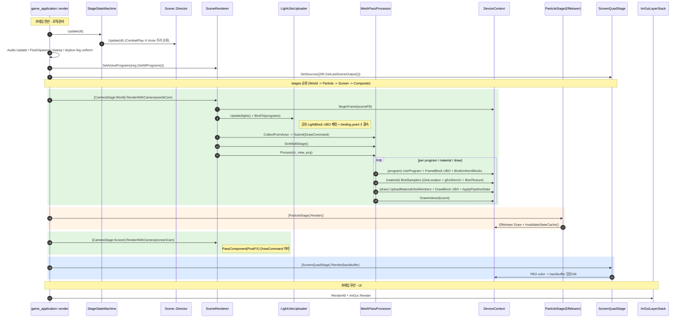

# 렌더링 엔진 구조 다이어그램

> 대상: `src/render` + `src/render_bootstrap` + `apps/_MyApp_/main.cpp`
> 작성: 2026-06-21 (Phase C 정착 반영 — PropertyBlockSetter/uniform_cache 삭제, sampler=BindSamplers / 값=UBO 멤버, binding point 의미명 고정).

## 산출물
| 다이어그램 | Graphviz | Mermaid |
|---|---|---|
| Class & Dependency | [`render-class-dependency.dot`](./render-class-dependency.dot) | 본 문서 §1 |
| Sequence (per-frame) | [`render-sequence.dot`](./render-sequence.dot) | 본 문서 §2 |

Graphviz 렌더: `dot -Tsvg render-class-dependency.dot -o out.svg` (graphviz `dot` 필요).
Mermaid 렌더: GitHub/VSCode Markdown Preview Mermaid 플러그인, 또는 `mmdc -i render-architecture.md -o out.svg`.

---

## 1. Class & Dependency (Mermaid)

```mermaid
classDiagram
    direction TB

    %% ===== 상속 =====
    class IRenderPassable {
        <<interface>>
        +Render(RenderTarget&)
        +OnResize(w, h)
    }
    class SceneRenderer {
        +RenderWithCamera(Camera&)
        +SetActivePrograms(progs)
        +GetLastSceneOutput() Framebuffer*
        -CollectFromActor(...)
        -mProcessor : MeshPassProcessor
        -mUploader : LightUboUploader
        -mActivePrograms : Program[]
    }
    class ScreenQuadStage {
        +SetSources(FBs)
        +Render(target)
        -mProgram& / mMesh&
        -mSources : Framebuffer[]
    }
    class CameraStage {
        +Render(target)
        -mRenderer : SceneRenderer*
        -mCamera : Camera*
    }
    IRenderPassable <|-- SceneRenderer
    IRenderPassable <|-- ScreenQuadStage
    IRenderPassable <|-- CameraStage

    class MeshPassProcessor {
        +SortMultiStage()
        +Process(rc, view, proj)
        -UploadMaterialUboMembers()
        -BindSamplers()
        -mItems : DrawCommand[]
    }
    class LightUboUploader {
        +Update(dir, points, spots, viewPos)
        +BindTo(programs)
        -mLightBlockUbo : UniformBuffer
    }
    class DeviceContext {
        <<singleton>>
        +Get()$
        +UseProgram / BindVAO / BindTexture
        +ApplyRenderStateBlock(RenderStateBlock)
        +InvalidateStateCache()
        +BeginFrame(RT) / DrawIndexed()
        -mBoundProgram / mLast
    }

    class MeshRenderer {
        <<Scene::Component>>
        +Mesh* / Material*
        +Visible / QueueOffset
    }
    class PassComponent {
        <<Scene::Component>>
        +InputFB / OutputFB
        +mMaterial
    }

    %% ===== render_bootstrap (Pure Factory) =====
    class SetupDefaultPipeline {
        <<factory fn>>
        () ScreenQuadStage
    }
    class BuildPostFXChain {
        <<factory fn>>
        () PostFXChainResult
    }

    %% ===== Application =====
    class game_application {
        +render(dt)
        +OnSceneSetup()
        -mStages : IRenderStage[]
        -mScreenQuadStagePtr
        -mSceneFB / mPostFXFBs
        -mPassComponents
        -mCamera / mScreenCamera
        -mStageFsm
    }

    %% ===== 협력 모듈 =====
    class Program { UBO 블록/멤버 + GetLocation(live) }
    class Material
    class Mesh
    class RenderTarget
    class Actor

    %% ===== 합성/집약 =====
    SceneRenderer *-- MeshPassProcessor : owns
    SceneRenderer *-- LightUboUploader : owns
    CameraStage o-- SceneRenderer : mRenderer
    CameraStage o-- Actor : mCamera
    ScreenQuadStage o-- Program : mProgram
    ScreenQuadStage o-- Mesh : mMesh
    game_application o-- IRenderStage : mStages
    game_application o-- PassComponent : mPassComponents
    MeshRenderer --|> Actor : Component
    PassComponent --|> Actor : Component

    %% ===== 의존 (uses) =====
    game_application ..> SetupDefaultPipeline : calls
    game_application ..> BuildPostFXChain : calls
    game_application ..> CameraStage : creates
    SetupDefaultPipeline ..> ScreenQuadStage : creates
    BuildPostFXChain ..> PassComponent : creates
    SceneRenderer ..> Actor : DFS collect
    SceneRenderer ..> MeshRenderer : collect
    SceneRenderer ..> PassComponent : collect(Screen)
    SceneRenderer ..> DeviceContext : BeginFrame
    MeshPassProcessor ..> DeviceContext : Use/Apply/Draw
    MeshPassProcessor ..> Program : UpdateUniformBlock/Member, GetLocation
    MeshPassProcessor ..> Material : Properties
    LightUboUploader ..> Program : Disown/FindUniformBlock
    DeviceContext ..> Program
    DeviceContext ..> RenderTarget
    ScreenQuadStage ..> DeviceContext : blit
```

### 핵심 관찰
- **3 stage 다형성** (`IRenderPassable`): `CameraStage`(씬), `ParticleStage`(VFX, 클라 측), `ScreenQuadStage`(최종 합성). Application 이 `mStages` 벡터로 *순서를 명시 제어* (Unity URP ScriptableRenderPass 정통).
- **SceneRenderer = orchestrator**: `MeshPassProcessor`(DrawCommand 큐) + `LightUboUploader`(공유 LightBlock UBO) 를 소유. `RenderWithCamera` 1패스 단위.
- **DeviceContext = GL state 단일 facade(싱글톤)**: program/VAO/texture 바인딩 + `ApplyRenderStateBlock`(D-RS-1) + `InvalidateStateCache`(foreign GL 경계).
- **render_bootstrap = Pure Factory**: `SetupDefaultPipeline`/`BuildPostFXChain` 가 ScreenQuadStage/PassComponent 를 조립해 Application 에 반환 (상태 없음).
- **MeshRenderer/PassComponent** = `Scene::Component` (파일은 render/, 네임스페이스 Scene — D7). SceneRenderer 가 Actor 트리에서 수집.

---

## 2. Sequence — per-frame `render(dt)` (Mermaid)



### 핵심 흐름 메모
- **게임 로직(FSM/Director.Update) → 준비(active programs/sources) → stages 순회 → UI** 의 3단.
- **stages 순서** = `[CameraStage(World), ParticleStage, CameraStage(Screen), ScreenQuadStage]` (main.cpp T4 에서 명시 조립).
- **조명**: `LightUboUploader.Update`가 매 프레임 공유 LightBlock UBO 패킹 → `BindTo`가 phong program 의 LightBlock(의미명 고정 binding point **3**)에 결속. (binding point 충돌 회귀버그 = `bindingPoint=blockIndex` → 의미명 고정으로 수정.)
- **foreign GL 경계**: ParticleStage(Effekseer) Draw 후 `InvalidateStateCache()` 로 DeviceContext pipeline-state 캐시 desync 차단.
- **PostFX**: `ScreenCamera` pass 의 PassComponent 들이 FBO→FBO 체인 → `ScreenQuadStage` 가 마지막 FBO 를 backbuffer 에 합성.
```
