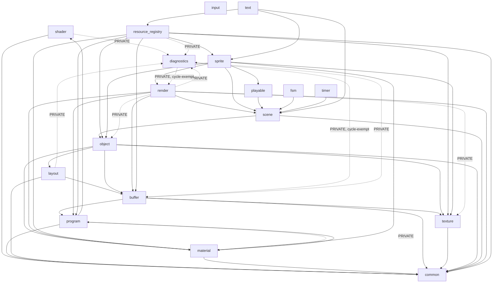

# HO-3 — 루트 ARCHITECTURE.md 신설 (의존 지도) (핸드오프, 맥락0 자기완결)

> AI-Readiness 70% 플랜의 콘텐츠 패키지 3건 중 2번. 정본 플랜 = [`doc/superpowers/plans/2026-07-10-ai-readiness-70pct-plan.md`](../../superpowers/plans/2026-07-10-ai-readiness-70pct-plan.md) §3 HO-3 행 + §4 "D — 의존 지도" 절. 루브릭 = [`.claude/skills/ai-readiness-cartography/references/scoring-rubric.md`](../../../.claude/skills/ai-readiness-cartography/references/scoring-rubric.md) D절. 이 문서만 읽고 실행 가능 — 아래 ③에 실제 의존 그래프(직접 소스 대조로 검증됨)를 이미 풀어놓았다.

## ① 배경

이 저장소는 2026-07-10 감사(`doc/report/ai-readiness-score.json`)에서 카테고리 D(의존 매핑) **2/15**를 받았다 — `ARCHITECTURE.md` 부재, mermaid 다이어그램 0건이 사유(evidence: `architecture_doc: false, mermaid_diagrams: false`). HO-3 은 루트에 `ARCHITECTURE.md`를 신설해 17→18모듈 의존 그래프(mermaid) + "What depends on X?" 역인덱스 + `project_deps`/`game_deps` 계층 + diagnostics cycle-exempt 예외를 담아 D를 10.5+로 올린다.

**계측기 고정**: 재채점은 반드시 `python3 doc/report/score_cpp.py . --json <출력경로>`. 원본 `score.py`(cartography skill 것) 사용 금지.

**⚠ 스코어러 핵심 사실(`doc/report/score_cpp.py:394-398` 직접 확인)**: D 카테고리는 루트 상대경로 `ARCHITECTURE.md` / `docs/architecture.md` / `docs/ARCHITECTURE.md` / `docs/dependency-graph.md` / `docs/data-flow.md` 중 하나라도 있으면 +6, 어떤 context file에든 &#96;```mermaid&#96; 펜스가 있으면 +3, 컨텍스트 파일 절반 이상에 `## Cross-module`류 헤딩이 있으면 +4. **루트 경로가 정확히 `ARCHITECTURE.md`(대문자, repo 루트) 여야 인식된다** — `doc/ARCHITECTURE.md`는 목록에 없어 인식 안 됨.

## ② 소유 파일 목록

- `ARCHITECTURE.md` (신규, **repo 루트**)

읽기 전용 참조(수정 금지): `.claude/architecture.md`(역할 분리 대상 — 이 문서는 "왜/규율", 새 `ARCHITECTURE.md`는 "무엇/지도"), `src/CMakeLists.txt`, 각 `src/<module>/CMakeLists.txt`(18개), `doxygen/pages/20-dependencies.md`, `doc/diagrams/2026-06-19-module-deps-current.dot`(참고용 — **아래 ③의 검증된 그래프로 대체할 것, 그대로 베끼지 말 것**. 3주 이상 지난 스냅샷이라 일부 사이클 서술이 stale).

## ③ 작업 사양

### 모듈 수 정정 (필수 반영)

`src/` 는 **18개** STATIC/INTERFACE 라이브러리다(`ls src/` + `src/CMakeLists.txt`의 `add_subdirectory` 18줄로 확인, 2026-07-10 실측). `texture`가 2026-06-11 리팩토링으로 `resource_registry`에서 분리된 18번째 모듈(`src/texture/CMakeLists.txt` 주석 "18번째 모듈"). `.claude/CLAUDE.md`·`.claude/architecture.md`가 "17개"라 적은 곳은 stale — `ARCHITECTURE.md`는 18로 쓸 것.

### mermaid 의존 그래프 (아래 그대로 사용 가능 — 각 `src/<module>/CMakeLists.txt`의 `target_link_libraries` PUBLIC/PRIVATE 를 직접 대조해 이미 검증됨)



### 확인된 사이클 2건 (`target_link_libraries` 직접 대조로 검증 — 추측 아님)

1. **`diagnostics` ↔ `render`/`buffer`** — 공식 예외. `.claude/CLAUDE.md`의 diagnostics 절 인용: "diagnostics 는 *진단·에러검증·캡처용 엔진-독립 관측 모듈*이라... 상위 모듈(render 의 PassIterator / buffer 의 RenderTarget 등)을 상향 의존해도 허용... CMake 가 STATIC lib 순환을 link-line 반복으로 해소." `src/diagnostics/CMakeLists.txt` 주석도 동일 취지("★ cycle-exempt").
2. **`material` ↔ `program`** — 의도된 Observer cascade(공식 "예외" 딱지는 없으나 두 모듈 CMakeLists 주석에 설계 의도가 명시됨). `material`이 PUBLIC 으로 `program`을 참조(Material 이 Program* 보유), `program.cpp`가 PRIVATE 으로 `material.h`의 `OnProgramReleased`를 호출(Program 소멸 시 소유 Material에 통지). `src/material/CMakeLists.txt` 상단 주석: "material -> program 정방향 의존 + program.cpp 가 material.h 의 OnProgramReleased 호출 (Observer cascade)."
3. **과거(2026-06-19 dot 스냅샷) 서술된 `render→resource_registry→sprite→render` 3-사이클은 현재 재확인 결과 존재하지 않음** — `render`의 `target_link_libraries`에 `resource_registry` 링크가 없고, `sprite`도 `resource_registry`를 링크하지 않는다(반대로 `resource_registry → sprite` 단방향만 존재). 2026-06-11 D8 절단이 완료된 상태로 판단됨. `doc/diagrams/2026-06-19-module-deps-current.dot`을 인용할 때는 이 정정을 각주로 남길 것.

### "What depends on X?" 역인덱스 (직접 피의존 module만, PUBLIC+PRIVATE 합산)

| Module | 이 모듈에 의존하는 곳 (바꾸면 흔들리는 곳) |
|---|---|
| common | shader, program, layout, material, buffer, texture, object, scene, render, resource_registry (사실상 전역 기반) |
| diagnostics | program, layout, buffer, shader, render(순환), resource_registry — 전부 PRIVATE(cpp 전용) |
| shader | program |
| program | material, buffer, render, resource_registry |
| layout | object |
| material | object, render, resource_registry, sprite, program(순환, PRIVATE) |
| buffer | layout, object, render, resource_registry, diagnostics(순환, PRIVATE) |
| texture | buffer, object, resource_registry, sprite, render(PRIVATE) |
| object | scene, resource_registry, sprite, render(PRIVATE) |
| scene | render, fsm, playable, timer, sprite, text |
| render | sprite, diagnostics(순환, PRIVATE) |
| resource_registry | text |
| sprite | resource_registry, text |
| playable | sprite |
| fsm | (없음 — 사용처 0, M4 PlayerStateMachine 도입 대기) |
| timer | (src 내부는 없음 — `apps/_MyApp_` 클라이언트 코드가 직접 사용) |
| text | (src 내부는 없음 — 앱이 직접 사용) |
| input | (src 내부는 없음 — 앱이 직접 사용) |

### project_deps / game_deps 계층 (`cmake/Dependency.cmake` 인용)

- `project_deps` (INTERFACE) = `sb7` + `glfw3` + OpenGL + 플랫폼 프레임워크. **모든** 데모 필수, 18개 모듈 대부분이 PUBLIC 으로 전파.
- `game_deps` (INTERFACE) = `box2d` + `EffekseerRendererGL`(→`Effekseer`) + `assimp` + `spdlog` + `tweeny` + `stb_extra` + 조건부 `fmod`/`fmodstudio`. **`resource_registry`만 PUBLIC 링크**(2026-05-26 M5 — Sound/Effect 캐시가 FMOD/Effekseer 헤더 노출) → `SJH::engine` 우산을 링크하는 모든 소비자(`apps/_MyApp_`)가 자동 합류.
- `apps/_MyApp_` → `SJH::engine`(18모듈 INTERFACE 우산, `src/CMakeLists.txt:20-21` `sjhopengl_engine`/`SJH::engine` ALIAS) + `project_deps` + `game_deps` 명시 링크.
- `test/*` 각 타겟은 `Catch2::Catch2WithMain` + 해당 단일 모듈만 링크(`test/CMakeLists.txt`의 `sjh_add_test(test_timer SJH::timer)` 패턴, 우산 미사용 — 격리 단위테스트 의도).

## ④ 수신 게이트

```bash
git log --oneline -5
git status --short | wc -l
ls ARCHITECTURE.md 2>&1              # "No such file"이어야 함 — 존재하면 다른 세션 산출물, 진행 전 보고
ls scripts/audit_docs.py 2>&1        # HO-1 산출물, 없어도 이 HO는 진행 가능(참고만)
```

**작성 시점 상태 (2026-07-10 실측)**
- 브랜치: `refactor/pcb-to-worldscene`
- HEAD: `5590cc9` (`5590cc902d4774964c09d56bfa7ca5df81ced44d`, "[chore] : 주석 수정")
- `git status --short` 476줄(대부분 staged), untracked 13건. dirty — 파셜 커밋 필수.
- `ARCHITECTURE.md` 루트 미존재 확인 완료.

## ⑤ green 체크포인트

```bash
python3 doc/report/score_cpp.py . --json /tmp/rescan_ho3.json
python3 -c "import json; d=json.load(open('/tmp/rescan_ho3.json')); print('D =', d['categories']['D']['score'], d['categories']['D']['evidence'])"
```

**통과 기준**: `D ≥ 10.5`. evidence 확인: `architecture_doc: true`(+6) · `mermaid_diagrams: true`(+3, 위 mermaid 펜스로 충족) · `context_with_deps_section`이 전체 컨텍스트 파일 중 과반 이상(+4, `## Cross-module deps` 류 헤딩 — HO-2 산출물 6장이 이미 이 헤딩을 갖고 있으므로 HO-2 완료 후 재채점 시 자동 충족. HO-2 전에 이 HO 단독 재채점하면 6+3=9로 `context_with_deps_section` 미달일 수 있음 — 정상, HO-2 합류 후 최종 확인).

## ⑥ 금지 사항

- `ARCHITECTURE.md` 외 어떤 파일도 수정하지 않는다. 특히 `.claude/architecture.md`(역할 분리 대상이지 통합 대상 아님 — 그 문서의 "왜/규율" 내용을 이쪽으로 복사하지 말 것), HO-2의 6개 모듈 `CLAUDE.md`, `.claude/CLAUDE.md`(HO-6 소유)는 불가침.
- 커밋은 `git commit ARCHITECTURE.md`처럼 파셜 커밋만. `git add -A` 금지.
- `doc/diagrams/2026-06-19-module-deps-current.dot`을 검증 없이 그대로 베끼지 않는다 — 위 ③의 "확인된 사이클" 절이 이미 그 스냅샷의 정정을 담고 있으므로 그것을 기준으로 쓸 것.
- 존재를 확인 못 한 배선/링크를 단정하지 않는다(예: 이 그래프에 없는 모듈 간 엣지를 추측으로 추가 금지 — 새 엣지가 필요하면 해당 `CMakeLists.txt`를 직접 열어 확인 후 추가).
- 소유 파일 밖에서 발견한 문제(예: `.claude/architecture.md`의 "17개 모듈" stale 서술)는 수정하지 말고 오케스트레이터에 보고만 한다.
