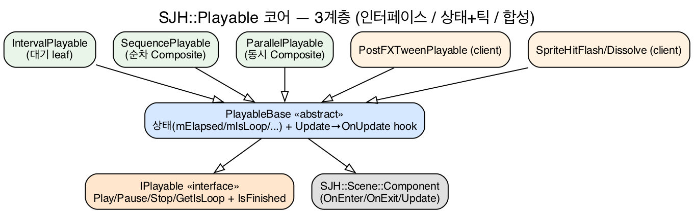
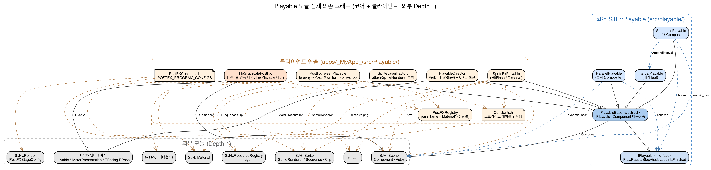
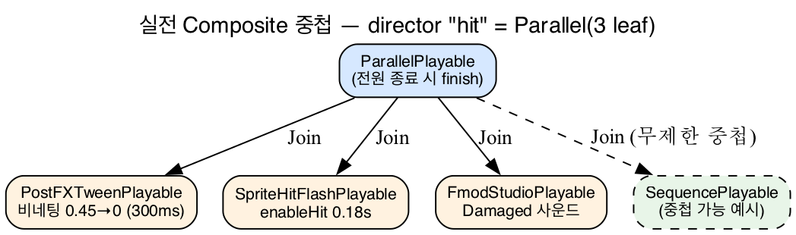

# Playable 모듈 — 시간축 연출의 합성 가능한 추상

> 코어: `src/playable/` · 클라이언트: `apps/_MyApp_/src/Playable/`
> 벤치마킹: DOTween(Sequence 빌더) · Unity Playables(그래프 합성)

---

## S2. 왜 Playable인가? — 연출은 "동시에, 순서대로, 중첩되어" 일어난다

게임 한 번의 피격 = **화면 비네팅 플래시 ‖ 스프라이트 흰색 플래시 ‖ 피격 사운드** 가 *동시에*.
사망 = **디졸브 1.5초 -> (지연) -> 폭발 FX** 가 *순서대로*.

이걸 컴포넌트마다 `if (피격) { 타이머++; if (타이머>0.18) ... }` 로 흩으면:
- 연출 1개 추가 = 모든 곳에 분기 추가 (조합 폭발)
- "동시/순차/중첩"이 코드에 안 드러남
- 게임 로직(HP 계산)과 연출(깜빡임)이 한 함수에 엉김

**해결**: 연출을 *값처럼 조립 가능한 객체* = **Playable** 로 만든다.
순차는 `Sequence`, 동시는 `Parallel`, 무제한 중첩.

---

## S3. 핵심 철학 — 3계층 분리



| 계층 | 클래스 | 책임 | 한 줄 |
|---|---|---|---|
| 계약 | `IPlayable` | 무엇을 할 수 있나 | Play/Pause/Stop/Loop + IsFinished, 그게 전부 |
| 상태+틱 | `PlayableBase` | 어떻게 시간이 흐르나 | `Component`와 **다중상속** → 씬 틱에 자연 편입 |
| 합성 | `Sequence`/`Parallel` | 어떻게 조립되나 | 무제한 중첩 트리 |

**왜 다중상속?** Playable이 곧 `Component` → Actor에 붙이면 `Actor::Update`가 알아서 틱.
단, Composite의 *children*은 Actor에 안 붙으므로(`mOwner==nullptr`) Composite가 수동 `Update` 디스패치.

> **전체 모듈 의존 지도** (코어 + 클라이언트 + 외부 Depth1): 
> 코어 5개(`src/playable/`)가 `IPlayable`/`PlayableBase`로 수렴하고, 클라이언트 연출 8종이 그 위에 얹혀
> `scene`/`material`/`render`/`sprite`/`resource_registry`/`Entity`/`tweeny`로만 바깥 의존이 새는 구조.

---

## S4. 계약 = IPlayable (4-method + IsFinished)

```cpp
class IPlayable {                  // I* 컨벤션: 전부 =0, copy/move delete
  virtual void Play()  = 0;        // Pause 후 재개 / Stop 후 첫 프레임 — 단일 진입점
  virtual void Pause() = 0;        // 상태 보존 (재개 가능)
  virtual void Stop()  = 0;        // 리셋 후 정지 (Unity AudioSource.Stop 정통)
  virtual bool GetIsLoop() const = 0;
  virtual bool IsFinished() const = 0;  // Loop=true면 절대 true 안 됨
};
```

**결정 2가지**
- **Pause ≠ Stop**: Pause=중단 위치 보존, Stop=elapsed/cursor 리셋.
- **Loop 자동 재시작**: `GetIsLoop()`면 종료 시 내부 재시작 → `IsFinished()`가 영영 false.
  → Composite가 "child 끝났나?"를 `IsFinished()`로 감지하는 신호선이 된다.

---

## S5. PlayableBase — Template Method로 틱 흡수

```cpp
void Update(float dt) final {                 // override 금지(final)
    if (!IsEnabled() || mPaused || mIsFinished) return;  // 게이트
    mElapsed += dt;                            // 상태 누적은 base가
    OnUpdate(dt);                              // 연출만 자식이 (hook)
}
protected:
    virtual void OnUpdate(float dt) = 0;       // 유일 필수 override
    virtual void OnPlay()  {}                  // 선택
    virtual void OnStop()  {}                  // 선택
```

자식(leaf)은 `OnUpdate` *하나만* 구현. `mElapsed` 누적·게이트·종료판정 보일러플레이트는 base가 전부 흡수.
예) `IntervalPlayable::OnUpdate` = `if (mElapsed >= mDuration) mIsFinished = true;` 단 한 줄.

---

## S6. Composite — 순차 / 동시 / 무제한 중첩



- **SequencePlayable**: `cursor`로 현재 1개만 틱. `IsFinished()`면 다음 child `Play()`. (Loop면 cursor=0)
- **ParallelPlayable**: 전부 틱. 전원 `IsFinished()`면 자기 종료.
- **무제한 중첩**: children이 `IPlayable*` → Sequence 안에 Parallel, 그 안에 또 Sequence.

> trade-off: children은 Actor 미부착이라 Composite가 `dynamic_cast<Component*>` 후 수동 `Update`.

---

## S7. Fluent Builder — DOTween/Tweeny 정통 "배턴"

```cpp
auto par = std::make_unique<ParallelPlayable>();
par->Join(std::make_unique<PostFXTweenPlayable>("grayscale_vignetting", "uVignetteAmount",
            tweeny::from(0.45f).to(0.0f).during(300).via(tweeny::easing::sinusoidalInOut)))
   .Join(std::make_unique<SpriteHitFlashPlayable>(&spriteActor))
   .Join(std::make_unique<FmodStudioPlayable>(damagedEvt));
```

핵심: `Append`/`Insert`/`Join`/`AppendInterval`가 **derived 참조(`SequencePlayable&`)** 를 반환 →
체이닝해도 derived 메서드 유실 없음. 빌더가 트리를 "한 식"으로 조립.

---

## S8. PlayableDirector — verb → Play(key), 로직과 연출의 분리막

```cpp
director.Register("hit",  std::move(hitParallel));   // 빌드 시 등록
director.Register("death", std::move(dissolveSeq));
// ...
void ReactDamaged(int) override { Play("hit"); }     // Life sink → 연출 트리거
```

- 게임 로직(HP 계산)은 `Life::DoDamaged`. 연출은 전부 director의 named Playable.
- **컴포넌트는 VFX/사운드를 모른다** — 빌더가 seam(콜백) 주입: `life->SetOnHitFx([](pos){ VFX::Spawn("hit",pos); })`.
- 정통: Cocos `ActionManager`(named action + tick) / Unity `Animator`(trigger→clip).

---

## S9. 모든 게 Playable은 아니다 — 연속 바인딩 vs 트리거

| | HpGrayscalePostFX | PostFXTweenPlayable |
|---|---|---|
| 종류 | **일반 Component** | **Playable** |
| 동작 | HP비율을 *매 프레임 연속* uniform 기록 | 트윈을 *한 번* 재생(one-shot) |
| 시작 | 항상 (상시 바인더) | `Play("hit")` 트리거 |
| 끝 | 없음(상태 추종) | `progress>=1` → finish |

**교훈**: "시작점이 있는 일회성 연출"만 Playable. "상태를 계속 따라가는 바인딩"은 그냥 Component.
무리하게 전부 Playable로 만들지 않은 게 설계 포인트.

---

## S10. 벤치마킹 ① DOTween — "Sequence 빌더 배턴"을 그대로

DOTween (Unity 트윈 엔진):
```csharp
DOTween.Sequence()
  .Append(transform.DOMoveX(45,1))
  .Insert(0, transform.DOScale(...))   // 시간 위치에 겹쳐 삽입
  .AppendInterval(1);
```

**차용한 것**
- `Append` / `Insert` / `AppendInterval` — **메서드명까지 동일**하게 `SequencePlayable`에 이식.
- one-shot tween leaf 개념 → `PostFXTweenPlayable`(tweeny 트윈을 leaf로 래핑).
- 메서드 체이닝으로 "타임라인을 한 식으로".

**단순화한 것**
- DOTween의 `Insert(시간, tween)` 겹침(시간축 자유배치)은 → 우리는 `ParallelPlayable`(동시 시작)로 단순화.
- DOTween `Join`(직전과 동시) ≈ 우리 `ParallelPlayable::Join`.

---

## S11. 벤치마킹 ② Unity Playables — "그래프 합성 + 출력 분리"

Unity Playables (런타임 애니 그래프):
```csharp
var graph = PlayableGraph.Create("g");
var mixer = AnimationMixerPlayable.Create(graph, 2);
var output = AnimationPlayableOutput.Create(graph, "Anim", animator);
output.SetSourcePlayable(mixer);          // 출력이 그래프를 구동
graph.Connect(clipA, 0, mixer, 0);        // 노드를 트리로 배선
graph.Play();
```

**차용한 것**
- **노드 트리 합성** — Playable을 노드로 연결해 트리. 우리 `Sequence/Parallel` 무제한 중첩 = 같은 발상.
- **구동(Output) 분리** — Unity는 `PlayableOutput`이 그래프를 돌림. 우리는 **`PlayableDirector`** 가 그 역할(틱 주체 = 트리 밖).
- "동적 런타임 구성" — 빌드 시 트리를 조립.

**생략한 것**
- Unity 핵심인 **weight blend mixer**(`SetInputWeight`로 A↔B 섞기)는 우리 범위 밖. 우리는 섞지 않고 순차/동시만.

---

## S12. 한눈에 — 세 API 매핑

| 개념 | DOTween | Unity Playables | 본 프로젝트 |
|---|---|---|---|
| 합성 단위 | Sequence | PlayableGraph(트리) | Sequence/Parallel |
| 빌더 | Append/Insert/Join | graph.Connect | Append/Insert/Join/AppendInterval |
| 동시 | Insert(같은시각)/Join | Mixer+weight | ParallelPlayable |
| 대기 | AppendInterval | (timeline) | IntervalPlayable |
| leaf | Tweener(DOMoveX) | AnimationClipPlayable | PostFXTween/SpriteFx/Fmod/Effekseer |
| 구동 | DOTween 엔진(autoPlay) | PlayableOutput+graph.Play | PlayableDirector + Component tick |
| 종료 | onComplete | (graph 수명) | IsFinished + Loop |

**한 줄**: DOTween에서 *빌더 문법*을, Unity에서 *트리 합성+구동 분리*를 빌리고, weight blend는 버렸다.

---

## S13. 실전 — 피격 한 번에 무슨 일이

1. `Life::DoDamaged(dmg)` (게임 로직) → HP 차감 → `mSink->ReactDamaged()`
2. sink = `PlayableDirector` → `Play("hit")`
3. `"hit"` = `ParallelPlayable` → 3 leaf 동시 `Play()`
   - 비네팅 트윈(PostFXTween) ‖ 스프라이트 플래시(SpriteHitFlash) ‖ Damaged 사운드(Fmod)
4. 매 프레임 `Director::Update` → playing slot만 틱 → 전원 끝나면 휴면
5. 별개로 `life->SetOnHitFx` seam이 `VFX::Spawn("hit", pos)` (월드 파티클)

로직 1줄(`ReactDamaged`)이 연출 트리 전체를 트리거. 컴포넌트는 여전히 VFX를 모른다.

---

## S14. 피로 배운 함정 3가지

1. **Sequence + Effekseer = 무음 hang**
   Sequence(EffekseerPlayable → 사운드)에서 efk 핸들이 무효면 `IsFinished`가 영영 false →
   다음 child(사운드)에 도달 못 함 = 무음. **동시 연출은 반드시 Parallel.**
2. **tweeny `step` 오버로드** — `step(int32_t)`=ms, `step(float)`=[0,1] 비율.
   float로 ms를 넘기면 트윈 폭주. → `int32_t dtMs`로 명시 선언.
3. **GL_BOOL uniform 갭** — `enableHit`/`enableDissolve`(bool) 디스패치 누락 시
   셰이더에 영영 업로드 안 됨 = sprite FX 완전 무반응. 빌드는 GREEN이라 더 위험.

교훈: Composite의 `IsFinished` 계약은 *신호선*이다. leaf가 끝을 못 알리면 트리 전체가 멈춘다.

---

## S15. 정리 — Playable이 산 것

1. **합성 가능성**: 연출을 값처럼 `Append`/`Join`으로 조립, 무제한 중첩.
2. **관심사 분리**: 게임 로직(Life/HP) ↔ 연출(Director named Playable) ↔ 출력(seam 주입).
3. **정통 차용**: DOTween 빌더 문법 + Unity 그래프 합성·구동 분리, weight blend는 의도적 생략.

향후: M5 leaf Playable(Effekseer/FMOD)가 Client에 정착 → 같은 `IPlayable` 계약으로 합성.

> "연출은 if/else가 아니라 트리다." — Sequence는 순서, Parallel은 동시, IsFinished는 신호선.
