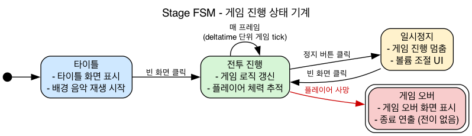

# 발표 대본 — 그래픽스 기말 프로젝트

> `[화면]` 큐 **및 멘트 본문의 함수·클래스명**은 클릭 시 해당 코드의 정확한 줄로 이동합니다 (VSCode Markdown Preview 또는 에디터에서 Cmd/Ctrl+클릭).
> 링크가 아닌 "보고서 슬라이드"는 제출 docx의 해당 페이지를 띄우세요.
>
> 발표 순서: Stage FSM → ② Renderer & Multi Pass(3-6) → ③ Bloom(3-7) → ④ Skybox(3-7). (① Parametric은 주석 보관)

---

<!-- ## ① Parametric Surface (보고서 3-5, 10~11p · 약 1분)

"**Parametric Surface**를 설명드리겠습니다. 구·원기둥·원판 같은 곡면을 정점 하나하나 코드로 찍는 건, CCW 와인딩이나 법선까지 다 맞춰야 해서 너무 번거롭습니다. 그래서 이걸 **자동화**하려고 도입했습니다."

"핵심은 (u, v) 두 매개변수를 받아 **표면의 한 점을 돌려주는 SurfaceFunction**입니다. 같은 u, v가 들어와도 이 함수가 무엇이냐에 따라 모델 모양이 완전히 달라집니다 — x, y, z 각각이 (u, v)의 함수인 거죠."

> `[화면]` 보고서 ② 수식 `x=fₓ(u,v), y=f_y(u,v), z=f_z(u,v)`

"생성할 땐 u·v 각각의 **정의역**, 즉 시작·끝 범위와, 얼마나 촘촘히 쪼갤지 **해상도**를 입력받습니다. uRes 곱하기 vRes가 곧 만들어질 Quad 메시의 개수입니다."

> `[화면]` 보고서 ① — "정의역(us·ue, vs·ve)과 해상도(uRes·vRes) 입력 / uRes×vRes = Quads Count"

"SurfaceFunction의 예로 **Sphere**를 보면, v는 위도, u는 경도로 매핑돼서 R·cos(위도)·cos(경도) 같은 구면좌표 식으로 위치가 나옵니다."

> `[화면]` 보고서 ② — `v는 위도 lat = v·π − π/2, u는 경도 lon → (R·cos(lat)·cos(lon), R·sin(lat), −R·cos(lat)·sin(lon))`

"실제 모델링은, 정점이 Quad보다 가로·세로 하나씩 더 많아야 하니 **(uRes+1)×(vRes+1)개를 격자로** 찍습니다. Δu·Δv 간격으로 한 칸씩 옮겨가며 각 격자점을 SurfaceFunction에 넣어 위치를 구하고, 텍스처 좌표는 격자 인덱스를 해상도로 나눈 정규화 값을 씁니다."

> `[화면]` [`geometry.cpp` → `BuildSphereIndexed`](../../src/object/geometry.cpp#L423) — `numCols = uRes+1; numRows = vRes+1;` 격자 이중 루프 + `uv = (col/uRes, row/vRes)`

"법선은 보통 두 접선 벡터를 외적해 구하지만, **Sphere는 중심이 원점이라 정점의 위치 벡터를 정규화하면 그대로 법선**이 되어, 외적 없이 해석적으로 간단히 구합니다. 이상입니다."

> `[화면]` [`geometry.cpp:458`](../../src/object/geometry.cpp#L458) — 구면 법선 = 위치 정규화 `vmath::normalize(glm::vec3(px, py, pz))`

> **한 줄 흐름**: 정점 코딩 자동화 → (u,v)→점 `SurfaceFunction` → 정의역·해상도로 `(uRes+1)×(vRes+1)` 격자 생성 → Sphere는 위치 정규화로 법선까지 해석적.

--- -->

## Stage FSM — 게임 진행 상태 머신 (약 1분)

> ↑ 이미지 클릭 시 다이어그램이 열립니다 (`doc/diagrams/stage-fsm.png`).

"게임 전체 진행을 관리하는 **Stage 상태 머신**을 설명드리겠습니다. 상태는 **타이틀 · 전투 진행 · 일시정지 · 게임 오버** 네 가지이고, 각각을 [`EStageStatus`](../../apps/_MyApp_/src/Stage/Stage.h#L31)라는 `uint64_t` 비트 플래그 하나로 표현합니다."

> `[화면]` [`Stage.h:31`](../../apps/_MyApp_/src/Stage/Stage.h#L31) — `EStageStatus`(Title / CombatPlay / Pause / GameOver 비트)

"구조는 두 부분입니다. **[`StateMachine`](../../src/fsm/state_machine.h#L66)이 상태 객체들을 언 오더드 맵 컨테이너로 포함하고 있는 객체**가 되고, 각 상태(Title / CombatPlay / Pause / GameOver)는 [`IFsmState`](../../src/fsm/fsm_state.h#L43) 인터페이스를 구현합니다. 
핵심은 각 상태가 [`GetStateFlag`](../../src/fsm/fsm_state.h#L50)로 '내가 누구', [`GetTransitFlag`](../../src/fsm/fsm_state.h#L56)로 '내가 갈 수 있는 곳'을 스스로 노출합니다. 이를 통해 상태 전환에 있어서 스테이트 플래그와 트랜짓 플래그를 비트 연산으로 전이 가능 유무를 판단할 수 있습니다.

> `[화면]` [`fsm_state.h:50`](../../src/fsm/fsm_state.h#L50) `GetStateFlag` · [`:56`](../../src/fsm/fsm_state.h#L56) `GetTransitFlag` · [`state_machine.h:66`](../../src/fsm/state_machine.h#L66) `StateMachine`(Aggregate Root)

"전이는 [`TryTransit`](../../src/fsm/state_machine.h#L167)으로 합니다. 현재 상태의 [`GetTransitFlag`](../../src/fsm/fsm_state.h#L56)와 목적지 비트를 AND해서 허용 여부를 검증하고, 다음 State에 Pending을 수행합니다. 

실제 [`OnExit`](../../src/fsm/fsm_state.h#L69)·[`OnEnter`](../../src/fsm/fsm_state.h#L60)가 바로 호출되는게 아니라. **다음 프레임에서 실행되도록 [`Update`](../../src/fsm/state_machine.h#L157) [`ApplyPending`](../../src/fsm/state_machine.h#L196)** 합니다, 왜냐하면 Update의 내용이 다 끝나지도 않았는데 넘어가면서 생기는 버그가 있었기 떄문입니다.

> `[화면]` [`state_machine.h:104`](../../src/fsm/state_machine.h#L104) `TryTransit`(즉시 검증) · [`:196`](../../src/fsm/state_machine.h#L196) `ApplyPending`(다음 프레임 OnExit→OnEnter)

"상태마다 동작이 다릅니다. **[`OnEnter`](../../src/fsm/fsm_state.h#L60)가 GUI를 띄우고** — [타이틀 화면](../../apps/_MyApp_/src/Stage/State/StageState.Impl.h#L79)(`TitleState::OnEnter`), [일시정지 볼륨 UI](../../apps/_MyApp_/src/Stage/State/StageState.Impl.h#L198)(`PauseState::OnEnter`), 

> `[화면]` 구상 State 4종 ([`StageState.Impl.h`](../../apps/_MyApp_/src/Stage/State/StageState.Impl.h)) — [`TitleState`](../../apps/_MyApp_/src/Stage/State/StageState.Impl.h#L69) · [`CombatPlayState`](../../apps/_MyApp_/src/Stage/State/StageState.Impl.h#L123) · [`PauseState`](../../apps/_MyApp_/src/Stage/State/StageState.Impl.h#L188) · [`GameOverState`](../../apps/_MyApp_/src/Stage/State/StageState.Impl.h#L262) 각각의 `OnEnter`(GUI) / `OnUpdate`(동작) 구현

그리고 **플레이어가 죽으면** [`WaveController`](../../apps/_MyApp_/src/Stage/WaveController.cpp#L130)가 [`SetOnDeath`](../../apps/_MyApp_/src/Stage/WaveController.cpp#L52)로 켜둔 [`mPlayerDead`](../../apps/_MyApp_/src/Stage/WaveController.cpp#L133) 플래그를 보고 [`TryTransit`](../../apps/_MyApp_/src/Stage/WaveController.cpp#L135)으로 게임 오버로 넘깁니다. 이상입니다."
[게임 오버 화면](../../apps/_MyApp_/src/Stage/State/StageState.Impl.h#L272)(`GameOverState::OnEnter`) — **[`OnUpdate`](../../src/fsm/fsm_state.h#L65)가 상태별 로직**을 돌립니다. [전투 진행 상태](../../apps/_MyApp_/src/Stage/State/StageState.Impl.h#L150)(`CombatPlayState::OnUpdate`)에선 매 프레임 게임 로직을 갱신하고 플레이어 체력을 추적하죠 (다이어그램의 '매 프레임 deltatime 단위 게임 tick')."

> `[화면]` [`WaveController.cpp:133`](../../apps/_MyApp_/src/Stage/WaveController.cpp#L133) `mPlayerDead` 감지 → [`:135`](../../apps/_MyApp_/src/Stage/WaveController.cpp#L135) `TryTransit(GameOver)` · [`:52`](../../apps/_MyApp_/src/Stage/WaveController.cpp#L52) 사망 observer 등록

---

## ② Renderer & Multi Pass Rendering (보고서 3-6 · 약 2분)

**전제 — 어디에 그리나**

"이 엔진의 단 하나의 대전제는, **카메라마다 자기 앞에 '그림판'(렌더 타겟, FBO)이 한 장 붙어 있다**는 것입니다. 카메라가 그리는 모든 것은 화면이 아니라 그 텍스처에 *먼저* 그려집니다 — Unity의 `Camera.targetTexture`와 같은 발상이죠. 3D 장면은 [`sceneFB`](../../apps/_MyApp_/main.cpp#L110)라는 오프스크린 텍스처에 그려집니다."

> `[화면]` [`camera.h:145`](../../src/scene/camera.h#L145) (Camera가 자기 RenderTarget 보유) · [`main.cpp:110`](../../apps/_MyApp_/main.cpp#L110) (`sceneFB`를 깊이 텍스처까지 가진 FBO로 생성)

**멀티패스 — stage 벡터 순회**

"그럼 한 프레임은 어떻게 그려질까요? 복잡한 게 아니라, **Application이 든 [`stage 벡터(mStages)`](../../apps/_MyApp_/main.cpp#L357)를 순서대로 순회**할 뿐입니다."

> `[화면]` [`main.cpp:357`](../../apps/_MyApp_/main.cpp#L357) — `for (auto& s : mStages) s->Render(*mDefaultTarget);`

"스테이지는 [네 개로 고정](../../apps/_MyApp_/main.cpp#L173)돼 있습니다 — `worldCam` → [`ParticleStage`](../../apps/_MyApp_/src/VFX/ParticleStage.cpp#L57) → `screenCam` → `ScreenQuadStage`. 앞 두 개는 3D 씬을 `sceneFB`에 그리는 일반 패스, 뒤 두 개는 후처리와 최종 화면 출력입니다."

> `[화면]` [`main.cpp:173`](../../apps/_MyApp_/main.cpp#L173) (mStages 셋업 — CameraStage 2개 + ParticleStage + ScreenQuadStage)

**1패스의 코어 — 무엇을 언제 보내나**

"한 패스를 실제로 그리는 코어는 [`SceneRenderer::RenderWithCamera`](../../src/render/scene_renderer.cpp#L71)입니다. 순서가 분명합니다 — ① 켜진 조명만 수집해서 ② [`LightUniformDispatcher`](../../src/render/light_uniform_dispatcher.cpp#L32)로 모든 셰이더에 *한 번에* 보내고, ③ [`CollectFromActor`](../../src/render/scene_renderer.cpp#L127)로 액터 트리를 DFS로 훑어 그릴 대상을 [`DrawCommand`](../../src/render/mesh_pass_processor.h#L55) 큐에 담고, ④ [`SortMultiStage`](../../src/render/scene_renderer.cpp#L128)로 불투명·투명 순으로 정렬한 뒤, ⑤ [`MeshPassProcessor`](../../src/render/mesh_pass_processor.cpp#L95)가 실제 GL 드로우를 발행합니다."

> `[화면]` [`scene_renderer.cpp:71`](../../src/render/scene_renderer.cpp#L71) (RenderWithCamera) · [`:124`](../../src/render/scene_renderer.cpp#L124) Dispatch · [`:127`](../../src/render/scene_renderer.cpp#L127) Collect · [`:128`](../../src/render/scene_renderer.cpp#L128) Sort · [`mesh_pass_processor.cpp:95`](../../src/render/mesh_pass_processor.cpp#L95) Process

"핵심 설계는, **자주 안 바뀌는 조명은 패스당 1회, 자주 바뀌는 모델 행렬은 메시 하나하나마다** 보내서 GL 상태 전환을 최소화한다는 겁니다."

**후처리 — PassComponent 선형 체인**

"후처리는 [`PassComponent`](../../src/render/pass_component.h#L48)라는 **렌더 로직이 전혀 없는 순수 데이터**로 엮습니다. 한 패스의 `OutputFB`가 다음 패스의 `InputFB`와 *같은 포인터*라서, fog → bloom → vignette가 FBO에서 FBO로 줄줄이 흐르는 **선형 체인**이 됩니다."

> `[화면]` [`pass_component.h:48`](../../src/render/pass_component.h#L48) (InputFB/OutputFB 포인터만 보유) · [`render_pipeline.cpp:82`](../../src/render/render_pipeline.cpp#L82) (BuildPostFXChain — prevFB→fbPtr 연결)

**외부 모듈 — Effekseer · ImGui**

"마지막으로 외부 모듈입니다. Effekseer는 [`IRenderStage`](../../src/render/render_stage.h#L44)를 상속한 **[`ParticleStage`](../../apps/_MyApp_/src/VFX/ParticleStage.cpp#L57)로 '위장'**시켜 리스트 중간에 끼우고, 월드 카메라의 `sceneFB`를 대신 bind해 그 위에 [`VFXSystem::Draw`](../../apps/_MyApp_/src/VFX/VFXSystem.cpp#L84)로 파티클을 얹습니다."

> `[화면]` [`ParticleStage.cpp:57`](../../apps/_MyApp_/src/VFX/ParticleStage.cpp#L57) (sceneFB BindTarget) · [`:79`](../../apps/_MyApp_/src/VFX/ParticleStage.cpp#L79) (VFXSystem.Draw)

"반면 ImGui는 패스로 만들지 않고, **모든 stage가 끝난 뒤** [백버퍼 위에 직접 얹습니다](../../apps/_MyApp_/main.cpp#L361) — 직전 ScreenQuadStage가 백버퍼를 bind해둔 상태를 그대로 이용하는 거죠."

> `[화면]` [`main.cpp:361`](../../apps/_MyApp_/main.cpp#L361) (mImGuiStack.RenderAll → ImGui::Render)

"정리하면, 모든 렌더링은 '카메라 앞 텍스처 위에 무언가를 그리는' **동일한 동작의 반복**이고, 외부 모듈조차 같은 그림판 체계 안으로 흡수했습니다."

---

## ③ Post-Processing — Bloom (Box Filter) (보고서 3-7 · 약 1분)

"포스트프로세싱 중 **Bloom**을 설명드리겠습니다. Bloom은 네온이나 발광체처럼 밝은 부분이 빛 번짐으로 주변에 새어 나오게 하는 효과인데, 세 조각의 조합입니다."

> `[화면]` [`bloom.fs`](../../apps/_MyApp_/resources/shaders/postprocess/bloom.fs) — 전체 셰이더를 띄우고 아래 세 부분을 차례로 짚는다.

"먼저 **휘도**입니다. [`dot(rgb, vec3(0.299, 0.587, 0.114))`](../../apps/_MyApp_/resources/shaders/postprocess/bloom.fs#L29)로 RGB를 밝기 한 숫자로 합치는데, 가중치가 다른 건 사람 눈이 초록을 가장 민감하게 보기 때문입니다(Rec.709)."

> `[화면]` [`bloom.fs:29`](../../apps/_MyApp_/resources/shaders/postprocess/bloom.fs#L29) — `float lum = dot(samp, vec3(0.299, 0.587, 0.114));`

"다음은 **bright-pass**. [`step`](../../apps/_MyApp_/resources/shaders/postprocess/bloom.fs#L30) 함수로 밝기가 문턱보다 큰 픽셀만 1로 골라내고, 어두운 픽셀은 0으로 버립니다 — 밝은 부분만 추출하는 거죠."

> `[화면]` [`bloom.fs:30`](../../apps/_MyApp_/resources/shaders/postprocess/bloom.fs#L30) — `bloom += samp * step(uBloomThreshold, lum);`

"핵심은 **박스 블러**입니다. 한 픽셀을 그릴 때 [주변 9×9, 즉 81칸을 모두 *똑같은 비중*으로 평균](../../apps/_MyApp_/resources/shaders/postprocess/bloom.fs#L22)냅니다. 가우시안 블러는 가운데일수록 비중이 큰 종 모양 가중이지만, 박스 블러는 균일 가중이라 구현이 훨씬 쌉니다. 이 평균 덕분에 밝은 점이 이웃으로 퍼져 흐릿한 덩어리가 됩니다."

> `[화면]` [`bloom.fs:22~33`](../../apps/_MyApp_/resources/shaders/postprocess/bloom.fs#L22) — 9×9 이중 for 루프 + `bloom /= 81.0;`

"마지막으로 원본 색에 이 번진 빛을 그냥 [**더합니다**(additive)](../../apps/_MyApp_/resources/shaders/postprocess/bloom.fs#L37). 섞거나 빼지 않고 더하니까 밝은 곳이 더 밝아지면서 글로우가 완성됩니다. 이상입니다."

> `[화면]` [`bloom.fs:37`](../../apps/_MyApp_/resources/shaders/postprocess/bloom.fs#L37) — `fragColor = vec4(base + bloom * uBloomIntensity, 1.0);`

> **한 줄 흐름**: [휘도](../../apps/_MyApp_/resources/shaders/postprocess/bloom.fs#L29)로 밝기 측정 → [`step`](../../apps/_MyApp_/resources/shaders/postprocess/bloom.fs#L30)으로 밝은 픽셀만 추출 → [9×9 박스 블러](../../apps/_MyApp_/resources/shaders/postprocess/bloom.fs#L22)로 번지게 → [원본에 덧셈](../../apps/_MyApp_/resources/shaders/postprocess/bloom.fs#L37).

---

## ④ Skybox — 구면좌표계 (보고서 3-7 · 약 1분)

"매트릭스 **스카이박스**의 구면좌표 구현을 설명드리겠습니다. 스카이박스는 한마디로 '바라보는 방향을 받아 칠할 색을 돌려주는 함수'입니다. 프래그먼트마다 단위 방향벡터 d를 받아 2D 텍스처 좌표로 바꾸는데, 이게 **구면좌표 ↔ 평면 투영**입니다."

> `[화면]` [`matrix_skybox.fs`](../../apps/_MyApp_/resources/shaders/matrix_skybox.fs) — 방향벡터 `v`를 받는 부분부터.

"핵심은 **역매핑**입니다. 텍셀을 화면에 뿌리는(forward) 게 아니라, 그려질 화면 픽셀마다 '이 방향은 텍스처 어디서 가져오지?'를 *거꾸로* 계산합니다(inverse). GPU는 출력 픽셀마다 정확히 한 번씩 읽으니 구멍도 겹침도 없죠."

"방향벡터에서 두 각을 구합니다 — 경도 θ는 [`atan2(z, x)`](../../apps/_MyApp_/resources/shaders/matrix_skybox.fs#L35), 위도 φ는 [`asin(y)`](../../apps/_MyApp_/resources/shaders/matrix_skybox.fs#L35)입니다. d가 단위벡터라 y가 곧 sinφ여서 `asin` 한 번이면 위도가 나오고, `atan` 대신 `atan2`를 쓰는 건 좌우 한 바퀴를 부호 두 개로 구분하기 위해서입니다."

> `[화면]` [`matrix_skybox.fs:35`](../../apps/_MyApp_/resources/shaders/matrix_skybox.fs#L35) — `vec2 uv = vec2(atan(v.z, v.x), asin(v.y));  // (θ, φ)`

"그다음 각을 2π, π로 나눠 **정규화**하면 UV 좌표가 됩니다. 코드로는 `atan`·`asin` 두 줄에 [`invAtan`](../../apps/_MyApp_/resources/shaders/matrix_skybox.fs#L10) 상수만 [곱하면 끝](../../apps/_MyApp_/resources/shaders/matrix_skybox.fs#L36)입니다. 지구본의 경위도 격자를 세계지도처럼 평면으로 편 셈이죠."

> `[화면]` [`matrix_skybox.fs:36`](../../apps/_MyApp_/resources/shaders/matrix_skybox.fs#L36) — `uv *= invAtan;  // (θ/2π, φ/π) = (U, V)` ([상수 정의 L10](../../apps/_MyApp_/resources/shaders/matrix_skybox.fs#L10))

"마지막으로 매트릭스 효과는 이 UV를 [`floor`](../../apps/_MyApp_/resources/shaders/matrix_skybox.fs#L47)/[`fract`](../../apps/_MyApp_/resources/shaders/matrix_skybox.fs#L48)로 글자 격자(256×128 칸)로 잘라, `floor`로 어느 칸인지 고르고 `fract`로 칸 안 글자를 샘플해 완성합니다. 이상입니다."

> `[화면]` [`matrix_skybox.fs:47~48`](../../apps/_MyApp_/resources/shaders/matrix_skybox.fs#L47) — `floor(grid_uv)` = 칸 번호 / `fract(grid_uv)` = 칸 안 위치.

> **한 줄 흐름**: 방향 d → 역투영으로 [θ=atan2(z,x)·φ=asin(y)](../../apps/_MyApp_/resources/shaders/matrix_skybox.fs#L35) → [2π·π로 나눠 UV](../../apps/_MyApp_/resources/shaders/matrix_skybox.fs#L36) → [floor/fract로 글자 격자](../../apps/_MyApp_/resources/shaders/matrix_skybox.fs#L47).
