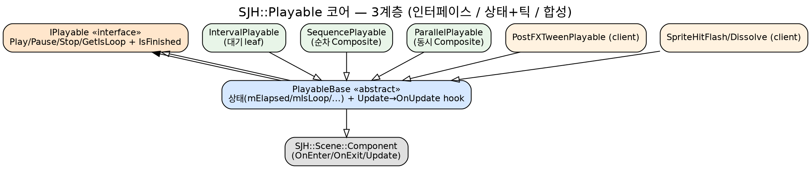
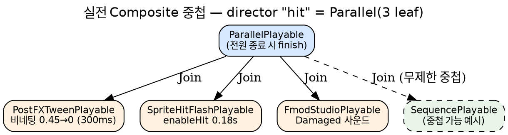

# Playable 모듈 발표자료 제작 Implementation Plan

> ⚠ 2026-06 시점 문서 (archival) — 코드 경로는 작성 당시 기준.

> **For agentic workers:** REQUIRED SUB-SKILL: Use superpowers:subagent-driven-development (recommended) or superpowers:executing-plans to implement this plan task-by-task. Steps use checkbox (`- [ ]`) syntax for tracking.

**Goal:** `SJH::Playable` 코어 + 클라이언트 연출 레이어를 "시간축 연출의 합성 가능한 추상"으로 설명하는 발표자료(마크다운 슬라이드 + 2 다이어그램)를 만든다.

**Architecture:** 발표는 15슬라이드 1-deck. (1) 문제정의 -> (2) 3계층 철학(IPlayable/PlayableBase/Composite) -> (3) Fluent Builder -> (4) Director 분리 -> (5) DOTween/Unity Playables 벤치마킹 -> (6) 실전 사례 + 함정. 산출물은 `<doc>/report/Playable.md`(발표 본문) + `doc/diagrams/playable-class.{dot,png}`(상속 클래스도) + `doc/diagrams/playable-composite-tree.{dot,png}`(Composite 중첩 트리). 발표 "소프트웨어"가 아니므로 TDD 대신 *코드/레퍼런스 대조 검증*을 각 Task 말미에 둔다.

**Tech Stack:** Markdown(슬라이드) · Graphviz `dot`(다이어그램) · 근거 코드 = `src/playable/` + `apps/_MyApp_/src/Playable/` · 외부 레퍼런스 = DOTween(`/websites/dotween_demigiant_documentation_php`) · Unity Playables(`/websites/unity3d_manual`, <Manual>/Playables.html)

---

## 사전 확정 사실 (모든 Task 공유 — 슬라이드에 인용)

### A. 코어 3계층 (`src/playable/`)
- `IPlayable` (iplayable.h) — 순수 인터페이스. 4-method `Play/Pause/Stop/GetIsLoop` + 2급 `IsFinished`. `I*` 컨벤션(모든 멤버 `=0`, protected ctor, copy/move `delete`). 결정 #1 = Pause(상태보존 재개) vs Stop(리셋 후 정지, Unity `AudioSource.Stop` 정통). 결정 #2 = Loop=true면 자동 재시작 -> `IsFinished()` 절대 true 안 됨.
- `PlayableBase : IPlayable, SJH::Scene::Component` (playable_base.h) — **다중 상속** abstract. 상태 `mPaused/mIsFinished/mElapsed/mIsLoop` 보유. `Play/Pause/Stop` trivial 구현. `Update(float) final` 가 `!IsEnabled()||mPaused||mIsFinished` 게이트 후 `mElapsed += dt` 누적하고 `OnUpdate(dt)` hook 디스패치(Template Method). `SetIsLoop`는 세팅 단계 속성이라 인터페이스 밖(결정 #5-부속). dtor out-of-line(playable_base.cpp) = 다중상속 vtable anchor.
- `IntervalPlayable : PlayableBase` (interval_playable.h) — `mElapsed >= mDuration`이면 `mIsFinished=true`. leaf 대기.
- `SequencePlayable : PlayableBase` (composite_playable.{h,cpp}) — 순차. `mPlayableCursor`로 현재 child 1개만 Update, `IsFinished()`면 `++cursor` + 다음 `Play()`. Loop면 cursor=0 재시작. Builder: `Append`/`Insert(pos)`/`AppendInterval(sec)` 가 `SequencePlayable&` 반환.
- `ParallelPlayable : PlayableBase` — 동시. 전 children Update, 전원 `IsFinished()`면 자기 `mIsFinished=true`. Builder: `Join` 이 `ParallelPlayable&` 반환.
- **Composite children 디스패치 trade-off** (composite_playable.cpp:84, 126): children은 Actor 미부착(`mOwner==nullptr`)이라 Composite가 `IPlayable*` -> `SJH::Scene::Component*` 로 `dynamic_cast` 후 `IsEnabled()` 검사 -> `Update(dt)` 수동 호출.

### B. 클라이언트 레이어 (`apps/_MyApp_/src/Playable/`)
- `PlayableDirector : Component, IActorPresentation` (PlayableDirector.{h,cpp}) — named Playable 레지스트리. `Register(key, playable)` -> `Play(key)`는 `Stop()+Play()`(첫 프레임 보장) + slot.playing=true. `Update`는 playing && !IsFinished slot만 tick(완료 즉시 휴면). `IActorPresentation` sink: `ReactDamaged->Play("hit")` / `ReactDied->Play("death")` / `ReactAttack->Play("attack")`. 4방향x2포즈=8그룹 `SpriteRenderer` 가시성 토글(`SetFacing/SetPose->Apply->SetActive`). 정통 = Cocos `ActionManager` / Unity `Animator` trigger.
- `PostFXTweenPlayable : PlayableBase` (PostFXTweenPlayable.cpp) — leaf. `tweeny::tween<float>` -> `PostFXRegistry::Material(pass)->Properties.Floats[uniform]` 기록. `OnPlay`=`seek(0)`, `OnUpdate`=`step(int32_t ms)`(float 오버로드 금지 — 폭주 함정), `progress()>=1`이면 one-shot finish.
- `HpGrayscalePostFX : Component` (**Playable 아님!**) — HP비율 [0,1]을 매 프레임 uniform에 *연속* 기록. 트리거가 아니라 연속 상태 바인딩이라 Director Playable이 아닌 **일반 Component**(설계 결정의 핵심 대비).
- `SpriteHitFlashPlayable` / `SpriteDissolvePlayable : PlayableBase` (SpriteFxPlayable.cpp) — leaf. 대상 Actor 서브트리 DFS로 모든 `SpriteRenderer`의 `enableHit`/`enableDissolve`+`dissolveThreshold` 구동. player/enemy 공용(target만 교체).
- `PostFXRegistry` — Meyer's 싱글톤. passName->Material* 비소유(서비스 로케이터). Material 소유는 PassComponent.
- `SpriteLayerFactory::AttachSpriteLayer` — atlas find-or-create + `SpriteRenderer` 부착, `ColCount>1`이면 `SpriteSequencePlayable(loop).Play()` 자동.
- 데이터 주도 상수: `Constants.h`(스프라이트 테이블+연출 튜닝), `PostFXConstants.h`(`POSTFX_PROGRAM_CONFIGS` 배열 인덱스=실행순서).

### C. 벤치마킹 근거 (Context7 조회 완료)
- **DOTween** (`http://dotween.demigiant.com/documentation.php`): `DOTween.Sequence()` + `Append(t)` / `Insert(pos, t)`(겹침) / `Prepend(t)` / `PrependInterval(i)` / `AppendInterval(i)` 메서드 체이닝. one-shot tween leaf(`DOMoveX` 등).
- **Unity Playables** (`https://doc.unity3d.com/Manual/Playables.html`): `PlayableGraph.Create(name)` 트리, `AnimationMixerPlayable.Create(graph, n)` + `graph.Connect(src, port, dst, port)` 노드 배선, `AnimationPlayableOutput.Create(...).SetSourcePlayable(mixer)` 출력 분리, `SetInputWeight`로 blend, `graph.Play()/Destroy()`. "dynamically creating blend graphs" + custom/script playables.

### D. 함정 (MEMORY 인용 — 실전 교훈 슬라이드)
- `sequence-playable-effekseer-hang`: Sequence(EffekseerPlayable->사운드)는 efk 핸들 무효 시 `IsFinished` 영영 false라 후속 사운드 미도달 = 무음. **동시 연출은 Parallel**.
- `tweeny_step_overload_trap`: `step(int32_t)`=ms / `step(float)`=[0,1]. float로 ms 넘기면 폭주.
- `propertyblock_gl_bool_gap`: GL_BOOL uniform 디스패치 누락 시 `enableHit`/`enableDissolve` 영영 미업로드 = sprite FX 무반응.

---

## File Structure

- Create: `<doc>/report/Playable.md` — 발표 본문(15슬라이드, `---` 슬라이드 구분). 한국어.
- Create: `doc/diagrams/playable-class.dot` + `.png` — 코어 상속 클래스도(IPlayable/Component -> PlayableBase -> leaf/Composite).
- Create: `doc/diagrams/playable-composite-tree.dot` + `.png` — "hit" Parallel 실전 Composite 중첩 트리.
- (참조 전용, 수정 금지) `src/playable/*`, `apps/_MyApp_/src/Playable/*`.

각 슬라이드는 자기완결적(독립적으로 말이 됨). 다이어그램 2장은 본문이 참조.

---

## Task 1: 발표 골격 + 제목/문제정의 슬라이드 (S1~S2)

**Files:**
- Create: `<doc>/report/Playable.md`

- [ ] **Step 1: 파일 헤더 + S1(제목) + S2(문제정의) 작성**

아래 내용을 그대로 작성:

```markdown
# Playable 모듈 — 시간축 연출의 합성 가능한 추상

> 코어: `src/playable/` · 클라이언트: `apps/_MyApp_/src/Playable/`
> 벤치마킹: DOTween(Sequence 빌더) · Unity Playables(그래프 합성)

---

## S2. 왜 Playable인가? — 연출은 "동시에, 순서대로, 중첩되어" 일어난다

게임 한 번의 피격 = **화면 비네팅 플래시 ‖ 스프라이트 흰색 플래시 ‖ 피격 사운드** 가 *동시에*.
사망 = **디졸브 1.5초 -> (지연) -> 폭발 FX** 가 *순서대로*.

이걸 컴포넌트마다 `if (피격) { 타이머++; if (타이머>0.18) ... }` 로 흩으면:
- 연출 1개 추가 = 모든 곳에 분기 추가 (조합 폭발)
- "동시/순차/중첩"이 코드에 안 드러남
- 게임 로직(HP 계산)과 연출(깜빡임)이 한 함수에 엉김

**해결**: 연출을 *값처럼 조립 가능한 객체* = **Playable** 로 만든다.
순차는 `Sequence`, 동시는 `Parallel`, 무제한 중첩.
```

- [ ] **Step 2: 코드 대조 검증**

확인: `apps/_MyApp_/src/Bootstrap/PlayerBuilder.cpp:140-148` 의 `"hit"` = `ParallelPlayable`에 비네팅(`PostFXTweenPlayable`) + `SpriteHitFlashPlayable` + `FmodStudioPlayable` 3개 `Join` — S2의 "피격=3개 동시" 주장과 일치하는지 확인.
Expected: `par->Join(...)` 3회 = 주장 일치.

---

## Task 2: 3계층 철학 슬라이드 + 클래스 다이어그램 (S3)

**Files:**
- Create: `doc/diagrams/playable-class.dot`
- Modify: `<doc>/report/Playable.md` (S3 추가)

- [ ] **Step 1: 클래스 다이어그램 .dot 작성**

`doc/diagrams/playable-class.dot`:



(주의: `IPlayable -> PlayableBase [dir=back]` 한 줄은 오타 방지용 중복 — Step 3에서 제거하고 `PlayableBase -> IPlayable` 만 남길 것.)

- [ ] **Step 2: 잘못된 중복 엣지 제거**

`.dot`에서 `IPlayable -> PlayableBase [dir=back];  // ...` 줄을 삭제(상속은 자식->부모 `PlayableBase -> IPlayable` 하나만 유지).

- [ ] **Step 3: 렌더 + 검증**

Run: `dot -Tpng -Gdpi=140 doc/diagrams/playable-class.dot -o doc/diagrams/playable-class.png`
Expected: 에러 없이 PNG 생성. `PlayableBase`가 `IPlayable`+`Component` 둘 다로 화살표(다중상속), leaf 5종이 `PlayableBase`로.

- [ ] **Step 4: S3 슬라이드 작성** (`<doc>/report/Playable.md`에 추가)

```markdown
---

## S3. 핵심 철학 — 3계층 분리


| 계층 | 클래스 | 책임 | 한 줄 |
|---|---|---|---|
| 계약 | `IPlayable` | 무엇을 할 수 있나 | Play/Pause/Stop/Loop + IsFinished, 그게 전부 |
| 상태+틱 | `PlayableBase` | 어떻게 시간이 흐르나 | `Component`와 **다중상속** → 씬 틱에 자연 편입 |
| 합성 | `Sequence`/`Parallel` | 어떻게 조립되나 | 무제한 중첩 트리 |

**왜 다중상속?** Playable이 곧 `Component` → Actor에 붙이면 `Actor::Update`가 알아서 틱.
단, Composite의 *children*은 Actor에 안 붙으므로(`mOwner==nullptr`) Composite가 수동 `Update` 디스패치.
```

- [ ] **Step 5: Commit**

```bash
git add doc/diagrams/playable-class.dot doc/diagrams/playable-class.png <doc>/report/Playable.md
git commit -m "docs(playable): S1-S3 발표 골격 + 3계층 클래스도"
```

---

## Task 3: IPlayable 계약 + PlayableBase Template Method (S4~S5)

**Files:**
- Modify: `<doc>/report/Playable.md`

- [ ] **Step 1: S4(계약) 작성**

```markdown
---

## S4. 계약 = IPlayable (4-method + IsFinished)

```cpp
class IPlayable {                  // I* 컨벤션: 전부 =0, copy/move delete
  virtual void Play()  = 0;        // Pause 후 재개 / Stop 후 첫 프레임 — 단일 진입점
  virtual void Pause() = 0;        // 상태 보존 (재개 가능)
  virtual void Stop()  = 0;        // 리셋 후 정지 (Unity AudioSource.Stop 정통)
  virtual bool GetIsLoop() const = 0;
  virtual bool IsFinished() const = 0;  // Loop=true면 절대 true 안 됨
};
```

**결정 2가지**
- **Pause ≠ Stop**: Pause=중단 위치 보존, Stop=elapsed/cursor 리셋.
- **Loop 자동 재시작**: `GetIsLoop()`면 종료 시 내부 재시작 → `IsFinished()`가 영영 false.
  → Composite가 "child 끝났나?"를 `IsFinished()`로 감지하는 신호선이 된다.
```

- [ ] **Step 2: S5(PlayableBase Template Method) 작성**

```markdown
---

## S5. PlayableBase — Template Method로 틱 흡수

```cpp
void Update(float dt) final {                 // override 금지(final)
    if (!IsEnabled() || mPaused || mIsFinished) return;  // 게이트
    mElapsed += dt;                            // 상태 누적은 base가
    OnUpdate(dt);                              // 연출만 자식이 (hook)
}
protected:
    virtual void OnUpdate(float dt) = 0;       // 유일 필수 override
    virtual void OnPlay()  {}                  // 선택
    virtual void OnStop()  {}                  // 선택
```

자식(leaf)은 `OnUpdate` *하나만* 구현. `mElapsed` 누적·게이트·종료판정 보일러플레이트는 base가 전부 흡수.
예) `IntervalPlayable::OnUpdate` = `if (mElapsed >= mDuration) mIsFinished = true;` 단 한 줄.
```

- [ ] **Step 3: 코드 대조 검증**

확인: playable_base.h:108-113 의 `Update final` 게이트/누적/hook 순서가 S5 코드와 일치. iplayable.h:58-74 의 5 메서드 시그니처가 S4와 일치. interval_playable.cpp:25-30 이 "한 줄"인지 확인.
Expected: 3개 모두 일치.

- [ ] **Step 4: Commit**

```bash
git add <doc>/report/Playable.md
git commit -m "docs(playable): S4-S5 계약 + Template Method"
```

---

## Task 4: Composite 무제한 중첩 + 트리 다이어그램 (S6)

**Files:**
- Create: `doc/diagrams/playable-composite-tree.dot`
- Modify: `<doc>/report/Playable.md`

- [ ] **Step 1: Composite 트리 .dot 작성** (실전 "hit" 예시)

`doc/diagrams/playable-composite-tree.dot`:



- [ ] **Step 2: 렌더 + 검증**

Run: `dot -Tpng -Gdpi=140 doc/diagrams/playable-composite-tree.dot -o doc/diagrams/playable-composite-tree.png`
Expected: PNG 생성. Parallel 아래 3 leaf + 점선으로 중첩 Sequence.

- [ ] **Step 3: S6 슬라이드 작성**

```markdown
---

## S6. Composite — 순차 / 동시 / 무제한 중첩


- **SequencePlayable**: `cursor`로 현재 1개만 틱. `IsFinished()`면 다음 child `Play()`. (Loop면 cursor=0)
- **ParallelPlayable**: 전부 틱. 전원 `IsFinished()`면 자기 종료.
- **무제한 중첩**: children이 `IPlayable*` → Sequence 안에 Parallel, 그 안에 또 Sequence.

> trade-off: children은 Actor 미부착이라 Composite가 `dynamic_cast<Component*>` 후 수동 `Update`.
```

- [ ] **Step 4: Commit**

```bash
git add doc/diagrams/playable-composite-tree.dot doc/diagrams/playable-composite-tree.png <doc>/report/Playable.md
git commit -m "docs(playable): S6 Composite 중첩 + 트리도"
```

---

## Task 5: Fluent Builder 배턴 (S7)

**Files:**
- Modify: `<doc>/report/Playable.md`

- [ ] **Step 1: S7 작성** (실제 코드 패턴)

```markdown
---

## S7. Fluent Builder — DOTween/Tweeny 정통 "배턴"

```cpp
auto par = std::make_unique<ParallelPlayable>();
par->Join(std::make_unique<PostFXTweenPlayable>("grayscale_vignetting", "uVignetteAmount",
            tweeny::from(0.45f).to(0.0f).during(300).via(tweeny::easing::sinusoidalInOut)))
   .Join(std::make_unique<SpriteHitFlashPlayable>(&spriteActor))
   .Join(std::make_unique<FmodStudioPlayable>(damagedEvt));
```

핵심: `Append`/`Insert`/`Join`/`AppendInterval`가 **derived 참조(`SequencePlayable&`)** 를 반환 →
체이닝해도 derived 메서드 유실 없음. 빌더가 트리를 "한 식"으로 조립.
```

- [ ] **Step 2: 코드 대조 검증**

확인: composite_playable.cpp:29-46(Append/Insert/AppendInterval가 `SequencePlayable&` 반환), :97-101(Join이 `ParallelPlayable&`). PlayerBuilder.cpp:140-148 의 실제 `Join` 체인과 S7 코드 일치.
Expected: 반환 타입이 derived& 이고 PlayerBuilder 패턴 일치.

- [ ] **Step 3: Commit**

```bash
git add <doc>/report/Playable.md
git commit -m "docs(playable): S7 Fluent Builder"
```

---

## Task 6: PlayableDirector + 연속 vs 트리거 (S8~S9)

**Files:**
- Modify: `<doc>/report/Playable.md`

- [ ] **Step 1: S8(Director) 작성**

```markdown
---

## S8. PlayableDirector — verb → Play(key), 로직과 연출의 분리막

```cpp
director.Register("hit",  std::move(hitParallel));   // 빌드 시 등록
director.Register("death", std::move(dissolveSeq));
// ...
void ReactDamaged(int) override { Play("hit"); }     // Life sink → 연출 트리거
```

- 게임 로직(HP 계산)은 `Life::DoDamaged`. 연출은 전부 director의 named Playable.
- **컴포넌트는 VFX/사운드를 모른다** — 빌더가 seam(콜백) 주입: `life->SetOnHitFx([](pos){ VFX::Spawn("hit",pos); })`.
- 정통: Cocos `ActionManager`(named action + tick) / Unity `Animator`(trigger→clip).
```

- [ ] **Step 2: S9(연속 vs 트리거 — 설계 분별) 작성**

```markdown
---

## S9. 모든 게 Playable은 아니다 — 연속 바인딩 vs 트리거

| | HpGrayscalePostFX | PostFXTweenPlayable |
|---|---|---|
| 종류 | **일반 Component** | **Playable** |
| 동작 | HP비율을 *매 프레임 연속* uniform 기록 | 트윈을 *한 번* 재생(one-shot) |
| 시작 | 항상 (상시 바인더) | `Play("hit")` 트리거 |
| 끝 | 없음(상태 추종) | `progress>=1` → finish |

**교훈**: "시작점이 있는 일회성 연출"만 Playable. "상태를 계속 따라가는 바인딩"은 그냥 Component.
무리하게 전부 Playable로 만들지 않은 게 설계 포인트.
```

- [ ] **Step 3: 코드 대조 검증**

확인: HpGrayscalePostFX.h:41 이 `: public SJH::Scene::Component` (PlayableBase 아님). PostFXTweenPlayable.h:42 가 `: public PlayableBase`. PlayableDirector.cpp:32-39(Play=Stop+Play+playing=true), :112(ReactDamaged->Play("hit")).
Expected: 상속 베이스 대비가 S9 표와 일치.

- [ ] **Step 4: Commit**

```bash
git add <doc>/report/Playable.md
git commit -m "docs(playable): S8-S9 Director + 연속/트리거 분별"
```

---

## Task 7: 벤치마킹 ① DOTween (S10)

**Files:**
- Modify: `<doc>/report/Playable.md`

- [ ] **Step 1: S10 작성** (Context7 근거)

```markdown
---

## S10. 벤치마킹 ① DOTween — "Sequence 빌더 배턴"을 그대로

DOTween (Unity 트윈 엔진):
```csharp
DOTween.Sequence()
  .Append(transform.DOMoveX(45,1))
  .Insert(0, transform.DOScale(...))   // 시간 위치에 겹쳐 삽입
  .AppendInterval(1);
```

**차용한 것**
- `Append` / `Insert` / `AppendInterval` — **메서드명까지 동일**하게 `SequencePlayable`에 이식.
- one-shot tween leaf 개념 → `PostFXTweenPlayable`(tweeny 트윈을 leaf로 래핑).
- 메서드 체이닝으로 "타임라인을 한 식으로".

**단순화한 것**
- DOTween의 `Insert(시간, tween)` 겹침(시간축 자유배치)은 → 우리는 `ParallelPlayable`(동시 시작)로 단순화.
- DOTween `Join`(직전과 동시) ≈ 우리 `ParallelPlayable::Join`.
```

- [ ] **Step 2: 근거 검증**

확인: 본 plan "사전 확정 사실 C.DOTween" 의 Append/Insert/AppendInterval/Prepend 가 S10 인용과 일치(Context7 `/websites/dotween_demigiant_documentation_php` 조회분).
Expected: 메서드명/시맨틱 일치.

- [ ] **Step 3: Commit**

```bash
git add <doc>/report/Playable.md
git commit -m "docs(playable): S10 DOTween 벤치마킹"
```

---

## Task 8: 벤치마킹 ② Unity Playables + 비교표 (S11~S12)

**Files:**
- Modify: `<doc>/report/Playable.md`

- [ ] **Step 1: S11(Unity Playables) 작성**

```markdown
---

## S11. 벤치마킹 ② Unity Playables — "그래프 합성 + 출력 분리"

Unity Playables (런타임 애니 그래프):
```csharp
var graph = PlayableGraph.Create("g");
var mixer = AnimationMixerPlayable.Create(graph, 2);
var output = AnimationPlayableOutput.Create(graph, "Anim", animator);
output.SetSourcePlayable(mixer);          // 출력이 그래프를 구동
graph.Connect(clipA, 0, mixer, 0);        // 노드를 트리로 배선
graph.Play();
```

**차용한 것**
- **노드 트리 합성** — Playable을 노드로 연결해 트리. 우리 `Sequence/Parallel` 무제한 중첩 = 같은 발상.
- **구동(Output) 분리** — Unity는 `PlayableOutput`이 그래프를 돌림. 우리는 **`PlayableDirector`** 가 그 역할(틱 주체 = 트리 밖).
- "동적 런타임 구성" — 빌드 시 트리를 조립.

**생략한 것**
- Unity 핵심인 **weight blend mixer**(`SetInputWeight`로 A↔B 섞기)는 우리 범위 밖. 우리는 섞지 않고 순차/동시만.
```

- [ ] **Step 2: S12(비교표) 작성**

```markdown
---

## S12. 한눈에 — 세 API 매핑

| 개념 | DOTween | Unity Playables | 본 프로젝트 |
|---|---|---|---|
| 합성 단위 | Sequence | PlayableGraph(트리) | Sequence/Parallel |
| 빌더 | Append/Insert/Join | graph.Connect | Append/Insert/Join/AppendInterval |
| 동시 | Insert(같은시각)/Join | Mixer+weight | ParallelPlayable |
| 대기 | AppendInterval | (timeline) | IntervalPlayable |
| leaf | Tweener(DOMoveX) | AnimationClipPlayable | PostFXTween/SpriteFx/Fmod/Effekseer |
| 구동 | DOTween 엔진(autoPlay) | PlayableOutput+graph.Play | PlayableDirector + Component tick |
| 종료 | onComplete | (graph 수명) | IsFinished + Loop |

**한 줄**: DOTween에서 *빌더 문법*을, Unity에서 *트리 합성+구동 분리*를 빌리고, weight blend는 버렸다.
```

- [ ] **Step 3: 근거 검증**

확인: 본 plan "사전 확정 사실 C.Unity" 의 `PlayableGraph.Create`/`graph.Connect`/`AnimationPlayableOutput.SetSourcePlayable`/`SetInputWeight` 가 S11 인용과 일치(Context7 `/websites/unity3d_manual` 조회분). 비교표의 "본 프로젝트" 열이 사전 확정 사실 A/B와 모순 없는지.
Expected: 인용 일치 + 표 내적 정합.

- [ ] **Step 4: Commit**

```bash
git add <doc>/report/Playable.md
git commit -m "docs(playable): S11-S12 Unity Playables 벤치마킹 + 비교표"
```

---

## Task 9: 실전 사례 + 함정/교훈 (S13~S14)

**Files:**
- Modify: `<doc>/report/Playable.md`

- [ ] **Step 1: S13(실전 흐름) 작성**

```markdown
---

## S13. 실전 — 피격 한 번에 무슨 일이

1. `Life::DoDamaged(dmg)` (게임 로직) → HP 차감 → `mSink->ReactDamaged()`
2. sink = `PlayableDirector` → `Play("hit")`
3. `"hit"` = `ParallelPlayable` → 3 leaf 동시 `Play()`
   - 비네팅 트윈(PostFXTween) ‖ 스프라이트 플래시(SpriteHitFlash) ‖ Damaged 사운드(Fmod)
4. 매 프레임 `Director::Update` → playing slot만 틱 → 전원 끝나면 휴면
5. 별개로 `life->SetOnHitFx` seam이 `VFX::Spawn("hit", pos)` (월드 파티클)

로직 1줄(`ReactDamaged`)이 연출 트리 전체를 트리거. 컴포넌트는 여전히 VFX를 모른다.
```

- [ ] **Step 2: S14(함정/교훈) 작성**

```markdown
---

## S14. 피로 배운 함정 3가지

1. **Sequence + Effekseer = 무음 hang**
   Sequence(EffekseerPlayable → 사운드)에서 efk 핸들이 무효면 `IsFinished`가 영영 false →
   다음 child(사운드)에 도달 못 함 = 무음. **동시 연출은 반드시 Parallel.**
2. **tweeny `step` 오버로드** — `step(int32_t)`=ms, `step(float)`=[0,1] 비율.
   float로 ms를 넘기면 트윈 폭주. → `int32_t dtMs`로 명시 선언.
3. **GL_BOOL uniform 갭** — `enableHit`/`enableDissolve`(bool) 디스패치 누락 시
   셰이더에 영영 업로드 안 됨 = sprite FX 완전 무반응. 빌드는 GREEN이라 더 위험.

교훈: Composite의 `IsFinished` 계약은 *신호선*이다. leaf가 끝을 못 알리면 트리 전체가 멈춘다.
```

- [ ] **Step 3: 근거 검증**

확인: MEMORY 항목 `sequence-playable-effekseer-hang` / `tweeny_step_overload_trap` / `propertyblock_gl_bool_gap` 과 S14 일치. PostFXTweenPlayable.cpp:38 의 `int32_t dtMs` 실재 확인.
Expected: 3 함정 모두 코드/메모리 근거 있음.

- [ ] **Step 4: Commit**

```bash
git add <doc>/report/Playable.md
git commit -m "docs(playable): S13-S14 실전 흐름 + 함정"
```

---

## Task 10: 정리 슬라이드 + 발표 리허설 점검 (S15)

**Files:**
- Modify: `<doc>/report/Playable.md`

- [ ] **Step 1: S15(정리) 작성**

```markdown
---

## S15. 정리 — Playable이 산 것

1. **합성 가능성**: 연출을 값처럼 `Append`/`Join`으로 조립, 무제한 중첩.
2. **관심사 분리**: 게임 로직(Life/HP) ↔ 연출(Director named Playable) ↔ 출력(seam 주입).
3. **정통 차용**: DOTween 빌더 문법 + Unity 그래프 합성·구동 분리, weight blend는 의도적 생략.

향후: M5 leaf Playable(Effekseer/FMOD)가 Client에 정착 → 같은 `IPlayable` 계약으로 합성.

> "연출은 if/else가 아니라 트리다." — Sequence는 순서, Parallel은 동시, IsFinished는 신호선.
```

- [ ] **Step 2: 전체 렌더 점검**

Run: `dot -Tpng doc/diagrams/playable-class.dot -o /tmp/c.png && dot -Tpng doc/diagrams/playable-composite-tree.dot -o /tmp/t.png && echo OK`
Expected: `OK` (두 다이어그램 문법 정상).

- [ ] **Step 3: 슬라이드 수 + 링크 점검**

확인: `<doc>/report/Playable.md`가 `---`로 15섹션(S1 제목 포함). 이미지 경로 `../diagrams/playable-class.png` / `../diagrams/playable-composite-tree.png` 가 `doc/report/`기준 상대경로로 유효.
Expected: 15섹션, 이미지 2개 경로 유효.

- [ ] **Step 4: Commit**

```bash
git add <doc>/report/Playable.md
git commit -m "docs(playable): S15 정리 + 발표자료 완성"
```

---

## Self-Review (작성자 체크리스트)

**1. 요청 커버리지**
- 요청 ① "어떻게 제작/철학" → S3~S9 (3계층 + Template Method + Composite + Builder + Director + 연속/트리거 분별). ✓
- 요청 ② "다른 모범 API 벤치마킹" → S10~S12 (DOTween 빌더 차용 / Unity 그래프 합성·구동 분리 / 생략한 weight blend 명시 + 비교표). ✓
- 요청 ③ "등등" → S2 문제정의 / S13 실전 / S14 함정 / S15 정리. ✓

**2. 플레이스홀더 스캔**: 모든 슬라이드가 실제 코드 인용/표/다이어그램 보유. "TBD" 0건. ✓

**3. 타입/이름 일관성**: `SequencePlayable`/`ParallelPlayable`/`PlayableBase`/`PlayableDirector`/`PostFXTweenPlayable`/`HpGrayscalePostFX`/`SpriteHitFlashPlayable` — 전 Task 동일 표기. `Append/Insert/Join/AppendInterval` 일관. ✓

**4. 근거**: 각 콘텐츠 Task에 "코드 대조 검증" 또는 "근거 검증" 스텝 — 슬라이드 주장이 실제 파일 라인/Context7 조회분과 대조됨. ✓
