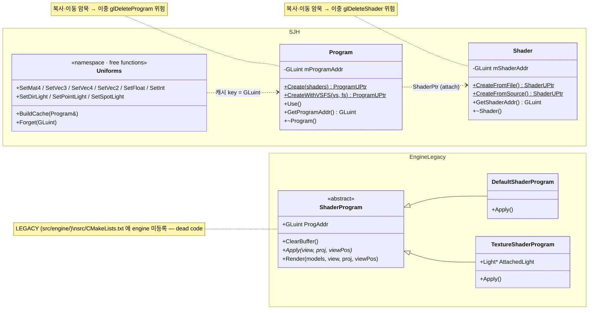
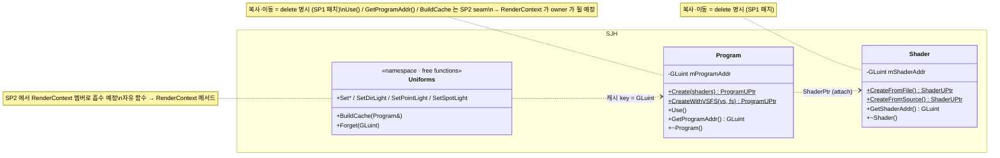

# SP1 — Shader/Program 리소스 통합 설계

> ⚠ 2026-05 시점 문서 (archival) — 코드 경로는 작성 당시 기준.

날짜: 2026-05-20
대상: `src/shader/shader.{h,cpp}`, `src/program/program.{h,cpp}`, `src/program/program_uniforms.{h,cpp}`, 삭제 대상 `src/engine/shader_program.{h,cpp}`

## 0. 상위 컨텍스트 — ECS 렌더링 아키텍처 재설계

본 스펙은 4단계 서브 프로젝트 분해의 **SP1**. 전체는 EnTT 기반 ECS 렌더링 아키텍처로의 전환이다.

```
 SP1  Shader/Program 리소스 통합          ◀ 본 스펙
 SP2  RenderContext (저수준)              — glUseProgram + uniform 흡수 + RenderTarget 추상
 SP3  ECS 컴포넌트 + RenderSystem         — EnTT 도입, Transform/Mesh/Material/MeshRenderer
 SP4  멀티패스 & 포스트프로세싱           — 스펙만, 구현은 후속 요청 시
```

SP1은 ECS 도입 전 *리소스 계층*만 정리한다. 행위(render, apply, bind)는 SP2/SP3가 흡수.

## 1. 동기

- `Engine::Program::ShaderProgram` (`src/engine/shader_program.{h,cpp}`)은 `src/CMakeLists.txt`에서 `add_subdirectory(engine)`이 빠져 **빌드 미등록 dead code**.
- 대체 모듈 `SJH::Shader`(per-stage 컴파일 RAII) + `SJH::Program`(N개 셰이더 link RAII) + `SJH::Uniforms`(외부 캐시 자유 함수 family)가 이미 깨끗하게 분리되어 존재하며 의존 방향 `SJH::program → SJH::shader` 가 올바름.
- 그러나 `SJH::Shader` / `SJH::Program` 모두 **복사·이동 생성자가 암묵적으로 생성**되어 있어 자원 핸들 이중 해제 위험을 안고 있음. 예: `Program copy = *prog;` 이 컴파일되고 → 소멸 시 `glDeleteProgram` 2회.

목표:
- 레거시 `Engine::Program::ShaderProgram`을 *물리적으로* 제거한다.
- `SJH::Shader` / `SJH::Program`을 정식 리소스로 확정하고 RAII 의미론을 **명시적으로** 강화한다.
- SP2가 흡수할 표면(seam)을 문서화한다. 코드는 변경하지 않는다.

## 2. 접근법

### 채택 — 표면 정리 + correctness 패치 + seam 메모

물리적 변경은 (a) 레거시 2파일 삭제, (b) `SJH::Shader` / `SJH::Program`의 복사·이동 `= delete` 명시. 구조 변경 없음.

### 기각 — 디렉토리 통합

`src/program/`을 `src/shader/`로 물리 합치는 안은 기각. 이미 두 모듈은 `SJH::program → SJH::shader` 로 의존 방향이 올바른 별도 CMake 라이브러리이며, 합치면 모듈 경계가 흐려진다.

### 기각 — Program 팩토리에 RenderContext 결합

캐시(BuildCache/Forget)를 RenderContext로 옮기며 Program의 팩토리에 RenderContext 의존을 주입하는 안은 SP2 범위로 미룬다. SP1에서는 `program_uniforms`를 그대로 둔다.

## 3. Before / After 클래스 다이어그램

### Before — 현재 cleanup 브랜치



### After SP1



## 4. 변경 사항 — file-by-file

### 4.1 삭제

| 파일 | 비고 |
|------|------|
| `<src>/engine/shader_program.cpp` | `add_subdirectory(engine)` 가 `src/CMakeLists.txt`에 없어 이미 빌드 미참여 — 안전 |
| `<src>/engine/shader_program.h` | 동일 |

`src/engine/` 의 다른 잔여(`camera.h`, `model_base.{h,cpp}`, `scene_graph.{h,cpp}`, `transform.h`)는 **SP1 범위 밖** — SP3 ECS 컴포넌트 재설계 시 정리.

### 4.2 수정 — `src/program/program.h`

`SJH::Program` 의 복사·이동 생성자/대입연산자를 **명시적 `= delete`** 로 차단한다.

```cpp
class Program
{
public:
    // ... 기존 public API ...
    Program(const Program&) = delete;
    Program& operator=(const Program&) = delete;
    Program(Program&&) = delete;
    Program& operator=(Program&&) = delete;
    ~Program();
    // ...
private:
    Program() = default;
    // ...
};
```

이동도 차단하는 이유: 팩토리가 `unique_ptr` 로만 반환하므로 외부에서 이동할 경로 자체가 없음. 미래 버그를 표면에서 차단.

### 4.3 수정 — `src/shader/shader.h`

`SJH::Shader` 에 동일 패치 적용 (`glDeleteShader` 이중 호출 위험 동일).

```cpp
class Shader
{
public:
    // ... 기존 public API ...
    Shader(const Shader&) = delete;
    Shader& operator=(const Shader&) = delete;
    Shader(Shader&&) = delete;
    Shader& operator=(Shader&&) = delete;
    ~Shader();
    // ...
private:
    Shader() = default;
    // ...
};
```

### 4.4 문서화 — SP2 seam 메모 (doxygen 주석만)

`src/program/program.h` 의 `Program::Use()` 와 클래스 doxygen 블록, `src/program/program_uniforms.h` 의 namespace 블록에 다음 의미의 한 줄을 추가한다.

```cpp
/// @note (SP2) RenderContext 가 glUseProgram 의 owner 가 될 예정 — Use() 호출 경로는
///       SP2 도입 시 RenderContext.UseProgram(*program) 로 이전됨.
```

```cpp
// (SP2 흡수 예정) 본 namespace 의 자유 함수 family 는 RenderContext 의 멤버 함수로
// 이전될 예정 — 캐시 자료구조 sCacheRegistry 도 RenderContext 가 owner 가 됨.
```

코드 동작에는 영향 없음. *읽는 사람을 위한 표지판*.

### 4.5 미변경 (의도적)

| 파일 | 사유 |
|------|------|
| `src/program/program.cpp` | API 동작 변경 없음 |
| `src/shader/shader.cpp` | 동일 |
| `src/program/program_uniforms.{h,cpp}` | SP2 에서 RenderContext 로 흡수 예정 — 현 시점 미수정 |
| `src/program/CMakeLists.txt`, `src/shader/CMakeLists.txt` | 의존 그래프 변경 없음 |
| `src/CMakeLists.txt` | engine 모듈 미참여 상태 유지 |

## 5. 검증 방법

1. **빌드 통과** — `cmake --build --preset ninja` 가 현재 활성화된 모든 타깃에서 성공.
2. **이중 자원 해제 차단 확인** — 다음 코드가 *컴파일 에러* 로 변하는지 확인:
   ```cpp
   auto prog = SJH::Program::CreateWithVSFS("vs", "fs");
   SJH::Program copy = *prog;          // 컴파일 에러여야 함
   SJH::Program moved = std::move(*prog); // 컴파일 에러여야 함
   ```
3. **레거시 잔재 부재** — `git grep -nl "engine/shader_program\.h"` 결과가 `src/engine/CMakeLists.txt` 외에 비어야 함 (`extern/`, `include/GL/` 의 false positive 무시). `samples/` 의 chapter 가 직접 include 하고 있다면 SP3 직전에 재평가 — SP1 에서는 활성 빌드 타깃 기준만.
4. **clangd 진단 클린** — `compile_commands.json` 재생성 후 두 헤더의 진단 0건.

## 6. 명시적 비스코프 (Out of scope)

| 항목 | 이전 위치 |
|------|----------|
| `program_uniforms` 의 RenderContext 흡수 | **SP2** |
| `glUseProgram` 의 RenderContext 이전 | **SP2** |
| `RenderTarget` 추상 + `DefaultRenderTarget` | **SP2** |
| `Render` / `Apply` / `ClearBuffer` 의 행위 흡수 | **SP2** |
| ECS 컴포넌트 (Transform/Mesh/Material/MeshRenderer) | **SP3** |
| `Engine::Program::ShaderProgram` 의 `Default`/`Texture` 다형성 대체 | **SP3** Material 컴포넌트 variants |
| `src/engine/` 의 camera/transform/scene_graph/model_base 정리 | **SP3** |
| FrameBuffer / RenderBuffer / 멀티패스 / 포스트프로세싱 | **SP4** (스펙만, 구현은 사용자 요청 시) |
| Mesh / Model 리소스 모듈 (VAO/VBO/EBO RAII) | **SP1.5 또는 SP3 분해 갱신 필요** — 본 스펙 시점에는 미정 |

## 7. SP2 가 받을 표면 (seam) 요약

SP2 가 SP1 산출물을 *수정 없이* 받아들이기 위해 필요한 public 표면:

| 항목 | SP1 상태 | SP2 사용 |
|------|---------|---------|
| `Program::GetProgramAddr() const` | public | RenderContext 가 캐시 key + glUseProgram 인자로 사용 |
| `Program::Use()` | public | SP2 도입 시 RenderContext 의 내부 호출로 이전 — public 유지하되 호출자 변경 |
| `Uniforms::BuildCache / Forget` | namespace 자유 함수 | SP2 가 RenderContext 멤버로 이전. SP1 에선 외부 호출자 없음(Program 의 생성/소멸자만 호출) |
| `Uniforms::Set*` family | namespace 자유 함수 | SP2 가 RenderContext 멤버로 이전 + `glProgramUniform*` 으로의 전환 여부는 SP2 결정 |

SP1 에선 위 표면의 시그니처를 *변경하지 않음*. 따라서 SP2 는 SP1 결과 위에 *추가* 만으로 진행 가능.

## 8. 결정 로그

| ID | 결정 | 근거 |
|----|------|------|
| D-1 | Cocos식 2계층 유지 (Shader per-stage + Program linked) | 두 개념은 엔진 용어로 서로 다른 레벨이며 의존 방향이 이미 정합 |
| D-2 | 디렉토리 통합 안 함 | 모듈 경계 보존, 변경 최소 |
| D-3 | `glUseProgram` 은 SP2 의 RenderContext 가 owner | 사용자 의도 반영 (옵션 1 채택) |
| D-4 | `Uniforms` 자유 함수는 SP2 에서 RenderContext 멤버로 흡수 | bound program 추적과의 순서 계약을 타입으로 강제 |
| D-5 | 복사·이동 모두 `= delete` 명시 | 자원 핸들 이중 해제 차단, 팩토리 + UPtr 패턴과 정합 |
| D-6 | 레거시 삭제 범위는 `shader_program.*` 만 | 나머지 engine 파일은 SP3 ECS 재설계와 묶임 |

## 9. 후속 작업

- SP2 정식 브레인스토밍 — RenderContext 의 캐시 수명 결합 방식 (A1/A2/A3/A4), 인스턴스 수명 (DI vs 싱글톤), GL 상태 캐싱 여부, 이름 확정.
- 분해 갱신 — Mesh/Model 리소스 모듈 (VAO/VBO/EBO RAII) 의 위치 결정 (SP1.5 신설 vs SP3 흡수). `model_base.cpp` 분석 시 발견된 누락 모듈.
