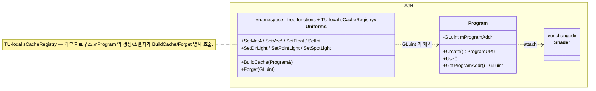
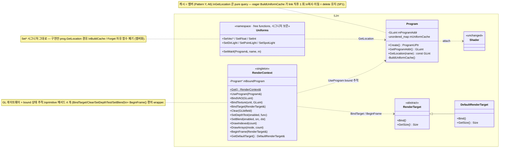

# SP2 — RenderContext (저수준 GL 게이트웨이) 설계

날짜: 2026-05-21
대상:
- 신규 `src/render/render_context.{h,cpp}`, `src/render/render_target.{h,cpp}`, `src/render/CMakeLists.txt`
- 수정 `src/program/program.{h,cpp}` (uniform 캐시 멤버 흡수, `GetLocation`/`GetType` 신규, `Use()` 제거)
- 수정 `src/program/program_uniforms.{h,cpp}` (`BuildCache`/`Forget` 자유 함수 제거, `Set*` 시그니처는 보존)
- 정정 `src/program/program_uniforms.h` 의 SP1 seam doxygen 메모
- 수정 `src/CMakeLists.txt` (`add_subdirectory(render)` 추가)
- 마이그레이션: 활성 챕터의 `prog->Use()` 호출 → `rc.UseProgram(*prog)`

## 0. 상위 컨텍스트

ECS 렌더링 아키텍처 재설계(SP1~SP4)의 SP2. SP1 이 리소스 계층(`SJH::Shader` + `SJH::Program`)을 정리했고, SP2 는 그 위에 *GL 호출 게이트웨이* `SJH::RenderContext` 를 신설한다. SP3 가 ECS 컴포넌트 + RenderSystem 을 도입하면 그것이 RenderContext 위에 큐 패턴으로 얹힐 *발판*까지 SP2 에서 제공.

```
 SP1 ✅  Shader/Program 리소스 통합 (완료)
 SP2 ◀  RenderContext + RenderTarget 신설, Program 에 uniform 캐시 흡수 (본 스펙)
 SP3     ECS 컴포넌트 + RenderSystem (RenderQueue 패턴 포함)
 SP4     멀티패스 + 포스트프로세싱 (스펙만, 구현 후속)
```

## 1. 동기

SP1 의 `SJH::Uniforms` 자유 함수 family 는 TU-local static `sCacheRegistry` (program ID → name → location 캐시)를 사용한다. 자원 수명과 캐시 수명이 *외부 자료구조* 에 결합되어 있어:

- `Program::Create` 가 `Uniforms::BuildCache(*this)` 를 명시 호출 (eager)
- `~Program` 이 `Uniforms::Forget(addr)` 를 명시 호출 (GL ID 재사용 대비 stale 차단)

이 *외부 결합* 을 정리할 때가 됐다. 더불어 챕터 코드가 `glUseProgram` / `glBindVertexArray` / `glBindTexture` / `glDrawElements` / `glClear` 같은 GL API 를 *날것 그대로* 호출하는데, SP3 의 RenderSystem 이 등장하면 이 호출들을 *단일 게이트웨이* 로 위임해야 한다. SP2 는 그 게이트웨이를 만든다.

목표:
- `SJH::RenderContext` 신설 — GL 호출 단일 진입점 + 현재 bound 상태 추적 (싱글톤)
- `SJH::RenderTarget` 추상 + `SJH::DefaultRenderTarget` 구현 (FBO 0) — FrameBufferTarget seam 보존 (SP4 용)
- `SJH::Program` 에 uniform 캐시 멤버 흡수 — `sCacheRegistry` 외부 자료구조 폐기
- `SJH::Uniforms` 자유 함수 family 시그니처 보존 — *구현* 만 변경 (`prog.GetLocation` 경유)
- SP1 의 seam doxygen 메모 정정 (옵션 1 → A6 변경 사항 반영)

## 2. 핵심 결정 (브레인스토밍 결과)

### D-1. Pattern Y 정합 (A6 옵션)
캐시는 *resource-attached* (Program 멤버), setter 는 *자유 함수* 유지. Unity Material / Cocos ProgramState 와 동일 결정. 사유: SP1 의 SRP·OCP·decoupling 동기를 *전부 보존* (Set\* 자유 함수 → Program 헤더 미수정으로 신 타입 추가 가능).

### D-2. CQS-clean: pure `GetLocation` + eager `BuildUniformCache` (Q2 옵션)
`Program::GetLocation(name) const → GLint` 는 *순수 query* (캐시 read-only). `arr[3]` 같은 비-active uniform 의 fallback 은 `Uniforms::SetMat4` 안에서 `glGetUniformLocation` 직접 호출. *회색지대 함수 도입 회피*.

### D-3. 싱글톤 인스턴스 (B2 옵션)
`SJH::RenderContext::Get() → RenderContext&`. GL context 가 만들어진 후 첫 호출 시 lazy init. Godot RenderingServer / Cocos Director 패턴.

### D-4. 이름: `RenderContext`
"상태 추적 + 즉시 명령 게이트웨이" 의미. SP3 RenderSystem 과 혼동 회피. Godot `RenderingServer` (Pattern X 함의) / Cocos v4 `backend::Device` 와 다른 이름.

### D-5. Explicit Side Effects 준수 — primitive + 편의 wrapper 병존
ddd rule "Explicit Side Effects" 가 단일 함수가 여러 GL 호출 숨기는 패턴을 명시 비추천. 대응: primitive 4 개 (`BindTarget`, `Clear`, `SetDepthTest`, `SetBlend`) 노출 + `BeginFrame()` 은 *얇은 wrapper 로만* 보존 (alias 임을 doxygen 명시).

### D-6. Queue 패턴은 SP2 도입 안 함 — SP3 으로 미룸
ddd 평가 결과:
- Queue 는 2-layer (high-level RenderCommand / low-level CommandBuffer) — high-level 은 SP3 도메인
- Explicit Side Effects 규칙이 opaque `Submit()` 비추천
- 큐에 넣을 데이터(entity/material)가 SP3 까지 없음 — YAGNI

SP2 의 RenderContext 는 *immediate-mode* 게이트웨이로 유지. SP3 가 그 위에 `RenderQueue<DrawCommand>` 를 얹어 정렬·루프 순회 패턴 실현.

### D-7. Polymorphic Program 안 함 — 변형은 SP3 Material 데이터 분기
SP1 에서 폐기한 결정 재확인. `DefaultShaderProgram` / `TextureShaderProgram` 식 다형성은 모범 엔진 어디서도 안 함. SP3 Material 컴포넌트가 데이터 분기로 흡수.

### D-8. GL 3.3 컨텍스트 유지
DSA `glProgramUniform*` (4.1+) 채택 안 함. 순서 계약(Use 후 Set)은 *코드 인접성* + doxygen 명시로 해결. 내부 assertion 없음 (POLA 위반 회피).

## 3. 아키텍처 — Before / After

### Before (SP1 완료 시점, 현재)



### After SP2



## 4. 변경 사항 — file-by-file

### 4.1 신규 — `src/render/render_target.{h,cpp}`

```cpp
// render_target.h
#ifndef __SJH_RENDER_TARGET_H__
#define __SJH_RENDER_TARGET_H__

#include "GL/gl3w.h"

namespace SJH
{
    struct Size { int Width; int Height; };

    /// @brief 그릴 대상 (default framebuffer 또는 FBO) 의 추상.
    /// @note  SP4 에서 FrameBufferTarget 파생 추가 예정 — 본 인터페이스는 안정.
    class RenderTarget
    {
    public:
        virtual ~RenderTarget() = default;
        virtual void Bind() = 0;          ///< glBindFramebuffer + glViewport
        virtual Size GetSize() const = 0;
    };

    /// @brief 화면(FBO 0) 을 가리키는 기본 타깃.
    class DefaultRenderTarget : public RenderTarget
    {
    public:
        DefaultRenderTarget(int width, int height);
        void Bind() override;
        Size GetSize() const override;
    private:
        Size mSize;
    };
}

#endif
```

### 4.2 신규 — `src/render/render_context.{h,cpp}`

```cpp
// render_context.h
#ifndef __SJH_RENDER_CONTEXT_H__
#define __SJH_RENDER_CONTEXT_H__

#include "src/buffer/render_target.h"
#include "GL/gl3w.h"
#include <memory>

namespace SJH
{
    class Program;   // forward — 본 헤더는 Program 정의 의존 X

    /// @brief GL 호출의 단일 게이트웨이 + 현재 bound 상태 추적.
    /// @details
    ///   책임 5 가지:
    ///   -# 현재 bound program 추적 (mBoundProgram)
    ///   -# GL 상태 변경 단일 진입점 (glUseProgram / glBindVertexArray / glBindTexture / glClear / glEnable)
    ///   -# Draw 명령 발행 (glDrawElements / glDrawArrays)
    ///   -# RenderTarget 바인딩 위임 (BindTarget / BeginFrame)
    ///   -# SP4 멀티패스 진입 지점 (BeginFrame 이 패스마다 다른 target 받음)
    ///
    ///   ### 사용 패턴
    ///   GL context 가 만들어진 후 첫 @c Get() 호출 시 lazy init.
    ///   @code
    ///     auto& rc = SJH::RenderContext::Get();
    ///     rc.BeginFrame(rc.GetDefaultTarget());   // 표준 프레임
    ///     rc.UseProgram(*prog);                   // glUseProgram + bound 추적
    ///     SJH::Uniforms::SetMat4(*prog, "uModel", m);
    ///     rc.BindVAO(vao);
    ///     rc.BindTexture(0, tex);
    ///     rc.DrawIndexed(indexCount);
    ///   @endcode
    ///
    ///   ### 순서 계약 (POLA: 코드 강제 안 함, 문서 명시)
    ///   - @c UseProgram(prog) 호출 후에만 그 prog 에 @c Uniforms::Set* 호출 가능.
    ///     `glUniform*` 가 GL 3.3 에서 *currently bound* program 만 대상이라 발생.
    ///     디버그 빌드의 assertion 등은 *추가하지 않음* — hidden astonishment 회피.
    class RenderContext
    {
    public:
        /// @brief 싱글톤 접근. GL context 가 활성 상태일 때만 호출 유효.
        static RenderContext& Get();

        // --- bound 상태 변경 (primitive — Explicit Side Effects 준수) ---

        /// @brief glUseProgram + mBoundProgram 갱신.
        void UseProgram(const Program& prog);

        /// @brief glBindVertexArray.
        void BindVAO(GLuint vao);

        /// @brief glActiveTexture(GL_TEXTURE0 + unit) + glBindTexture(GL_TEXTURE_2D, tex).
        void BindTexture(GLuint unit, GLuint tex);

        /// @brief target->Bind() 위임 — glBindFramebuffer + glViewport.
        void BindTarget(RenderTarget& target);

        /// @brief glClear(mask). mask 예: GL_COLOR_BUFFER_BIT | GL_DEPTH_BUFFER_BIT.
        void Clear(GLbitfield mask);

        /// @brief glEnable/glDisable(GL_DEPTH_TEST) + glDepthFunc.
        void SetDepthTest(bool enabled, GLenum func = GL_LESS);

        /// @brief glEnable/glDisable(GL_BLEND) + glBlendFunc.
        void SetBlend(bool enabled, GLenum srcFactor = GL_SRC_ALPHA, GLenum dstFactor = GL_ONE_MINUS_SRC_ALPHA);

        // --- Draw 명령 ---

        /// @brief glDrawElements(GL_TRIANGLES, count, GL_UNSIGNED_INT, 0).
        void DrawIndexed(GLsizei count);

        /// @brief glDrawArrays(mode, 0, count).
        void DrawArrays(GLenum mode, GLsizei count);

        // --- 편의 wrapper ---

        /// @brief BindTarget + Clear(color|depth) + SetDepthTest(true) + SetBlend(true) 의 alias.
        /// @note  Stencil pass 등 커스텀 상태가 필요하면 primitive 메서드를 *직접* 호출.
        void BeginFrame(RenderTarget& target);

        /// @brief 화면 기본 타깃 (lazy 생성, 윈도우 크기 추적).
        DefaultRenderTarget& GetDefaultTarget();

        // 복사·이동 차단 (싱글톤)
        RenderContext(const RenderContext&)            = delete;
        RenderContext& operator=(const RenderContext&) = delete;
        RenderContext(RenderContext&&)                 = delete;
        RenderContext& operator=(RenderContext&&)      = delete;

    private:
        RenderContext() = default;
        ~RenderContext() = default;

        const Program* mBoundProgram = nullptr;
        std::unique_ptr<DefaultRenderTarget> mDefaultTarget;
    };
}

#endif
```

### 4.3 수정 — `src/program/program.h`

기존 `Use()` public 함수 폐기 (RenderContext 가 owner). `GetProgramAddr()` 보존. 신규 `GetLocation(name) const` + private `BuildUniformCache()`. 캐시 멤버 추가.

```cpp
// program.h (변경 부분만)
#include <string>
#include <unordered_map>

namespace SJH
{
    class Program
    {
    public:
        static ProgramUPtr Create(const std::vector<ShaderPtr> &shaders);
        static ProgramUPtr CreateWithVSFS(const std::string& vs, const std::string& fs);

        ~Program();
        Program(const Program&)            = delete;
        Program& operator=(const Program&) = delete;
        Program(Program&&)                 = delete;
        Program& operator=(Program&&)      = delete;

        GLuint GetProgramAddr() const { return mProgramAddr; }

        /// @brief uniform 이름 → location 조회. pure const query (캐시 read-only).
        /// @return active uniform 이면 location, 그 외(예: 비-active `arr[3]`) -1.
        /// @note  -1 반환 시 호출자가 fallback 으로 @c glGetUniformLocation 직접 호출.
        ///        본 함수는 *cache mutation 하지 않음* — POLA 준수.
        GLint GetLocation(const char* name) const;

        /// @brief uniform 이름 → GL 타입 (GL_FLOAT_MAT4 등). pure const query.
        /// @return active uniform 이면 type, 미캐시 시 0 — 진단의 타입 불일치 체크에 사용.
        GLenum GetType(const char* name) const;

        // Use() 는 폐기 — RenderContext::UseProgram 이 대체.

    private:
        Program() = default;
        bool TryLink(const std::vector<ShaderPtr> &shaders);
        void BuildUniformCache();   ///< link 직후 active uniform 전체 캐시.

        GLuint mProgramAddr{0};

        struct UniformEntry { GLint Location; GLenum Type; };
        std::unordered_map<std::string, UniformEntry> mUniformCache;
    };
}
```

### 4.4 수정 — `src/program/program.cpp`

`Create` 가 `BuildUniformCache()` 호출. `~Program` 의 `Uniforms::Forget` 호출 제거 (멤버 캐시는 자동 destroy). `Use()` 정의 제거. `GetLocation` 신규.

```cpp
// program.cpp (변경 부분만)
ProgramUPtr Program::Create(const std::vector<ShaderPtr> &shaders) {
    auto program = ProgramUPtr(new Program());
    if (!program->TryLink(shaders)) return nullptr;
    program->BuildUniformCache();   // eager (was: Uniforms::BuildCache(*this))
    return program;
}

Program::~Program() {
    if (mProgramAddr != 0) {
        Diagnostics::UniformDiagnostics::Invalidate(mProgramAddr);
        glDeleteProgram(mProgramAddr);
        // Uniforms::Forget 호출 제거 — 캐시가 멤버라 자동 destroy.
    }
}

void Program::BuildUniformCache() {
    GLint count = 0;
    glGetProgramiv(mProgramAddr, GL_ACTIVE_UNIFORMS, &count);
    if (count <= 0) return;
    GLint maxNameLen = 0;
    glGetProgramiv(mProgramAddr, GL_ACTIVE_UNIFORM_MAX_LENGTH, &maxNameLen);
    std::vector<char> nameBuf(static_cast<size_t>(maxNameLen + 1), '\0');
    for (GLint i = 0; i < count; ++i) {
        GLsizei nameSize = 0;
        GLint   size     = 0;
        GLenum  type     = 0;
        glGetActiveUniform(mProgramAddr, static_cast<GLuint>(i),
                           maxNameLen, &nameSize, &size, &type, nameBuf.data());
        const GLint loc = glGetUniformLocation(mProgramAddr, nameBuf.data());
        mUniformCache.emplace(
            std::string(nameBuf.data(), static_cast<size_t>(nameSize)),
            UniformEntry{loc, type});
    }
}

GLint Program::GetLocation(const char* name) const {
    auto it = mUniformCache.find(name);
    if (it == mUniformCache.end()) return -1;
    return it->second.Location;
}

GLenum Program::GetType(const char* name) const {
    auto it = mUniformCache.find(name);
    if (it == mUniformCache.end()) return 0;
    return it->second.Type;
}
```

### 4.5 수정 — `src/program/program_uniforms.h`

자유 함수 시그니처 보존. `BuildCache` / `Forget` 자유 함수 *제거* (멤버화). namespace docstring 정정.

```cpp
// program_uniforms.h (변경 부분만)
namespace SJH::Uniforms
{
    // BuildCache / Forget — 제거 (Program 멤버로 흡수).

    void SetMat4 (const Program& prog, const char* name, const vmath::mat4& m4);
    void SetVec4 (const Program& prog, const char* name, const vmath::vec4& v4);
    void SetVec3 (const Program& prog, const char* name, const vmath::vec3& v3);
    void SetVec2 (const Program& prog, const char* name, const vmath::vec2& v2);
    void SetFloat(const Program& prog, const char* name, const float&     v);
    void SetInt  (const Program& prog, const char* name, const int&       v);

    // 광원 helper — 시그니처 변동 없음.
    void SetDirLight   (const Program& prog, const char* prefix, const DirLight&  l, const vmath::vec3& worldDir);
    void SetPointLight (const Program& prog, const char* prefix, const PointLight& l, const vmath::vec3& worldPos);
    void SetSpotLight  (const Program& prog, const char* prefix, const SpotLight&  l, const vmath::vec3& worldPos, const vmath::vec3& worldDir);
}
```

### 4.6 수정 — `src/program/program_uniforms.cpp`

`sCacheRegistry` 폐기. 각 `Set*` 내부에서 `prog.GetLocation(name)` 호출 + -1 fallback (`glGetUniformLocation` 직접 — `arr[3]` 같은 비-active uniform 처리).

```cpp
// program_uniforms.cpp (대표 1 함수만 — 나머지 동일 패턴)
void SetMat4(const Program& prog, const char* name, const vmath::mat4& m4) {
    GLint loc = prog.GetLocation(name);
    if (loc < 0) {
        // Fallback: 비-active uniform (예: 배열 원소 `arr[3]`).
        // 캐시 miss 외부 fallback — Program 의 캐시는 mutation 하지 않음 (POLA).
        loc = glGetUniformLocation(prog.GetProgramAddr(), name);
    }
    if (loc < 0) {
        Diagnostics::UniformDiagnostics::NotifyMissing(prog.GetProgramAddr(), name);
        return;
    }
    Diagnostics::UniformDiagnostics::NotifyTypeMismatch(
        prog.GetProgramAddr(), name, GL_FLOAT_MAT4, prog.GetType(name));
    glUniformMatrix4fv(loc, 1, GL_FALSE, (const float*)m4);
}
```

`prog.GetType(name)` 은 §4.3 의 두 번째 pure query — 캐시 read-only, 미캐시 시 0 반환 (진단의 타입 비교가 0 을 만나면 skip).

### 4.7 정정 — SP1 seam doxygen 메모

SP1 의 `program.h::Use()` 위 메모: `Use()` 자체가 제거되므로 메모도 함께 제거.

SP1 의 `program_uniforms.h` namespace 메모:
- 이전: "RenderContext 의 멤버로 이전될 예정"
- 정정: "캐시는 Program 멤버로 이전 완료 (SP2). 자유 함수 family 는 본 namespace 에 유지."

### 4.8 신규 — `src/render/CMakeLists.txt`

```cmake
add_library(sjhopengl_render STATIC
    render_context.cpp
    render_target.cpp
)
add_library(SJH::render ALIAS sjhopengl_render)

target_include_directories(sjhopengl_render
    PUBLIC  $<BUILD_INTERFACE:${CMAKE_CURRENT_SOURCE_DIR}/..>
    PRIVATE ${CMAKE_CURRENT_SOURCE_DIR}
)

target_link_libraries(sjhopengl_render
    PUBLIC  SJH::common SJH::program project_deps
    PRIVATE SJH::diagnostics
)

target_compile_features(sjhopengl_render PUBLIC cxx_std_17)
```

### 4.9 수정 — `src/CMakeLists.txt`

```diff
 add_subdirectory(program)
 add_subdirectory(material)
 add_subdirectory(shader)
+add_subdirectory(render)
 add_subdirectory(resource_registry)
 add_subdirectory(input)
```

## 5. ddd Rules 정합성 — 명시 검증

| ddd Rule | 본 설계의 정합 방식 |
|---|---|
| **Separation of Concerns** | Program(자원) / Uniforms(도메인 helper) / RenderContext(GL 게이트웨이) / RenderTarget(추상) 4 계층 단일 책임 |
| **Domain-Specific Naming** | 각 클래스명이 GL 도메인에서 즉시 의미 전달. generic (`Manager`/`Helper`/`Util`) 회피 |
| **Functional Core / Imperative Shell** | Uniforms 의 광원 helper (도메인 → field 매핑) pure / GL 호출 imperative — 자연 분리 |
| **Command-Query Separation** | `Program::GetLocation` const pure query, BuildUniformCache eager command. `RenderContext::UseProgram` command, draw 메서드 command. 회색지대 함수 도입 회피 |
| **Explicit Side Effects** | RenderContext 의 primitive 4 개 (`BindTarget`/`Clear`/`SetDepthTest`/`SetBlend`) — 각 호출이 1 GL state mutation 만. `BeginFrame` 은 *얇은 alias* 임을 doxygen 명시 |
| **Principle of Least Astonishment** | `GetLocation` const = 캐시 mutation 없음. 순서 계약은 *코드 강제* 안 함 (assertion 없음) — 헤더 doxygen 으로만 안내 |
| **Library-First** | sb7 가 RenderContext 추상 제공 안 함 → 신규 작성 정당 |
| **Function/File Size Limits** | RenderContext 메서드 ~13 개 — 단일 파일 충분. 각 메서드 본문 5~10 줄 (GL 호출 1~2 개) |
| **Early Return Pattern** | `SetMat4` 의 `if (loc < 0) return` 유지 |
| **Error Handling** | RenderContext::Get() 의 GL context 미초기화 케이스는 *학습용 프로젝트* 라 assert 로 단순 처리 |

## 6. 검증 방법

1. **빌드 통과** — `cmake --build --preset ninja --target sjhopengl_render` 신규 라이브러리 생성. `sjhopengl_program` 도 캐시 멤버화로 인한 재빌드 통과.
2. **컴파일 타임 검증** — `Program::GetLocation` / `Program::GetType` 시그니처가 `const` 인지 + `mUniformCache` 가 `mutable` *아님* (pure query 보장).
3. **활성 챕터 마이그레이션** — 기존 활성 챕터 (`apps/_MyApp_`) 의 `prog->Use()` 호출 → `rc.UseProgram(*prog)` 로 일괄 치환. `Uniforms::Set*` 호출은 *시그니처 보존* 이라 무수정.
4. **싱글톤 lazy init** — `RenderContext::Get()` 첫 호출이 GL context 활성 상태에서만 동작 (manual smoke test).
5. **legacy 자유 함수 호출 부재** — `git grep "Uniforms::BuildCache\|Uniforms::Forget\|Program::Use"` 결과 *비어야 함* (samples/ 제외).
6. **시각 회귀 없음** — 마이그레이션된 챕터 (`_MyApp_`) 의 출력이 SP1 종료 시점과 *육안 동일*. 라이팅·머티리얼·텍스처 표시 변동 없음.

## 7. 명시적 비스코프 (Out of Scope)

| 항목 | 위치 |
|------|------|
| ECS 컴포넌트 (Transform/Mesh/Material/MeshRenderer) | **SP3** |
| `RenderQueue<DrawCommand>` + 정렬 + 루프 순회 | **SP3** (RenderSystem 내부) |
| `Render` 씬 순회 로직 | **SP3** RenderSystem |
| per-frame uniform *결정* (view/proj/light 어떤 걸 셋업할지) | **SP3** |
| Polymorphic Program (Default/Texture variants) | **폐기** — SP3 Material 데이터 분기로 흡수 |
| `FrameBufferTarget` (오프스크린) 구현 | **SP4** |
| GL 상태 캐싱 최적화 (depth/blend 토글 redundancy 제거) | **미래 최적화** — SP2 는 *매번 호출* 단순 모드 |
| Mesh/Model 리소스 모듈 (VAO/VBO/EBO RAII) | **별도 분해 갱신 필요** — SP2 의 `BindVAO` 는 `GLuint` 직접 받음 |
| DSA `glProgramUniform*` (GL 4.1+) 전환 | **폐기** — GL 3.3 유지 (D-8) |

## 8. SP3 가 받을 표면 (seam) 요약

SP3 가 SP2 의 산출물 위에 RenderSystem + RenderQueue 를 *수정 없이* 얹기 위해 필요한 public 표면:

| 항목 | SP2 상태 | SP3 사용 |
|------|---------|---------|
| `RenderContext::Get()` | 싱글톤, 즉시 명령 게이트웨이 | RenderSystem 이 의존성으로 보유 (또는 직접 호출) |
| `RenderContext::UseProgram` / `BindVAO` / `BindTexture` / `DrawIndexed` | immediate-mode, 1 call = 1 GL action | RenderQueue 의 `Flush()` 루프 바디가 각 DrawCommand 마다 호출 |
| `Program::GetProgramAddr() const` | public | Material 컴포넌트가 참조 보관 |
| `Uniforms::Set*` | 자유 함수 시그니처 보존 | RenderSystem 이 Material 데이터로부터 호출 |

SP2 는 *immediate-mode + queue-friendly* — SP3 가 큐를 *추가* 만 으로 진행 가능. SP2 본체 수정 0.

## 9. 결정 로그

| ID | 결정 | 근거 |
|----|------|------|
| D-1 | Pattern Y (cache=Program member, setters=자유함수) | Unity/Cocos 정통; SP1 의 SRP·OCP 동기 보존 |
| D-2 | `GetLocation` pure query + eager `BuildUniformCache` | ddd CQS 완전 충족; 회색지대 함수 도입 회피 |
| D-3 | 싱글톤 (`RenderContext::Get()`) | Godot/Cocos 정통; 학습 프로젝트 단순함 |
| D-4 | 이름 `RenderContext` | SP3 RenderSystem 과 혼동 회피; 의미 정확 |
| D-5 | primitive 4 개 + `BeginFrame` alias | ddd Explicit Side Effects 준수 |
| D-6 | Queue 패턴 SP2 미도입 | ddd: Layer A 는 SP3 도메인; YAGNI |
| D-7 | Polymorphic Program 안 함 | SP1 결정 재확인; SP3 Material 데이터 분기로 흡수 |
| D-8 | GL 3.3 유지, DSA 미채택 | 프로젝트 정책; 순서 계약은 코드 인접 + doxygen |

## 10. 후속 작업

- **SP3 정식 브레인스토밍** — EnTT 도입, 컴포넌트 (`Transform`/`Mesh`/`Material`/`MeshRenderer`), `RenderSystem` + `RenderQueue<DrawCommand>` 설계
- **Mesh/Model 리소스 모듈 분해 갱신** — `src/buffer/` (이미 untracked 존재) 와의 관계 정리. SP3 전에 결정 필요
- **SP1 seam memo 정정** — 본 spec §4.7 의 정정 사항 SP2 구현 시 일괄 적용
