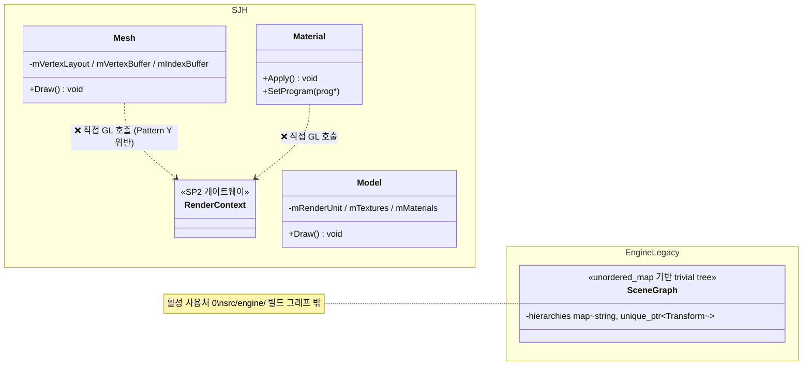
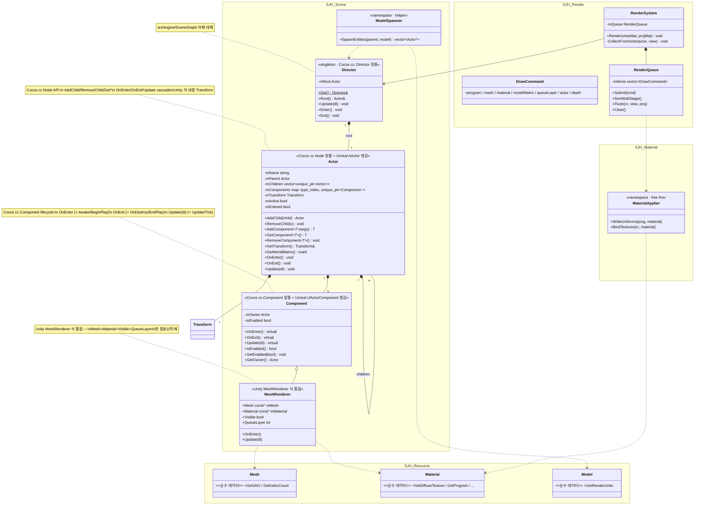

# SP3 — Actor + Component + RenderSystem + RenderQueue 설계

> ⚠ 2026-05 시점 문서 (archival) — 코드 경로는 작성 당시 기준.

날짜: 2026-05-21
대상:
- 신규 `src/scene/scene.{h,cpp}` (Scene::Director 싱글톤 = root Actor wrapper — Cocos cc::Director 정통)
- 신규 `src/scene/actor.{h,cpp}` (Actor + Component 베이스, Cocos2D 정통 + Unreal 영감)
- 신규 `src/scene/components.{h,cpp}` (`MeshRenderer` 구체 컴포넌트)
- 신규 `src/scene/model_spawner.{h,cpp}` (Model → Actor 트리 펼침 helper)
- 신규 `src/scene/CMakeLists.txt`
- 신규 `src/render/render_queue.{h,cpp}` (DrawCommand + Multi-stage sort + Flush)
- 신규 `src/render/render_system.{h,cpp}` (Actor 트리 traverse → DrawCommand 빌드 → Queue Flush)
- 신규 `src/material/material_applier.{h,cpp}` (Material → GL 변환 자유함수)
- 수정 `src/object/mesh.{h,cpp}` (`Draw()` 제거, `GetVAO()` 추가)
- 수정 `src/material/material.{h,cpp}` (`Apply()` 제거 — 순수 데이터화)
- 수정 `src/object/model.{h,cpp}` (`Draw()` 제거, `GetRenderUnits()` 노출)
- 수정 `src/CMakeLists.txt` (`add_subdirectory(scene)` 추가)
- 수정 `src/render/CMakeLists.txt` (render_queue / render_system + `SJH::scene` 의존)
- 수정 `src/material/CMakeLists.txt` (material_applier)
- **삭제** `src/engine/` 전체 (scene_graph / transform / camera / model_base / CMakeLists)
- 신규 `apps/ecs_demo/` 챕터 (Actor+Component 동작 시각 검증)
- 활성화 `add_subdirectory(ecs_demo)` 를 `apps/CMakeLists.txt` 에

> **변경 이력**: 본 spec 의 *초안* (2d1c65e) 은 entt 기반 *데이터 ECS* 였으나, 사용자 결정으로 **Cocos2D `cc.Node`+`cc.Component` 정통 + Unreal 영감 흡수** 의 **OOP Actor+Component 패턴** 으로 전면 재작성. `extern/entt` 는 SP3 에서 *미사용* (다른 용도로 잔존).

## 0. 상위 컨텍스트

ECS 렌더링 아키텍처 재설계(SP1~SP4)의 SP3. SP1 (Shader/Program 리소스) + SP2 (RenderContext + Pattern Y) 완료. 본 SP3 가 *상위 오케스트레이션* 계층 — **Cocos2D Node + Unreal Actor 정통의 OOP Component 패턴** + RenderSystem + RenderQueue (Cocos 식 Layer A) 도입.

```
 SP1 ✅  Shader/Program 리소스
 SP2 ✅  RenderContext + Pattern Y (cache in Program)
 SP3 ◀  Actor + Component + RenderSystem + RenderQueue (본 스펙)
 SP4     멀티패스 + 포스트프로세싱 (FrameBufferTarget — `src/buffer/framebuffer.{h,cpp}` 일부 존재)
```

## 1. 동기

탐색 결과 발견 — *SP3 의 "신규 4 컴포넌트" 자리가 이미 리소스 클래스로 구현돼 있다*:

- `SJH::Transform` (`src/object/transform.h`) — TRS 값 객체
- `SJH::Mesh` (`src/object/mesh.h`) — VAO/VBO/EBO RAII + `Draw()`
- `SJH::Material` (`src/material/material.h`) — Texture/Program 관찰자 + `Apply()`
- `SJH::Model` (`src/object/model.h`) — Assimp 로드 + RenderUnit 목록 + `Draw()`

문제 1: `Mesh::Draw` / `Material::Apply` / `Model::Draw` 가 *GL 을 직접 호출* — SP2 의 Pattern Y (GL 호출은 RenderContext 게이트웨이 경유) 와 정면 충돌.

문제 2: 레거시 `Engine::SceneGraph` (`<src>/engine/scene_graph.h`) 가 `unordered_map<string, unique_ptr<Transform>>` 기반 trivial scene tree — 사용처 없음, 폐기 대상.

**패러다임 선택 — 사용자 결정**: 초안의 entt 데이터 ECS 대신 **Cocos2D `cc.Node` + `cc.Component` 정통** (Unreal `AActor` + `UActorComponent` 영감 흡수) 의 **OOP 상속 기반 Actor+Component** 패턴 채택. 이유:
- Unity `GameObject` / Unreal `AActor` / Cocos2D `Node` 식 *직관적* OOP 모델 선호
- 라이프사이클 메서드 (`OnEnter`/`OnExit`/`Update`) 가 *클래스 멤버* 로 명시
- 부모-자식 트리 + flat 컴포넌트 리스트 → Cocos 식 안정 검증된 구조
- entt 의 데이터-oriented 캐시 친화성 < 학습 코드 *가독성·일관성*

조사 결과 (Cocos2D + Unreal Context7 + 다수 라이브러리 검색):
- *경량 stand-alone Actor+Component 라이브러리는 부재* (toy/Wildcat/Crimild 등은 full 엔진의 일부)
- → **직접 설계** + 향후 standalone 추출 가능한 응집도로 작성

목표:
1. **`SJH::Scene::Director` 싱글톤** — root Actor 보유 (Cocos `cc::Director` 정통, SP2 RenderContext 와 일관). `Scene` 은 namespace, `Director` 는 nested class — 식별자 충돌 회피
2. **`SJH::Scene::Actor`** — 부모-자식 트리 + flat 컴포넌트 리스트 + 내장 `Transform`
3. **`SJH::Scene::Component`** — `OnEnter`/`OnExit`/`Update(dt)` lifecycle (Cocos `cc.Component` 정통)
4. **`SJH::Scene::MeshRenderer`** — Unity `MeshRenderer` 식 — `Mesh*`/`Material*`/`visible`/`queueLayer` 보유, 자기 OnEnter 시점에 부모 Actor 의 GetTransform 으로 매트릭스 계산
5. **`SJH::DrawCommand` + `SJH::RenderQueue`** — Cocos 식 Layer A, Multi-stage sort (QueueLayer → Program → Material → Depth)
6. **`SJH::RenderSystem::Render(view, proj)`** — Actor 트리 traverse → MeshRenderer 수집 → DrawCommand → Queue Flush via RenderContext
7. **`SJH::MaterialApplier`** — Material 의 uniform/texture 적용을 자유함수로 분리 (Q4-3)
8. **`Mesh::Draw` / `Material::Apply` / `Model::Draw` 폐기** — Pattern Y 정통 (자원은 순수 데이터)
9. **`src/engine/` 전체 삭제** — 레거시 SceneGraph + 기타 잔재
10. **`ecs_demo` 챕터 신설** — SP3 동작 시각 검증

## 2. 핵심 결정 (브레인스토밍 결과)

| ID | 결정 | 근거 |
|----|------|------|
| **D-1 (A2)** | `Mesh::Draw` / `Material::Apply` / `Model::Draw` *완전 폐기* | Pattern Y 정통 — 자원은 순수 데이터, GL 호출은 RenderContext 게이트웨이만 |
| **D-2 (B1)** | `SJH::Scene::Director::Get()` 싱글톤 (root Actor wrapper) — Cocos `cc::Director` 정통 명명 | SP2 `RenderContext::Get()` 패턴과 일관. `Scene` 은 namespace, `Director` 는 nested class (namespace/class 식별자 충돌 회피) |
| **D-3** | **Cocos2D `cc.Node`+`cc.Component` 우선** + Unreal `AActor`+`UActorComponent` 영감 흡수 | 사용자 결정. OOP 직관성·라이프사이클 메서드·트리 구조 |
| **D-4** | Actor 자체가 트리 (Cocos 식) + 컴포넌트는 flat 리스트 | Unreal 의 USceneComponent 트리 *기각* — 복잡도 ↑ |
| **D-5** | 컴포넌트 lookup `GetComponent<T>()` 템플릿 (Unity 식) | Cocos 의 name string lookup *기각* — C++ 타입 안전성 우선 |
| **D-6** | Lifecycle 이름 `OnEnter` / `OnExit` / `Update(float dt)` (Cocos 정통) | `BeginPlay`/`EndPlay`/`Tick` (Unreal) 보다 Cocos 정렬. ddd POLA — 영문 표준 |
| **D-7** | `Component::SetEnabled(bool)` per-component 토글 (Unreal 영감) | Cocos 의 `_enabled` + Unreal `SetComponentTickEnabled` 둘 다 흡수 |
| **D-8** | OnExit 가 `removeAllComponents()` 호출 *안 함* | Cocos 와 *의도적 차이*. C++ RAII (`unique_ptr`) 가 destructor 위임 자연. ddd Explicit Side Effects 준수 |
| **D-9** | `AddComponent` / `AddChild` 가 이미 entered 인 부모에 대해 *즉시 OnEnter* 호출 — **단일 호출 contract** (construct + insert + lifecycle dispatch 한 호출에서 발생). 호출자가 이를 인지하도록 doxygen 강조 + 비대칭 분리 (`Create` vs `Attach`) 는 *학습 코드 단순성* 우선으로 기각 | Cocos/Unity 정통. POLA — 사용자가 즉시 작동 기대 |
| **D-10** | `MeshRenderer` 컴포넌트가 mesh/material/visible/queueLayer *통합* 보유 (Unity 식) | Unity `MeshFilter + MeshRenderer` 분리 *기각* — 학습 프로젝트 단순화 |
| **D-11 (Q2-3)** | `DrawCommand` 6+ 필드 (program, mesh, material, modelMatrix, queueLayer, **actor**, depth) | actor (debug ptr) + depth (back-to-front 정렬) 친화 |
| **D-12 (Q3-4)** | Multi-stage sort: QueueLayer → Program → Material → Depth (Unreal/Cocos 정통) | 모든 최적화 동시 |
| **D-13 (Q4-3)** | `SJH::MaterialApplier` 자유함수 family (`WriteUniforms`, `BindTextures`) | Material 순수성 + Queue 단순성 |
| **D-14 (Q5-1)** | 1 RenderUnit = 1 Actor (assimp Model 의 N RU 가 N Actor 로 펼침, 부모 Actor 의 자식들로) | parent-child Transform 계층이 *자연 흡수* (Cocos 트리) |
| **D-15 (F1)** | `apps/ecs_demo/` 신규 챕터로 시각 검증 | 활성 챕터 `imguitest` 가 Mesh/Material 미사용 |
| **D-16 (G1)** | `RenderSystem::Render(viewMat, projMat)` 인자로 전달 | SP3.5 의 CameraComponent 도입 시 internal 추출로 마이그레이션 쉬움 |
| **D-17** | `src/engine/` 전체 삭제 | 빌드 그래프 밖 dead code, 활성 사용처 0 |

## 3. 아키텍처 — Before / After

### Before (SP2 완료 시점)



### After SP3



## 4. 변경 사항 — file-by-file

### 4.1 신규 — `src/scene/actor.h` (Actor + Component 베이스)

```cpp
#ifndef __SJH_SCENE_ACTOR_H__
#define __SJH_SCENE_ACTOR_H__

#include "object/transform.h"
#include <memory>
#include <string>
#include <unordered_map>
#include <vector>
#include <typeindex>
#include <typeinfo>

namespace SJH::Scene
{
    class Actor;

    /// @brief Cocos cc.Component 정통 + Unreal UActorComponent 영감 베이스.
    /// @details
    ///   ### 라이프사이클 (Cocos 정통 명명)
    ///   - @c OnEnter — Actor 가 *running* 상태가 될 때 (Cocos cc.Component.onEnter / Unreal BeginPlay / Unity Awake)
    ///   - @c OnExit  — Actor 가 *running* 상태에서 벗어날 때 (Cocos onExit / Unreal EndPlay / Unity OnDestroy)
    ///   - @c Update(dt) — 매 프레임 (Cocos update / Unreal TickComponent / Unity Update)
    ///
    ///   ### Enabled 토글 (Unreal 영감)
    ///   - @c SetEnabled(false) 시 @c Update 가 호출되지 *않음*. OnEnter/OnExit 는 무관.
    ///     Unreal @c SetComponentTickEnabled 와 동등.
    ///
    ///   ### 소유권
    ///   - @c Owner 는 비소유 관찰자 — Actor 가 @c unique_ptr 로 Component 소유.
    ///   - 외부에서 *Component 인스턴스를 직접 생성하지 않음* — @c Actor::AddComponent<T>() 가 유일 경로.
    class Component
    {
    public:
        virtual ~Component() = default;

        // Lifecycle — 모두 default no-op (subclass override)
        virtual void OnEnter() {}
        virtual void OnExit()  {}
        virtual void Update(float dt) { (void)dt; }

        bool IsEnabled() const { return mEnabled; }
        void SetEnabled(bool e) { mEnabled = e; }

        Actor* GetOwner() const { return mOwner; }

    private:
        friend class Actor;
        Actor* mOwner   = nullptr;
        bool   mEnabled = true;
    };

    /// @brief Cocos cc.Node 정통 — 부모-자식 트리 + flat 컴포넌트 리스트 + 내장 Transform.
    /// @details
    ///   ### 트리 (Cocos 정통)
    ///   - @c AddChild(unique_ptr<Actor>) — 자식이 *running* 부모에 추가되면 자식 @c OnEnter 즉시 호출.
    ///   - @c GetWorldMatrix() — 부모 체인의 곱 (재귀, SP3.5 후속 단계에서 캐시 최적화 가능).
    ///
    ///   ### 컴포넌트 (Cocos flat 리스트 + Unity<T> 격상)
    ///   - @c AddComponent<T>(args...) — 인플레이스 생성. 이미 entered 면 즉시 @c OnEnter.
    ///   - @c GetComponent<T>() — pure const query. 미존재 시 nullptr.
    ///
    ///   ### Active 상태 (Cocos isRunning 식)
    ///   - @c SetActive(false) — @c Update 만 일시 정지, OnEnter/OnExit 무관.
    ///
    ///   ### 소유권 (RAII 정통)
    ///   - 자식 Actor 와 컴포넌트 모두 @c unique_ptr 보유 — destructor 가 자동 cleanup.
    ///   - @c OnExit 는 *destroy 안 함*. Cocos 의 @c removeAllComponents 호출 *제거됨* (ddd Explicit Side Effects).
    class Actor
    {
    public:
        explicit Actor(std::string name = "");
        ~Actor();

        Actor(const Actor&)            = delete;
        Actor& operator=(const Actor&) = delete;
        Actor(Actor&&)                 = delete;
        Actor& operator=(Actor&&)      = delete;

        // === Tree ===
        Actor* AddChild(std::unique_ptr<Actor> child);
        void   RemoveChild(Actor* child);
        Actor* GetParent() const { return mParent; }
        const std::vector<std::unique_ptr<Actor>>& GetChildren() const { return mChildren; }

        // === Components ===
        template<typename T, typename... Args>
        T* AddComponent(Args&&... args);
        template<typename T> T*   GetComponent() const;
        template<typename T> void RemoveComponent();
        void RemoveAllComponents();

        // === Identity ===
        const std::string& GetName() const { return mName; }
        void SetName(std::string n) { mName = std::move(n); }

        // === Transform (Unity 식 내장) ===
        Transform&       GetTransform()       { return mTransform; }
        const Transform& GetTransform() const { return mTransform; }
        vmath::mat4      GetWorldMatrix() const;   ///< 부모 체인 곱 (재귀)

        // === Active 상태 ===
        bool IsActive() const { return mActive; }
        void SetActive(bool a) { mActive = a; }
        bool IsEntered() const { return mEntered; }

        // === Lifecycle dispatch ===
        void OnEnter();   ///< 자기 + components.OnEnter + children.OnEnter (재귀)
        void OnExit();    ///< children.OnExit (역순) + components.OnExit. *destroy 안 함*.
        void Update(float dt);  ///< mActive && enabled 컴포넌트만, children 재귀.

    private:
        std::string mName;
        Actor*      mParent = nullptr;
        std::vector<std::unique_ptr<Actor>> mChildren;
        std::unordered_map<std::type_index, std::unique_ptr<Component>> mComponents;
        Transform   mTransform;
        bool        mActive  = true;
        bool        mEntered = false;
    };

    // === 템플릿 정의 (헤더 inline) ===

    template<typename T, typename... Args>
    T* Actor::AddComponent(Args&&... args)
    {
        static_assert(std::is_base_of_v<Component, T>, "T must derive from Component");

        // 중복 추가 가드 (ddd Explicit Side Effects — silent overwrite 금지)
        // 같은 타입 중복은 *프로그래머 실수* 로 간주, 학습 코드 strict 정책.
        auto [it, inserted] = mComponents.try_emplace(typeid(T), nullptr);
        assert(inserted && "Duplicate component type — Actor::AddComponent<T> called twice");

        it->second = std::make_unique<T>(std::forward<Args>(args)...);
        it->second->mOwner = this;
        T* raw = static_cast<T*>(it->second.get());
        if (mEntered) raw->OnEnter();   // 즉시 OnEnter (Cocos/Unity 정통)
        return raw;
    }

    template<typename T>
    T* Actor::GetComponent() const
    {
        auto it = mComponents.find(typeid(T));
        return it != mComponents.end() ? static_cast<T*>(it->second.get()) : nullptr;
    }

    template<typename T>
    void Actor::RemoveComponent()
    {
        auto it = mComponents.find(typeid(T));
        if (it == mComponents.end()) return;
        if (mEntered) it->second->OnExit();   // OnEnter 호출됐던 경우만 OnExit (symmetric)
        mComponents.erase(it);
    }
}

#endif
```

### 4.2 신규 — `src/scene/actor.cpp`

```cpp
#include "scene/actor.h"

namespace SJH::Scene
{
    Actor::Actor(std::string name) : mName(std::move(name)) {}
    Actor::~Actor() = default;   // unique_ptr 들이 자동 cleanup

    Actor* Actor::AddChild(std::unique_ptr<Actor> child)
    {
        if (!child) return nullptr;    // ddd Early Return — nullptr 방어
        child->mParent = this;
        Actor* raw = child.get();
        mChildren.push_back(std::move(child));
        if (mEntered) raw->OnEnter();   // Cocos/Unity 정통 — 이미 running 부모면 즉시 entry
        return raw;
    }

    void Actor::RemoveChild(Actor* child)
    {
        auto it = std::find_if(mChildren.begin(), mChildren.end(),
            [&](const auto& p) { return p.get() == child; });
        if (it == mChildren.end()) return;
        if (mEntered) (*it)->OnExit();
        mChildren.erase(it);   // unique_ptr destroy
    }

    void Actor::RemoveAllComponents()
    {
        // ddd POLA: OnExit 는 enabled 무관 cleanup hook (SetEnabled 는 Update 만 토글).
        // OnEnter 호출됐던 경우만 OnExit — symmetric.
        if (mEntered)
            for (auto& [_, comp] : mComponents)
                comp->OnExit();
        mComponents.clear();
    }

    vmath::mat4 Actor::GetWorldMatrix() const
    {
        const vmath::mat4 local = mTransform.GetLocalMatrix();
        if (mParent)
            return vmath::mat4(mParent->GetWorldMatrix() * local);
        return local;
        // 주: vmath::mat4 explicit wrap — operator* 가 base type (matNM<float,4,4>) 반환하므로
        // ternary 타입 통일이 필요. 의미는 동일.
    }

    void Actor::OnEnter()
    {
        if (mEntered) return;
        mEntered = true;
        for (auto& [_, comp] : mComponents)
            comp->OnEnter();
        for (auto& child : mChildren)
            child->OnEnter();
    }

    void Actor::OnExit()
    {
        if (!mEntered) return;
        for (auto it = mChildren.rbegin(); it != mChildren.rend(); ++it)
            (*it)->OnExit();   // 자식 먼저 (역순)
        for (auto& [_, comp] : mComponents)
            comp->OnExit();
        mEntered = false;
    }

    void Actor::Update(float dt)
    {
        if (!mActive) return;
        for (auto& [_, comp] : mComponents)
            if (comp->IsEnabled()) comp->Update(dt);
        for (auto& child : mChildren)
            child->Update(dt);
    }
}
```

### 4.3 신규 — `src/scene/scene.{h,cpp}` (싱글톤)

```cpp
// scene.h
#ifndef __SJH_SCENE_H__
#define __SJH_SCENE_H__

#include "scene/actor.h"

namespace SJH::Scene
{
    /// @brief Cocos cc::Director 정통 — root Actor 보유 싱글톤.
    /// @details `namespace SJH::Scene` 의 nested 싱글톤 — Scene 은 namespace 이므로 클래스명을
    ///          @c Director 로 분리해 *namespace/class 식별자 충돌 회피*. SP2 @c RenderContext::Get()
    ///          과 일관된 Meyer's 싱글톤. 향후 활성 카메라/조명 entity 흡수.
    /// @note    사용: `SJH::Scene::Director::Get().Root().AddChild(...)`.
    class Director
    {
    public:
        static Director& Get();

        Actor&       Root()       { return mRoot; }
        const Actor& Root() const { return mRoot; }

        void Update(float dt)     { mRoot.Update(dt); }
        void Enter()              { mRoot.OnEnter(); }
        void Exit()               { mRoot.OnExit(); }

        Director(const Director&) = delete;
        Director(Director&&)      = delete;

    private:
        Director() : mRoot("WorldRoot") {}
        ~Director() = default;

        Actor mRoot;
    };
}

#endif
```

### 4.4 신규 — `src/scene/components.{h,cpp}` (`MeshRenderer` 통합 컴포넌트)

```cpp
// components.h
#ifndef __SJH_SCENE_COMPONENTS_H__
#define __SJH_SCENE_COMPONENTS_H__

#include "scene/actor.h"

namespace SJH
{
    class Mesh;
    class Material;
}

namespace SJH::Scene
{
    /// @brief Unity MeshRenderer 식 통합 컴포넌트 — Mesh + Material + Visible + QueueLayer 모두 보유.
    /// @details Unity 의 MeshFilter + MeshRenderer 를 *합친* 형태. 학습 프로젝트 단순화.
    ///          per-frame 렌더 시 RenderSystem 이 자기 owner 의 GetWorldMatrix() 와 함께 DrawCommand 빌드.
    class MeshRenderer : public Component
    {
    public:
        MeshRenderer() = default;
        MeshRenderer(const SJH::Mesh* mesh, const SJH::Material* material,
                     int queueLayer = 2000)
            : Mesh(mesh), Material(material), QueueLayer(queueLayer) {}

        // 모두 public Pascal — POD 식 데이터 컴포넌트 (Unity convention).
        // 클래스 타입과 필드명이 같아 도큐먼트 가독성을 위해 정의에서는 SJH:: 한정자 사용.
        const SJH::Mesh*     Mesh       = nullptr;
        const SJH::Material* Material   = nullptr;
        bool                 Visible    = true;
        int                  QueueLayer = 2000;   // Unity 정통: 2000=Opaque, 3000=Transparent
    };
}

#endif
```

### 4.5 신규 — `src/render/render_queue.{h,cpp}` (DrawCommand + Sort + Flush)

```cpp
// render_queue.h
#ifndef __SJH_RENDER_QUEUE_H__
#define __SJH_RENDER_QUEUE_H__

#include "GL/gl3w.h"
#include <vmath.h>
#include <vector>

namespace SJH::Scene { class Actor; }
namespace SJH
{
    class Program;
    class Mesh;
    class Material;
    class RenderContext;

    /// @brief Cocos 식 Layer A — 한 프레임의 정렬 가능한 draw command.
    struct DrawCommand
    {
        const Program*       program     = nullptr;
        const Mesh*          mesh        = nullptr;
        const Material*      material    = nullptr;
        vmath::mat4          modelMatrix;
        int                  queueLayer  = 2000;
        const Scene::Actor*  actor       = nullptr;  ///< 디버그 추적 (어느 Actor 생성)
        float                depth       = 0.0f;     ///< view-space z (back-to-front 정렬 키)
    };

    class RenderQueue
    {
    public:
        void Submit(const DrawCommand& cmd) { mItems.push_back(cmd); }
        void Clear()                        { mItems.clear(); }
        std::size_t Size() const            { return mItems.size(); }

        /// @brief Multi-stage sort: queueLayer → program → material → depth (back-to-front).
        void SortMultiStage();

        /// @brief 정렬된 command 발행. program 전환 시 UseProgram + view/proj uniform 재셋업.
        ///        material 전환 시 MaterialApplier::WriteUniforms + BindTextures 재발행.
        ///        per-draw 는 model matrix 만.
        void Flush(RenderContext& rc,
                   const vmath::mat4& viewMat,
                   const vmath::mat4& projMat);

    private:
        std::vector<DrawCommand> mItems;
    };
}

#endif
```

### 4.6 신규 — `src/render/render_system.{h,cpp}` (Actor 트리 traverse)

```cpp
// render_system.h
#ifndef __SJH_RENDER_SYSTEM_H__
#define __SJH_RENDER_SYSTEM_H__

#include "<render>/render_queue.h"
#include <vmath.h>

namespace SJH::Scene { class Actor; }
namespace SJH
{
    /// @brief Actor 트리 traverse → MeshRenderer 수집 → DrawCommand → Queue Flush.
    /// @details per-frame 호출 흐름:
    ///   -# Scene::Director::Get().Root() 부터 DFS — 각 Actor 의 MeshRenderer 컴포넌트 수집
    ///   -# Actor::GetWorldMatrix() = model, depth = (view × model)[3].z
    ///   -# Queue 정렬 (Multi-stage)
    ///   -# Queue Flush → RenderContext 게이트웨이
    ///
    ///   SP3.5 의 CameraComponent 도입 시 view/proj 인자 없는 overload 추가.
    class RenderSystem
    {
    public:
        void Render(const vmath::mat4& viewMat, const vmath::mat4& projMat);

    private:
        void CollectFromActor(const Scene::Actor& actor, const vmath::mat4& viewMat);

        RenderQueue mQueue;
    };
}

#endif
```

```cpp
// render_system.cpp (핵심)
#include "<render>/render_system.h"
#include "<render>/render_context.h"
#include "scene/scene.h"
#include "<scene>/components.h"
#include "material/material.h"

void RenderSystem::Render(const vmath::mat4& viewMat, const vmath::mat4& projMat)
{
    auto& rc = RenderContext::Get();
    mQueue.Clear();
    CollectFromActor(Scene::Director::Get().Root(), viewMat);
    mQueue.SortMultiStage();
    mQueue.Flush(rc, viewMat, projMat);
}

void RenderSystem::CollectFromActor(const Scene::Actor& actor, const vmath::mat4& viewMat)
{
    if (!actor.IsActive()) return;

    if (auto* mr = actor.GetComponent<Scene::MeshRenderer>())
    {
        if (mr->IsEnabled() && mr->Visible && mr->Mesh && mr->Material)
        {
            const vmath::mat4 model    = actor.GetWorldMatrix();
            const vmath::vec4 viewPos  = (viewMat * model) * vmath::vec4(0,0,0,1);
            mQueue.Submit({
                mr->Material->GetProgram(),
                mr->Mesh,
                mr->Material,
                model,
                mr->QueueLayer,
                &actor,
                viewPos[2]
            });
        }
    }

    for (const auto& child : actor.GetChildren())
        CollectFromActor(*child, viewMat);
}
```

### 4.7 신규 — `src/material/material_applier.{h,cpp}`

```cpp
// material_applier.h
namespace SJH::MaterialApplier
{
    /// @brief Material 의 sampler unit + shininess uniform 송신.
    /// @note  prog 가 미리 bound (UseProgram) — POLA 호출자 책임.
    void WriteUniforms(const Program& prog, const Material& material);

    /// @brief diffuse/specular 텍스처를 sampler unit 에 바인딩.
    void BindTextures(RenderContext& rc, const Material& material);
}
```

### 4.8 신규 — `src/scene/model_spawner.{h,cpp}` (Model → Actor 트리)

```cpp
// model_spawner.h
namespace SJH::Scene::ModelSpawner
{
    /// @brief Assimp Model 의 N RenderUnit → N 자식 Actor (각자 MeshRenderer 컴포넌트 보유).
    /// @details 부모 Actor 의 자식들로 추가. 부모-자식 Transform 계층이 *자연 흡수*.
    std::vector<Actor*> SpawnEntities(Actor& parent, const Model& model);
}
```

### 4.9 수정 — `src/object/mesh.{h,cpp}`

`Mesh::Draw()` *완전 제거*. 신규 `GetVAO()` 추가.

### 4.10 수정 — `src/material/material.{h,cpp}`

`Material::Apply()` *완전 제거*. 기존 getter family 그대로.

### 4.11 수정 — `src/object/model.{h,cpp}`

`Model::Draw()` *완전 제거*. `GetRenderUnits()` 노출.

### 4.12 삭제 — `src/engine/` 전체

`scene_graph.{h,cpp}`, `transform.h`, `camera.h`, `model_base.{h,cpp}`, `CMakeLists.txt` — 활성 사용처 0.

### 4.13 신규 — `apps/ecs_demo/` 챕터

```cpp
// main.cpp 핵심
class ecs_demo_app : public sb7::application {
    void startup() override {
        // 셰이더 program + box mesh + material 생성
        // ...
        auto& scene = SJH::Scene::Director::Get();
        auto box = std::make_unique<SJH::Scene::Actor>("Box");
        box->GetTransform().Translate = vmath::vec3(0, 0, -3);
        box->AddComponent<SJH::Scene::MeshRenderer>(mBoxMesh.get(), mBoxMat.get());
        scene.Root().AddChild(std::move(box));
        scene.Enter();   // OnEnter cascade
    }

    void render(double t) override {
        const float dt = static_cast<float>(t - mLastTime);
        mLastTime = t;
        SJH::Scene::Director::Get().Update(dt);   // 모든 Component::Update 재귀

        auto& rc = SJH::RenderContext::Get();
        rc.BeginFrame(rc.GetDefaultTarget());
        const auto view = vmath::lookat(vmath::vec3(0,0,5), vmath::vec3(0), vmath::vec3(0,1,0));
        const auto proj = vmath::perspective(45.0f, aspect, 0.1f, 100.0f);
        mRenderSys.Render(view, proj);
    }

    void shutdown() override { SJH::Scene::Director::Get().Exit(); }

    SJH::RenderSystem mRenderSys;
    double mLastTime = 0;
};
DECLARE_MAIN(ecs_demo_app);
```

### 4.14 CMake 갱신

- `src/CMakeLists.txt` — `add_subdirectory(scene)` 추가
- `src/scene/CMakeLists.txt` — 신규. `SJH::scene` STATIC. 의존: `SJH::common`, `SJH::object` (Transform), `project_deps`
- `src/render/CMakeLists.txt` — `render_queue.cpp`, `render_system.cpp` 추가. 의존에 `SJH::scene`, `SJH::material` 추가
- `src/material/CMakeLists.txt` — `material_applier.cpp` 추가
- `apps/CMakeLists.txt` — `add_subdirectory(ecs_demo)` 추가
- `apps/ecs_demo/CMakeLists.txt` — 신규. 의존: `project_deps` + `SJH::render` + `SJH::scene` + `SJH::material` + `SJH::object` + `SJH::program`

## 5. ddd Rules 정합성

| ddd Rule | 본 설계 정합 |
|---|---|
| **Separation of Concerns** | Scene(싱글톤) / Actor(트리+lifecycle 디스패치) / Component(per-aspect 동작) / Transform(TRS 값) / RenderSystem(orchestration) / RenderQueue(sortable items) / RenderContext(GL 게이트웨이) / MaterialApplier(material→GL 변환) / 리소스 클래스(순수 데이터). 9 계층 단일 책임 |
| **Functional Core / Imperative Shell** | Transform.GetLocalMatrix / Actor.GetWorldMatrix = pure. OnEnter/Update/OnExit = imperative shell. RenderQueue.SortMultiStage = pure. Flush = imperative |
| **CQS** | `GetComponent<T>` / `GetChildren` / `GetParent` / `GetTransform` 등 pure const query. `AddChild`/`AddComponent` 가 *반환 + mutation* — *factory* 패턴 예외로 수용 |
| **POLA** | OnEnter/OnExit/Update 가 *재귀 cascade* 라는 점 doxygen 명시. AddComponent 의 *즉시 OnEnter* 동작 명시. *제거* 동작 ≠ Cocos 정통이라는 점 (D-8) 명시 |
| **Explicit Side Effects** | OnExit 가 *destroy 하지 않음* (Cocos 와 의도적 차이). RAII destructor 가 자동. AddComponent 가 OnEnter 호출하는 건 *명시 동작* |
| **Domain-Specific Naming** | Cocos 정통 `OnEnter/OnExit/Update`. Unreal-style `Actor` + `Component`. Unity 식 `MeshRenderer`. generic 회피 |
| **Library-First** | STL 만 (`<memory>`, `<unordered_map>`, `<vector>`, `<string>`, `<typeindex>`). entt 미사용 |
| **Early Return Pattern** | Update 의 `if (!mActive) return`, RemoveChild 의 not-found return, OnEnter 의 `if (mEntered) return` |
| **Function/File Size Limits** | Actor.h ~150 줄, actor.cpp ~80 줄. Component ~30 줄. MeshRenderer ~30 줄 |
| **Error Handling** | AddChild(nullptr) 가드 (`if (!child) return nullptr`). `static_assert(is_base_of_v<Component, T>)` 컴파일 타임 검증 |

## 6. 검증 방법

1. **빌드 통과** — `cmake --build --preset ninja` 전체 + 신규 타깃 `sjhopengl_scene`, `sjhopengl_render` (확장), `apps/ecs_demo` PASS
2. **컴파일 타임 검증** — `Actor` / `Component` / `Scene` 비복사·비이동 `static_assert` 확인. `AddComponent<T>` 의 `is_base_of_v` static_assert
3. **`ecs_demo` 시각 동작 검증** — box 가 화면에 정확히 렌더링 (수동 검증)
4. **단위 테스트** (`<test>/test_actor_lifecycle.cpp` 신규)
   - AddComponent 후 즉시 `OnEnter` 호출 검증 (parent entered 상태)
   - OnExit cascade — children 역순, components after
   - SetEnabled(false) 시 Update 미호출 검증
   - SetActive(false) 시 자식까지 Update 차단 검증
5. **`Pattern Y` 정합 확인** — `git grep "->Draw()\|->Apply()" -- 'src/' 'apps/' 'test/'` 0 건
6. **legacy `src/engine/` 부재 확인** — `git ls-files src/engine/` 결과 비어야 함

## 7. 명시적 비스코프 (Out of Scope)

| 항목 | 위치 |
|------|------|
| **CameraComponent** + 활성 카메라 자동 추출 | **SP3.5** |
| **LightComponent** + 광원 list | **SP3.5** |
| **GetWorldMatrix 캐시** (dirty flag) | **SP3.5** — 본 SP3 는 매 호출 재귀 계산 |
| **prefab/직렬화** (Cocos cc.Component.serialize 흡수) | **영구 미지원** — 학습 프로젝트 |
| **FrameBufferTarget + post-processing** | **SP4** |
| **multi-threaded Actor update** | **영구 미지원** |
| **assets 핫리로드** | **영구 미지원** |
| **Component 간 의존 (`RequireComponent`)** | **영구 미지원** — Unity 식 매크로 |
| **`OnEnable` / `OnDisable` transition hook** (Unity 식) | **영구 미지원** — Cocos `_enabled` 도 transition hook 없음. SetEnabled 는 *Update 만 토글*, OnEnter/OnExit 와 무관 |
| **SP2 인계 사항** (mBoundProgram getter, DefaultRenderTarget resize) | 본 SP3 *중* 필요 시 처리 |

> **SP3 가 자연 흡수한 SP3.5 항목**: 부모-자식 Transform 계층. Actor 의 트리 + `GetWorldMatrix()` 가 *자동 처리*. 초안 (entt 버전) 에서는 SP3.5 로 미뤘던 항목이 Cocos Node 패턴 채택으로 *무료* 흡수.

## 8. SP3.5 / SP4 가 받을 표면 (seam)

| 항목 | SP3 상태 | 후속 SP 사용 |
|---|---|---|
| `Scene::Root()` Actor 트리 | public | SP3.5 의 CameraComponent / LightComponent 가 Actor 의 컴포넌트로 추가 |
| `Actor::GetWorldMatrix()` | public, 재귀 | SP3.5 가 dirty flag 캐시로 최적화 (인터페이스 무변경) |
| `RenderSystem::Render(viewMat, projMat)` | public, 2 인자 | SP3.5 가 인자 없는 overload 추가 (활성 카메라 자동 추출) |
| `Component` 베이스 | public, 3 lifecycle 메서드 | SP3.5 가 `CameraComponent` / `LightComponent` / `ScriptComponent` 등 파생 |
| `DrawCommand` 7 필드 | public struct | SP4 가 *pass index* 등 추가 가능 |

## 9. 결정 로그 (요약)

| ID | 결정 | 옵션/근거 |
|---|---|---|
| D-1 | Mesh/Material/Model Draw/Apply 폐기 | Pattern Y |
| D-2 | Scene 싱글톤 (root Actor wrapper) | SP2 일관 + Cocos cc.Scene |
| D-3 | Cocos2D 우선 + Unreal 영감 | 사용자 결정 |
| D-4 | Actor 자체 트리, 컴포넌트 flat | Cocos cc.Node 정통 |
| D-5 | `GetComponent<T>()` 템플릿 | Unity 식 — C++ 타입 안전성 |
| D-6 | OnEnter/OnExit/Update lifecycle | Cocos 정통 명명 |
| D-7 | Component::SetEnabled per-component 토글 | Unreal SetComponentTickEnabled 영감 |
| D-8 | OnExit 가 components destroy 안 함 | RAII 위임, ddd Explicit Side Effects |
| D-9 | AddComponent/AddChild 가 이미 entered 부모면 즉시 OnEnter | POLA — 즉시 작동 기대 |
| D-10 | MeshRenderer 컴포넌트 통합 (mesh+material+visible+queueLayer) | Unity 식, 단순화 |
| D-11 | DrawCommand 7 필드 (actor + depth 포함) | 디버그 + back-to-front |
| D-12 | Multi-stage sort | Unreal/Cocos 정통 |
| D-13 | MaterialApplier 자유함수 family | Material 순수성 + Queue 단순성 |
| D-14 | 1 RenderUnit = 1 Actor | 부모-자식 Transform 자연 흡수 |
| D-15 | apps/ecs_demo 챕터 신설 | 시각 검증 |
| D-16 | RenderSystem::Render(viewMat, projMat) 인자 | SP3.5 마이그레이션 쉬움 |
| D-17 | src/engine/ 전체 삭제 | dead code 청소 |

## 10. 후속 작업

- **SP3.5 정식 브레인스토밍** — CameraComponent + LightComponent + GetWorldMatrix dirty cache
- **SP4 정식 브레인스토밍** — FrameBufferTarget + multi-pass + post-processing
- **SP2 인계 사항 처리** — `mBoundProgram` getter, `DefaultRenderTarget::SetSize` 재고 — SP3 구현 *중* 필요 발생 시
