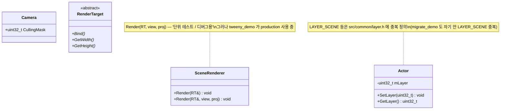
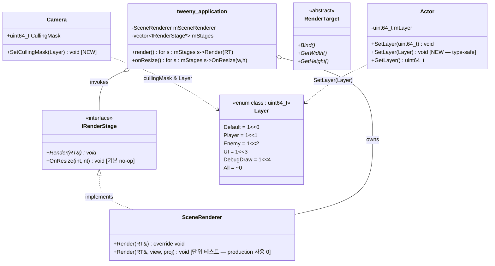

# SP5 — IRenderStage 추상 + Layer 시스템 정착 설계

> ⚠ 2026-05 시점 문서 (archival) — 코드 경로는 작성 당시 기준.

날짜: 2026-05-25
대상:
- NEW: `<src>/render/render_stage.h`, `<src>/render/render_stage.cpp`, `src/scene/layer.h`
- MOD: `<src>/render/scene_renderer.h`, `<src>/render/scene_renderer.cpp`, `src/render/CMakeLists.txt`
- MOD: `src/scene/actor.h` (`mLayer` / `SetLayer` / `GetLayer` 의 type — uint32 → uint64 + `Layer` overload)
- MOD: `src/scene/camera.h` (`CullingMask` type — uint32 → uint64 + `Layer` overload)
- MOD: `src/scene/CMakeLists.txt` (layer.h 가 헤더-only 라 install 명시)
- MOD: `<apps>/tweeny_demo/main.cpp` (SceneCamera Actor 도입 + IRenderStage 패턴 채택)
- DEL: `src/common/layer.h` (옛 `LAYER_SCENE` constexpr — DRY 통합)

---

## 0. 상위 컨텍스트

본 spec 은 [`OptimizeRenderTarget.md`](../../../doc/design/OptimizeRenderTarget.md) 의 세션 정리 (2026-05-24) 에서 식별된 *3 개 Future SP 후보* 중 **SP-RenderStage** 의 정착 spec 이다. SP 시리즈 번호 = **SP5** (SP1~SP4 누적 위에 쌓는 다섯 번째).

### SP 시리즈 위치

| SP | 정착 | 대상 |
|---|---|---|
| SP1 | ✅ | Shader/Program 리소스 통합 |
| SP2 | ✅ | Render Context (DeviceContext) |
| SP3 | ✅ | ECS-like Render System (Actor+Component) |
| SP4 | ✅ | Multipass PostProcessing (Camera depth chain) |
| **SP5 (본 spec)** | 🟡 진행 | **IRenderStage 추상 + Layer 시스템 정착** |
| SP-FramebufferResize | 🟡 후속 | `Framebuffer::Resize` + `EnsureSize` (별 spec) |
| SP-PerRendererProperties | 🟢 선택 | MeshRenderer.Properties per-instance (별 spec) |

### OptimizeRenderTarget.md 흡수 항목

| # | 주제 | 본 SP 처리 |
|---|---|---|
| ③ | UI/ImGui 통합 추상 — `IRenderStage` 가 정답 자리 | 정착 (추상 신설) |
| ④ | `Pass` vs `Stage` 명명 분리 — 같은 단어 두 레이어 회피 | 정착 (`IRenderStage` 도입 + `Pass::Kind` 그대로 유지) |
| ⑤(B) | tweeny_demo 옵션 A(Camera 우회) → B(Overlay Camera) 승격 | 정착 (SceneCamera Actor + Layer 명시) |

---

## 1. 동기

### 1.1 N×M 조합 폭발 회피

현재 추상:
- `RenderTarget` — *어디에* 그리나
- `???` — *무엇을* 그리나 (Scene / ImGui / Skybox / DebugDraw / PostFX)

만약 "무엇" 책임을 RenderTarget 에 박으면 `DefaultSceneRT`, `DefaultUiRT`, `FboSceneRT`, `FboUiRT`, `FboSkyboxRT`, ... — *N × M 조합* 마다 클래스 폭발. 직교 축으로 분리해야 *N + M*.

### 1.2 명명 충돌 — `Pass` 단어 두 레이어

기존 [src/material/pass.h](../../../src/material/pass.h) 의 `Pass::Kind` (Opaque/Transparent/Skybox) 는 *한 SceneRenderer 내부 Queue Layer*. 만약 새 추상을 `IRenderPass` 로 만들면 동일 단어 두 레이어 사용 → 미래 본인 혼동. → `IRenderStage` 로 *상위 레이어* 만 명명, 기존 `Pass::Kind` 는 그대로 유지.

### 1.3 tweeny_demo 의 임시 우회 부채

[<apps>/tweeny_demo/main.cpp](../../../apps/tweeny_demo/main.cpp) 가 현재 `mRenderSys.Render(*mDefaultTarget, I, I)` (identity view/proj) 사용. [<src>/render/scene_renderer.h:36](../../../src/render/scene_renderer.h#L36) 의 doxygen 이 *"단위 테스트 + 디버그용 (CameraComponent 우회)"* 라 명시했음에도 production 데모가 사용 중 — *model 미스매치 부채*.

### 1.4 미래 stage 통합의 seam (가장 실용적)

| 종류 | 현 패턴 | 통일 후 |
|---|---|---|
| Scene | `SceneRenderer.Render(RT)` (자동 Camera traversal) | `sceneStage->Render(RT)` |
| PostFX | `Camera.depth=1~N + targetFB chain` (migrate_demo) | `postFxStage->Render(RT)` (자기 chain 내부) |
| ImGui | *미정착* | `imGuiStage->Render(RT)` |
| Skybox | *미정착* | `skyboxStage->Render(RT)` |
| DebugDraw | *미정착* | `debugStage->Render(RT)` |

→ Application: `for (auto* s : mStages) s->Render(*mDefaultTarget);` *단일 패턴*.

### 1.5 Layer 어휘 *중복 정의* 정리

발견: `LAYER_SCENE` 어휘가 *두 곳* 에 중복:
- [src/common/layer.h:18](../../../src/common/layer.h#L18) — `SJH::LAYER_SCENE = 1u`
- [<apps>/migrate_demo/src/Scene.Warmup.h:57-58](../../../apps/migrate_demo/src/Scene.Warmup.h#L57-L58) — `LAYER_SCENE=1u`, `LAYER_POSTFX=2u`

DRY 위반. 본 SP 가 *진실의 원천 단일화* — `src/scene/layer.h` 의 `enum class Layer : uint64_t` 가 *단일 정의*. 옛 `src/common/layer.h` 삭제.

---

## 2. 핵심 결정

| # | 결정 | 근거 |
|---|---|---|
| **D-1** | 추상 명명 = `SJH::IRenderStage` (top-level, I prefix) | `SJH::FSM::IFsmState` (M2 P1.5 commit `16a6cdd`) 와 일관. *I prefix* 가 최근 도입된 컨벤션. `SceneRenderer` (top-level) 와 *수평 관계* 명확. |
| **D-2** | 인터페이스 = 2 메서드 (`Render(RT&)` 필수 + `OnResize(int,int)` no-op 기본) | YAGNI + 실용. SceneRenderer 는 OnResize 미사용 (Camera 가 매 frame `RT.GetSize` 동적 조회), 미래 PostFXStage/ImGuiStage 의 *자기 FBO sync* 위해 hook 필요. |
| **D-3** | Layer = `enum class Layer : uint64_t` in `src/scene/layer.h` | 사용자 명시 — `uint64`. FSM `StateMachine<TState, TOwner>` 의 enum class 비트 패턴과 일관. enum class 는 type-safe (raw uint 보다 오타 차단). |
| **D-4** | Layer 비트 자리 — Default/Player/Enemy/UI/DebugDraw (5 비트 예약) | 사용자 선택 (게임 도메인 — 옵션 C). 본 SP 가 *실제 사용* 하는 비트는 `Default` 1개 (tweeny SceneCamera 의 cullingMask 명시값). 나머지는 *비트 자리 예약*. |
| **D-5** | Actor / Camera type 변경 — `mLayer` / `CullingMask` uint32 → uint64 | Layer enum 이 uint64 면 storage 도 uint64. 옛 호출처 (`SetLayer(LAYER_SCENE)` — uint32 변수) 는 *자동 promotion* 으로 영향 0. 신규 코드는 `Layer` overload 사용. |
| **D-6** | Application 호출 패턴 — 직접 멤버 소유 + non-owning `std::vector<IRenderStage*>` | 라이프타임이 *직접 멤버로 명확* + 호출 순서가 *vector* 로 readable. 새 stage 추가 시 *멤버 1줄 + push_back 1줄*. |
| **D-7** | OnResize 위임 — Application 의 `onResize` 가 vector loop broadcast | `Render` loop 와 일관. 미래 stage 가 *자기 FBO* 보유 시 자동 sync. SceneRenderer 는 기본 no-op 그대로. |
| **D-8** | tweeny_demo 셋업 — 단일 SceneCamera (Layer::Default), Layer/cullingMask 어휘 시범 | tweeny 콘텐츠가 *2D-like 행/열 quad 패턴* 뿐 — UI Camera 추가는 *별 SP* (FPS counter 등 새 UI element 필요). 본 SP 는 *Camera + Layer 어휘 정통화* 만. |
| **D-9** | 옛 `src/common/layer.h` 삭제 + `src/scene/layer.h` 가 *단일 진실의 원천* | DRY. 동기 1.5 의 중복 정리. migrate_demo 의 자기 `Scene.Warmup.h` *자기 namespace 안 LAYER_SCENE* 은 *그대로 유지* (자기 격리 — 별 SP 마이그레이션). |

---

## 3. Before / After 클래스 다이어그램

### Before — 현재



### After — SP5 정착 후



---

## 4. 변경 사항 — file-by-file

### 4.1 NEW: `<src>/render/render_stage.h`

```cpp
#ifndef __SJH_IRENDER_STAGE_H__
#define __SJH_IRENDER_STAGE_H__

namespace SJH
{
    class RenderTarget;

    /// @brief 최상위 렌더 단계 추상 — Unity ScriptableRendererFeature / Unreal FSceneRenderer 정통.
    /// @details Application 의 render() 가 보유한 IRenderStage* vector 를 순서대로 호출.
    ///          각 stage 는 *직교 책임* — Scene / PostFX / ImGui / Skybox / DebugDraw 등.
    ///          `Material::Pass::Kind` 와 *다른 레이어* — Pass 는 한 stage *내부* Queue 분류.
    class IRenderStage
    {
    public:
        virtual ~IRenderStage() = default;

        /// @brief 매 프레임 — Application 이 backbuffer 를 주입.
        /// @details 구체가 자기 안에서 DeviceContext::BeginFrame(target) 호출 책임.
        virtual void Render(RenderTarget& target) = 0;

        /// @brief Window resize broadcast — 자기 internal FBO 등 sync 용. 기본 no-op.
        /// @note SceneRenderer 는 미사용 (Camera 가 매 프레임 target.GetSize 동적 조회).
        virtual void OnResize(int /*w*/, int /*h*/) {}
    };
}

#endif // __SJH_IRENDER_STAGE_H__
```

### 4.2 NEW: `<src>/render/render_stage.cpp`

```cpp
// vtable home TU — header-only abstract 의 ODR 보장 (다른 .cpp 들이
// vtable 의 외부 정의를 한 곳에서 받음). 본 파일은 *내용 없음* 이 정답.
#include "<render>/render_stage.h"
```

### 4.3 NEW: `src/scene/layer.h`

```cpp
#ifndef __SJH_SCENE_LAYER_H__
#define __SJH_SCENE_LAYER_H__

#include <cstdint>

namespace SJH::Scene
{
    /// @brief Actor 가시성 비트 약속 — Unity LayerMask 정통, FSM uint64 enum 컨벤션과 일관.
    /// @details Actor.SetLayer(Layer) 의 비트 + Camera.CullingMask 의 AND 검사.
    ///          uint64 → 64 비트 (Unity 32 보다 풍부). FSM StateMachine 의 enum class 비트 패턴과 동일.
    ///          새 비트 추가 시 본 파일에 *모든 비트 자리 검토 후* 진입.
    enum class Layer : uint64_t
    {
        Default   = 1ull << 0,   ///< 1  — 모든 Actor 기본
        Player    = 1ull << 1,   ///< 2  — 미래 게임 로직 (예약, 본 SP 미사용)
        Enemy     = 1ull << 2,   ///< 4  — 미래 게임 로직 (예약, 본 SP 미사용)
        UI        = 1ull << 3,   ///< 8  — 본 SP 가 자리 정의 (tweeny 는 미사용, 미래 UI Camera 진입자가 사용)
        DebugDraw = 1ull << 4,   ///< 16 — 미래 DebugDrawStage (예약)

        All       = ~0ull,       ///< Camera 기본 mask — 모든 layer 매치
    };

    /// @brief 비트 OR — 여러 layer 결합 (`Layer::Default | Layer::UI`).
    constexpr Layer operator|(Layer a, Layer b) noexcept
    {
        return static_cast<Layer>(static_cast<uint64_t>(a) | static_cast<uint64_t>(b));
    }

    /// @brief 비트 AND — cullingMask 검사 (`mask & actor.GetLayer()`).
    /// @return 결과 uint64 — 0 이면 매치 안 됨.
    constexpr uint64_t operator&(Layer a, Layer b) noexcept
    {
        return static_cast<uint64_t>(a) & static_cast<uint64_t>(b);
    }

    /// @brief Layer → uint64 명시 변환 (호환 호출용).
    constexpr uint64_t ToBits(Layer l) noexcept { return static_cast<uint64_t>(l); }
}

#endif // __SJH_SCENE_LAYER_H__
```

### 4.4 MOD: `<src>/render/scene_renderer.h`

```diff
+ #include "<render>/render_stage.h"

  namespace SJH
  {
-     class SceneRenderer
+     class SceneRenderer : public IRenderStage
      {
      public:
-         void Render(RenderTarget& defaultTarget);
+         void Render(RenderTarget& defaultTarget) override;
          void Render(RenderTarget& defaultTarget,
                      const vmath::mat4& viewMat, const vmath::mat4& projMat);
          // OnResize 는 IRenderStage 의 기본 no-op 사용 — override 안 함.
```

### 4.5 MOD: `src/scene/actor.h`

```diff
+ #include "scene/layer.h"

  class Actor {
      ...
-     void     SetLayer(uint32_t layer) { mLayer = layer; }
-     uint32_t GetLayer() const         { return mLayer; }
+     void     SetLayer(uint64_t layer)  { mLayer = layer; }
+     void     SetLayer(SJH::Scene::Layer l) { mLayer = SJH::Scene::ToBits(l); } // type-safe overload
+     uint64_t GetLayer() const          { return mLayer; }

  private:
-     uint32_t    mLayer   = 1u;
+     uint64_t    mLayer   = SJH::Scene::ToBits(SJH::Scene::Layer::Default);
  };
```

### 4.6 MOD: `src/scene/camera.h`

```diff
- uint32_t CullingMask = ~0u;
+ uint64_t CullingMask = SJH::Scene::ToBits(SJH::Scene::Layer::All);
+ void SetCullingMask(SJH::Scene::Layer l) { CullingMask = SJH::Scene::ToBits(l); }
+ void SetCullingMask(uint64_t mask)        { CullingMask = mask; }
```

### 4.7 MOD: `<src>/render/scene_renderer.cpp:236`

```diff
- const bool visibleToCamera = (cullingMask & actor.GetLayer()) != 0u;
+ const bool visibleToCamera = (cullingMask & actor.GetLayer()) != 0ull;
```

(uint64 비교에 맞춰 0ull literal — 의미 동일.)

### 4.8 MOD: `src/render/CMakeLists.txt`

```diff
  add_library(sjhopengl_render STATIC
      device_context.cpp
      render_target.cpp
+     render_stage.cpp           # vtable home TU — IRenderStage virtual class
      mesh_pass_processor.cpp
      pipeline_state_setter.cpp
      property_block_setter.cpp
      scene_renderer.cpp
  )
```

### 4.9 MOD: `<apps>/tweeny_demo/main.cpp`

```diff
  class tweeny_application : public sb7::application
  {
      ...
      SJH::SceneRenderer mRenderSys;
+     std::vector<SJH::IRenderStage*> mStages;   // 호출 순서, non-owning
      ...

      void startup() override {
          // ... 기존 Material/Mesh/EasingRow 셋업 그대로 ...

+         // === SceneCamera Actor 도입 (D-8) ===
+         int fbW=0, fbH=0; glfwGetFramebufferSize(window, &fbW, &fbH);
+         const float aspect = static_cast<float>(fbW) / static_cast<float>(fbH);
+         auto camActor = SJH::Scene::CreateCameraActor("SceneCamera",
+             /*fov*/45.0f, aspect, /*near*/0.1f, /*far*/100.0f);
+         camActor->GetTransform().Translate = vmath::vec3(0.0f, 0.0f, 5.0f);
+         auto* cam = camActor->GetComponent<SJH::Scene::Camera>();
+         cam->SetCullingMask(SJH::Scene::Layer::Default);   // 명시 — UI 비트 제외
+         cam->SetTargetFramebuffer(nullptr);                // backbuffer
+         dir.Root().AddChild(std::move(camActor));
+         dir.SetActiveCamera(cam);

+         // 행/열 EasingRow Actor 들도 명시: spriteActor->SetLayer(Layer::Default)
+         //  (기본값이지만 *명시* 가 layer 어휘 시범)

+         mStages.push_back(&mRenderSys);
          dir.Enter();
      }

      void render(double currentTime) override {
          // ... dt + 리소스 sync 기존 그대로 ...
-         mRenderSys.Render(*mDefaultTarget, I, I);   // ← 우회 overload 제거
+         for (auto* s : mStages) s->Render(*mDefaultTarget);   // ← IRenderStage 패턴
      }

+     void onResize(int w, int h) override {
+         sb7::application::onResize(w, h);
+         mDefaultTarget = std::make_unique<SJH::DefaultRenderTarget>(w, h);
+         for (auto* s : mStages) s->OnResize(w, h);   // ← broadcast
+     }
  };
```

### 4.10 DEL: `src/common/layer.h`

옛 `constexpr uint32_t LAYER_SCENE = 1u;` 제거. `src/common/CMakeLists.txt` 의 install 목록에서도 제외 (만약 명시 노출이라면).

호환 영향 (implementation plan first task 로 검증 위탁):
- migrate_demo 의 [<apps>/migrate_demo/main.cpp:140](../../../apps/migrate_demo/main.cpp#L140) `SetLayer(SJH::LAYER_SCENE)` 의 *참조 출처* 가 두 후보 중 어느 것인지 implementation plan 의 *first task* 가 grep 으로 확정:
  - 후보 A: 옛 [src/common/layer.h:18](../../../src/common/layer.h#L18) `SJH::LAYER_SCENE` (engine-level)
  - 후보 B: [<apps>/migrate_demo/src/Scene.Warmup.h:57](../../../apps/migrate_demo/src/Scene.Warmup.h#L57) 의 *자기 namespace 안* LAYER_SCENE (demo-local)
- 후보 A 면 본 SP 의 `src/common/layer.h` 삭제 시 *migrate_demo 빌드 깨짐* — *임시 호환 alias* (`namespace SJH { constexpr uint32_t LAYER_SCENE = ToBits(Scene::Layer::Default); }`) 또는 *migrate_demo include 수정* 둘 중 선택.
- 후보 B 면 src/common/layer.h 삭제 *영향 0* — 가장 깨끗.

---

## 5. ddd Rules 정합성

14 ddd Rules 중 본 SP 가 *영향 큰* 4개 평가:

| Rule | 본 SP 정합 |
|---|---|
| **Aggregate Root** (객체 그래프의 단일 진입점) | ✅ Application (`tweeny_application`) 이 `IRenderStage*` 벡터의 *root* — 호출 순서 관리. Stage 가 자기 *내부 상태 (FBO/Material)* 의 root. |
| **Polymorphism over conditionals** | ✅ `IRenderStage::Render` 가 *다형* — Application 의 `if (stage_type == SCENE) ... else if (stage_type == UI) ...` 같은 *조건 분기 회피*. |
| **Explicit Side Effects** | ✅ `Stage::Render` 가 GL 호출 (명시 side effect — `DeviceContext::BeginFrame` 위임). `Layer::operator|` / `operator&` / `ToBits` 는 *pure constexpr*. |
| **Single Source of Truth** | ✅ Layer 비트 자리가 `src/scene/layer.h` 1 파일로 *단일화* (DRY). 옛 `src/common/layer.h` 삭제. |

---

## 6. 검증 방법

### 6.1 빌드 검증

```bash
cmake --preset ninja                                              # configure (Default)
cmake --build --preset ninja --target tweeny_demo                 # 본 SP 주 대상
cmake --build --preset ninja --target _MyApp_                     # 탑다운 슈터 — Layer 호환 검증 (모든 Actor 기본 layer)
cmake --build --preset ninja --target migrate_demo                # SP4 PostFX chain — Layer/cullingMask uint64 호환
```

기대: 3 데모 모두 빌드 PASS. compiler warning 0 (uint32→uint64 promotion 은 silent).

### 6.2 시각 회귀 검증

```bash
cd build_ninja/apps/tweeny_demo && ./tweeny_demo
cd build_ninja/apps/migrate_demo && ./migrate_demo
cd build_ninja/apps/_MyApp_ && ./_MyApp_
```

기대:
- tweeny_demo — 행/열 quad 패턴 *시각 동일* (Camera 정통화는 내부 model 변경, 결과 픽셀 동일).
- migrate_demo — Scene + PostFX 5-chain *시각 동일* (LAYER_SCENE 옛 정의 → 자기 namespace 안 LAYER_SCENE 사용으로 호환).
- _MyApp_ — 탑다운 슈터 *시각 동일* (Layer 변경 영향 없음 — 모든 Actor 기본 layer).

### 6.3 단위 테스트 (선택)

본 SP 의 *순수 함수* 만 단위 테스트 후보:
- `Layer::operator|` / `operator&` / `ToBits` — constexpr pure (static_assert 충분, .cpp 불요)
- `IRenderStage` 자체는 *virtual interface* — 테스트 대상 0 (구체가 테스트 책임)

`<test>/test_layer.cpp` 신설 — *옵션* (사용자 명시 요청 시에만, no_auto_tests 정책).

---

## 7. 명시적 비스코프

본 SP 가 *하지 않는* 것:

1. **SceneRenderer 의 우회 overload (`Render(RT, view, proj)`) deprecation** — tweeny 마이그레이션 후 *production 사용 0* 이지만 *지원 유지*. 미래 별 SP.
2. **PostFXStage 클래스화** — migrate_demo 의 *Camera depth chain* 을 *명시 PostFXStage 객체* 로. 본 SP 외.
3. **ImGuiStage / SkyboxStage / DebugDrawStage 신설** — 각각 *별 mini-spec 필요* (셰이더, 텍스처, backend 통합).
4. **migrate_demo 의 자기 LAYER_SCENE/LAYER_POSTFX 마이그레이션** — 자기 namespace 안 격리 + DRY 통합 비용 *큰 변경*. 별 SP.
5. **Layer enum 비트 자리 변경** — Player/Enemy/UI/DebugDraw 비트 자리는 *본 SP 가 정착*. 추가 layer 추가 시 본 파일 검토 후 *새 SP 가 진입* (충돌 검증).
6. **Camera::SetTargetFramebuffer(RenderTarget*)** 의 다형화 — 현재 `Framebuffer*` 만 받음. RenderTarget* 일반화는 SP-FramebufferResize 거리.
7. **Stage 가 자기 RenderTarget 보유 패턴** — 본 SP 의 SceneRenderer 는 외부 RT 주입만. 자기 FBO 보유 (PostFXStage 같은) 는 별 SP.

---

## 8. 후속 SP / 모듈이 받을 seam

본 SP 정착 후 *수정 없이 위에 쌓을 수 있는* 표면:

| 후속 SP | 활용 seam |
|---|---|
| **SP-PostFXStage** | `IRenderStage` 상속만으로 `class PostFXStage : public IRenderStage` 가능. migrate_demo 의 Camera depth chain 을 *PostFXStage 의 자기 내부* 로 흡수. |
| **SP-ImGuiStage** | `class ImGuiStage : public IRenderStage` + `Render` 안에서 `ImGui_ImplOpenGL3_RenderDrawData` 호출. `OnResize` 가 viewport 갱신. |
| **SP-SkyboxStage** | `class SkyboxStage : public IRenderStage` + cubemap + `.xyww` trick. SceneRenderer 와 *동시 mStages* 등록 (Skybox 가 SceneRenderer 후 호출). |
| **SP-DebugDrawStage** | `Layer::DebugDraw` 비트 *이미 예약됨* — DebugDraw Camera + DebugDraw Actor (와이어프레임/축/text) 가 *자기 mask* 로 격리. |
| **SP-FramebufferResize** | `IRenderStage::OnResize` 가 *이미 hook 정의* — Framebuffer::Resize 가 정착되면 stage 가 자기 FBO sync 자동. |
| **UI Layer 활용 데모** | `Layer::UI` 비트 *이미 예약됨* — UI Camera Actor + UI Quad Actor 가 *자기 mask* 로 격리. 본 SP 외 데모 작성 시 *추가 SP 없이* 진입. |

---

## 9. 결정 로그 (요약 표)

| ID | 결정 | 선택 | 대안 (기각) |
|---|---|---|---|
| D-1 | 추상 명명 | `SJH::IRenderStage` (top-level + I prefix) | `SJH::RenderStage` (no prefix) / `SJH::Stage::I` (namespace) |
| D-2 | 인터페이스 크기 | 2 메서드 (Render + OnResize) | 1 (Render only) / 3 (+ Name) |
| D-3 | Layer 표현 | `enum class : uint64_t` + operator overload | namespace + constexpr uint32 (옛 패턴) |
| D-4 | Layer 비트 자리 | 게임 도메인 5 비트 (Default/Player/Enemy/UI/DebugDraw) | 미니멀 2 비트 (Default/UI) / Unity 정통 (TransparentFX/IgnoreRaycast/Water/UI) |
| D-5 | Actor/Camera type | uint32 → uint64 (Big Bang) | uint32 유지 + 호환 헬퍼 |
| D-6 | Application 호출 패턴 | 직접 멤버 + non-owning vector | unique_ptr vector / 명시 각각 호출 |
| D-7 | OnResize 위임 | Application broadcast (vector loop) | 명시 호출 / lazy recreate (콜백 없음) |
| D-8 | tweeny 셋업 | 단일 SceneCamera + Layer/mask 어휘 시범 | 2 Camera (Scene + UI) + FPS counter 추가 |
| D-9 | 옛 layer.h 처리 | 삭제 (DRY 단일화) | deprecated alias 유지 |

---

## 10. 후속 작업

### 10.1 본 SP 의 구현 진입

본 spec 정착 후 `superpowers:writing-plans` 스킬로 *Implementation Plan* 작성 → `doc/superpowers/plans/2026-05-25-sp5-render-stage.md`.

Plan 단계의 task 분해 예상 (writing-plans 가 정밀화):
1. `src/scene/layer.h` 신설 + `src/scene/CMakeLists.txt` install
2. `src/scene/actor.h` + `src/scene/camera.h` type 변경 (uint32 → uint64) + Layer overload — 빌드 PASS 검증
3. `src/render/render_stage.{h,cpp}` 신설 + `CMakeLists.txt` 등록
4. `<src>/render/scene_renderer.h` 의 `: public IRenderStage` 상속 + override 키워드
5. `<src>/render/scene_renderer.cpp` 의 cullingMask 비교 0u → 0ull
6. `<apps>/tweeny_demo/main.cpp` SceneCamera Actor + mStages 패턴 마이그레이션
7. `src/common/layer.h` 삭제 (homestead 검증)
8. 4 데모 빌드 PASS + 시각 회귀 검증

### 10.2 별 SP 후속

[OptimizeRenderTarget.md §4](../../../doc/design/OptimizeRenderTarget.md#L261) 의 *3 개 SP 후보* 중:
- **SP-FramebufferResize** (위 §8 의 OnResize hook 활용) — 우선순위 🟡
- **SP-PerRendererProperties** (본 SP 와 무관, 선택) — 우선순위 🟢
- **SP-PostFXStage** (위 §8 의 seam 활용) — 우선순위 🔥 (본 SP 의 자연 다음)
