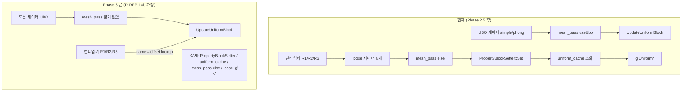

# Dynamic Properties 폐기 결정 설계 (D-DPP-1)

> **상태:** 🟡 결정 spec — 옵션표 + 추천까지. **D-DPP-1 (a/b/c) 은 사용자 pick 필수 (에이전트 단정 금지).**
> **작성:** 2026-06-21 · **위치:** Slang Phase 3 의 선행 결정 (코드 진입 전 필수).
> ⚠ **gitignore 로컬** (`doc/` 는 .gitignore — 다른 머신에 안 따라감).

---

## 0. 상위 컨텍스트 (decomposed sub-project 내 위치)

Slang 마이그레이션 Phase 3 = **`PropertyBlockSetter`(src/render) + `uniform_cache`(src/program) 모듈 삭제** 가 끝점.
선행 핸드오프: [`doc/handoffs/2026-06-21/2026-06-21-slang-phase3-propertyblocksetter-removal-handoff.md`](../../handoffs/2026-06-21-slang-phase3-propertyblocksetter-removal-handoff.md).

```
Phase 2 (simple) ✅ → Phase 2.5 (phong) ✅
   → D-DPP-3 셰이더 재고 검증 ✅ (2026-06-21, 코드 0)
   → ▶ D-DPP-1 (본 spec) — Dynamic Properties 폐기 방식 결정  ← 지금
   → 잔여 셰이더 UBO화 (셰이더당 1슬라이스)
   → fog viewPos → FrameBlock 이전 + LightUboUploader loose 경로 삭제
   → D-DPP-4 모듈 제거 별 PR (전 셰이더 UBO화 완료 직후)
```

본 spec 은 **위 체인에서 "잔여 셰이더 UBO화" 가 막혀 있는 단 하나의 blocker** 를 푼다.

---

## 1. 동기 (왜 지금, 문제 진단)

### 1.1 끝점이 요구하는 것
모든 셰이더가 UBO ABI 면 loose `glUniform*` 경로(= `PropertyBlockSetter` + `uniform_cache`)가 GL 2.x 잔재라 삭제 가능. 3엔진 정통(Unity URP legacy property 폐기 / Unreal `BEGIN_UNIFORM_BUFFER_STRUCT` / Godot `uniform_set_create`).

### 1.2 진짜 blocker — 런타임 KEY 3사이트 (D-DPP-3 에서 grounded 확인)
동적키 사이트의 절대다수는 **컴파일타임 상수 문자열 키** 라 해당 `.slang` UBO 멤버로 기계적 이전 가능. 단 **런타임에 uniform 이름이 결정되는 3 사이트** 만 UBO 의 컴파일타임 layout 과 직접 충돌:

| # | 사이트 | 코드 | 키의 성격 |
|---|---|---|---|
| R1 | [`HpGrayscalePostFX.cpp:47`](../../../apps/_MyApp_/src/Playable/HpGrayscalePostFX.cpp#L47) | `mat->Properties.Floats[mUniformName] = ratio` | `mUniformName`/`mPassName` 둘 다 `std::string` *인스턴스 멤버* ([HpGrayscalePostFX.h:59-60](../../../apps/_MyApp_/src/Playable/HpGrayscalePostFX.h#L59)) |
| R2 | [`PostFXTweenPlayable.cpp:43`](../../../apps/_MyApp_/src/Playable/PostFXTweenPlayable.cpp#L43) | `mat->Properties.Floats[mUniformName] = value` | 트윈 대상 uniform 이름이 런타임 구성 |
| R3 | [`render_pipeline.cpp:115`](../../../src/render_bootstrap/render_pipeline.cpp#L115) | `for ([name,value] : def.InitFloats) Properties.Floats[name] = value` | PostFX 체인 정의(데이터주도, D-6)의 키 |

→ 이 3곳은 "어떤 uniform 을 구동할지" 를 **런타임 문자열** 로 정한다. **D-DPP-1 = 이 패턴을 무엇으로 대체할지 결정.**

### 1.3 동적키 backing API
3 사이트 모두 [`material_uniforms.cpp:23-62`](../../../src/material/material_uniforms.cpp#L23) `SJH::Uniforms::Set*` 7종(= `mat.Properties.<Map>[name]=v`) 또는 그 map 직접 대입으로 backing. D-DPP-1 의 pick 이 이 API 의 운명도 결정한다.

### 1.4 이미 손에 있는 인프라 (추천 근거)
- **refl.json std140 offset 메타** (D-DPP-3 검증): `phong.refl.json` 이 `FrameBlock{uView @0 size64, uProj @64 size64}` / `DrawBlock{uModel @0 size64}` 를 정확히 제공.
- **`Program::UpdateUniformBlock(name, data, bytes, offset)`** ([program.h:145-148](../../../src/program/program.h#L145)) — `offset` 파라미터 doc 에 *"std140 기준 호출자가 사전 계산, refl.json 인용 가능"* 이라 이미 명시. **런타임 name→offset lookup 이 그대로 들어갈 자리.**

---

## 2. 핵심 결정

### D-DPP-1 ★ Dynamic Properties (런타임 KEY 3사이트) 폐기 방식 — **✅ (b) 확정 (2026-06-21)**

| 옵션 | 형태 | 산출 | 부작용 | 장점 | 단점 |
|---|---|---|---|---|---|
| **(a) UBO 멤버 강제** | 런타임키 폐기 → 모든 uniform 을 `.slang` UBO 멤버로 선언, game 코드는 컴파일타임 멤버 접근 (`mat->Block().uX = …`) | `Properties` map + `Set*` API 전부 삭제 | PostFX 시스템(HpGrayscale/Tween/체인) 의 *런타임 구성* 패턴을 컴파일타임으로 재설계 강제 | ABI 단일, `material_uniforms` 통째 제거, 정통 끝점 | **D-7 PostFXRegistry 회로까지 흔듦** — 데이터주도 체인(`def.InitFloats`)이 컴파일타임 멤버와 모순. 재설계 범위 큼 |
| **(b) refl.json offset 런타임 lookup** ⭐ | UBO 멤버를 refl.json 의 컴파일타임 `{offset,size}` 테이블로 매핑. 런타임키 사이트는 `name→offset` lookup 후 `UpdateUniformBlock(block, &v, 4, offset)` | name→offset 테이블 빌드 인프라 1개 추가 (refl.json 파싱) | `Properties` map 은 *PostFX 한정* 으로 잔존하거나 offset 테이블로 대체 | **런타임키 패턴 보존** — R1/R2/R3 거의 무변경, D-7 회로 무영향. 인프라가 이미 절반 있음(§1.4) | refl.json 파싱 + 테이블 빌드 코드 추가. UBO `offset` 송신 1경로 더 |
| **(c) 하이브리드** | 컴파일타임 키만 UBO 화, 런타임 토글만 별도 경로(SSBO 또는 push 시뮬) 유지 | 두 경로 공존 | `PropertyBlockSetter` 일부 잔존 가능 | 점진, 위험 분산 | **끝점(모듈 제거) 미달성** — loose 경로가 안 죽으면 Phase 3 목표 자체가 무산 |

**💭 추천 = (b).** 근거:
1. **인프라가 손에 있다** — refl.json `{offset,size}` 가 정확(D-DPP-3 검증) + `UpdateUniformBlock` 의 `offset` 파라미터가 *이 용도로 이미 설계*([program.h:142](../../../src/program/program.h#L142) doc).
2. **D-7 PostFXRegistry 회로 무영향** — R1/R2/R3 의 런타임 string 키 패턴이 그대로 살아남아 PostFX 시스템 재설계 불필요. (a) 는 데이터주도 체인을 컴파일타임으로 못 바꿔 막힘.
3. **끝점 달성** — loose `glUniform*`/`uniform_cache` 가 완전히 죽어 D-DPP-4 모듈 제거 가능. (c) 는 끝점 미달.

대안: (a) 는 *PostFX 시스템을 어차피 재설계할 의향이 있다면* 가장 깨끗한 끝점. 단 범위가 D-7 까지 번져 Phase 3 가 비대해짐.

> **이 결정 전까지 §4 의 "런타임키 경로" 변경은 착수 불가.** 컴파일타임 키 셰이더 UBO화(§4.1)는 D-DPP-1 무관하게 선행 가능.

### D-DPP-2 LightBlock UBO scope (carry, 재논의 최소)
D-DPP-3 §7 관찰: **loose lit 셰이더 0개 + viewPos 보유 = `fog.fs` 1개뿐.** → LightBlock scope 확장은 거의 무의미. `fog.fs` 의 viewPos 를 **FrameBlock UBO 멤버로 이전** 하면 LightBlock 은 phong 전용 유지 + LightUboUploader loose 경로 통째 삭제. **결정: scope 확장 안 함, fog viewPos 만 FrameBlock 흡수.**

### D-DPP-4 모듈 제거 시점 (locked)
`program.h` API 변경(`mUniformCache`/`GetLocation`/`GetType`/`GetUniformCache` 제거)이 광범위 consumer 영향 → **전 셰이더 UBO화 완료 직후 단독 PR.** 부분 제거 금지.

---

## 3. Before / After



---

## 4. 변경 — 파일별 (D-DPP-1 pick 종속)

### 4.1 컴파일타임 키 셰이더 UBO화 (D-DPP-1 무관 — 선행 가능)
§D-DPP-3 표의 비-UBO 셰이더를 phong 패턴(`.slang` + 필요시 `import phong_lighting` + mesh_pass useUbo)으로 이전. 셰이더당 1슬라이스 + 육안 게이트. 우선순위: passthrough/simple_texture → transparent/healthbar/billboard_atlas → matrix_skybox → postfx(fog 포함). 새 `.slang` 배선은 사용자 toolchain 파일 [`shaders_slang/CMakeLists.txt`](../../../apps/_MyApp_/shaders_slang/CMakeLists.txt) 에 *추가만*.

### 4.2 런타임키 경로 (D-DPP-1 pick 후 확정)
- **(b) 채택 시:** 신규 `name→{block,offset,size}` 테이블 빌더(refl.json 파싱). R1/R2/R3 가 `Properties.Floats[name]=v` → 테이블 lookup 후 `prog->UpdateUniformBlock(block, &v, sizeof(v), offset)`. `material_uniforms` 의 동적키 Set* 는 PostFX 한정 잔존 또는 테이블 경로로 흡수.
- **(a) 채택 시:** PostFX 시스템(HpGrayscale/Tween/render_pipeline 체인) 재설계 → 컴파일타임 멤버 접근. `material_uniforms.{h,cpp}` + `Properties` map 삭제. (별도 spec 필요 — 범위 큼.)

### 4.3 D-DPP-4 모듈 제거 (최종 PR)
- `src/render/property_block_setter.{h,cpp}` 삭제 + [`mesh_pass_processor.cpp`](../../../src/render/mesh_pass_processor.cpp) else 분기(:191-196) + ScreenQuad(:126) 정리.
- `src/program/uniform_cache.{h,cpp}` 삭제 + `program.h` `mUniformCache`/`GetLocation`/`GetType`/`GetUniformCache` 제거.
- `src/render/light_ubo_uploader.cpp` loose 경로(`LooseDispatch` :140-186, `BindTo` sentinel :290-291) 삭제 — fog viewPos 이전 후.
- `src/diagnostics/uniform_diagnostics.h` cache 기반 진단 정리.

---

## 5. 설계 원칙 정합성 평가
- **단일 ABI (SRP/일관성):** 모든 uniform 송신이 UBO 1경로 → loose/UBO 이중 분기 제거. (b) 도 송신은 UBO `UpdateUniformBlock` 단일.
- **변동성≠다형성:** 런타임키는 "데이터의 변동" 이지 "타입의 다형성" 이 아님 → (b) 의 offset 테이블(데이터 lookup)이 정합. (a) 는 데이터 변동을 코드 구조로 승격해 과설계 위험.
- **소유권:** offset 테이블은 Program/refl 산출 1곳 소유 (중복 schema 금지).

---

## 6. 검증 방법
- 빌드: `export PATH="$HOME/slang/bin:$PATH"` → `cmake --preset ninja` → `cmake --build --preset ninja --target _MyApp_`.
- ⚠ **셰이더 링크는 빌드 GREEN/glslangValidator 로 안 잡힘** — 앱 기동 **런타임 GL 로그 + 육안 필수** ([[slang-varying-name-mismatch-macos]]). "투명/사라짐" = program=null 1순위.
- 셰이더 UBO화마다 R1(=R1 사용자만 확정) 육안 게이트.
- **테스트 자동작성 금지** ([[no_auto_tests]]).

---

## 7. Out of scope (명시)
- 사용자 병렬 toolchain 파일 (`scripts/slang_compile.py` / `Slang.cmake` / `shaders_slang/CMakeLists.txt` 구조) — *추가만*, 구조 변경 금지.
- D-7 PostFXRegistry 재설계 — (a) 채택 시에만, 별도 spec.
- `extern/sb7code`, `cmake/CXXStandard.cmake` 불가침.

---

## 8. 다음 단계가 무수정 활용할 seam
- `Program::UpdateUniformBlock(name, data, bytes, offset)` ([program.h:145](../../../src/program/program.h#L145)) — (b) 의 런타임 송신 진입점, 무변경.
- refl.json `{offset,size}` ([build_ninja/.../generated/*.refl.json](../../../build_ninja/apps/_MyApp_/shaders_slang/generated/)) — offset 테이블 소스.
- mesh_pass `useUbo = HasUniformBlocks()` 분기 ([mesh_pass_processor.cpp:155](../../../src/render/mesh_pass_processor.cpp#L155)) — 셰이더 UBO화 시 자동 useUbo.

---

## 9. Decision Log

| ID | 결정 | 선택 | 근거 |
|----|------|------|------|
| D-DPP-1 | Dynamic Properties(런타임키 3사이트) 폐기 방식 | **✅ (b) refl.json offset lookup (사용자 확정 2026-06-21)** | §2 옵션표. (b)=인프라 보유(UpdateUniformBlock offset)+D-7 무영향+끝점 달성. (a)=PostFX 재설계 위험, (c)=끝점 미달 |
| D-DPP-2 | LightBlock scope | scope 확장 안 함, fog viewPos → FrameBlock | loose lit 0 + viewPos=fog 1개 (D-DPP-3) |
| D-DPP-3 | 셰이더 재고 매트릭스 | 확정 | 2026-06-21 grounded 검증 통과 |
| D-DPP-4 | 모듈 제거 시점 | 전 셰이더 UBO화 완료 직후 단독 PR | program.h API 광범위 consumer |

---

## 10. 후속 작업
1. **D-DPP-1 사용자 pick** ← 본 spec 의 게이트.
2. (pick 후) §4.1 컴파일타임 키 셰이더 UBO화 — plan 분해 (`plans/2026-XX-XX-...`).
3. §4.2 런타임키 경로 ((b) 면 offset 테이블 빌더 / (a) 면 PostFX 재설계 spec).
4. fog viewPos → FrameBlock + loose 경로 삭제.
5. D-DPP-4 모듈 제거 별 PR.
