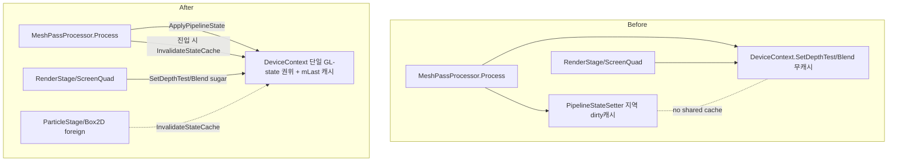

# Render GL-State 권위 통합 설계 (DeviceContext 단일 권위)

> ⚠ 2026-06 시점 문서 (archival) — 코드 경로는 작성 당시 기준.

> **상태:** 🟢 방향 확정 (2026-06-21 사용자 결정 2건). 다음 = 구현 plan 분해.
> **위치:** Slang Phase 3 *선행* — 사용자 결정 "render-state 통합 먼저".
> ⚠ **gitignore 로컬** (`doc/` 는 .gitignore).

---

## 0. 상위 컨텍스트

원래 트랙은 Slang Phase 3 (PropertyBlockSetter + uniform_cache 제거 = uniform *값* 경로). 그 분석 중 `src/render/` 의 **GL pipeline-state(depth/blend/stencil/cull) 책임이 3곳으로 분산**된 더 근본적인 스멜을 발견. 사용자 결정으로 **이 통합을 Slang Phase 3 보다 먼저** 수행한다.

```
▶ [본 spec] render GL-state 권위 통합   ← 지금 (Slang 무관)
   → Slang Phase 3 (D-DPP-1 → 셰이더 UBO화 → PropertyBlockSetter/uniform_cache 제거)
```

**범위 분리 (중요):** 본 리팩토링은 GL *pipeline-state* 만 다룬다. `PropertyBlockSetter`/`uniform_cache`(uniform *값* 경로)는 비-UBO 셰이더가 아직 의존하므로 **건드리지 않는다** — Slang UBO화 완료 후 D-DPP-4 에서 제거.

---

## 1. 동기 — GL state 3분산 (실측)

GL depth/blend/stencil/cull 을 만지는 곳이 조율 없이 셋:

| 경로 | 위치 | 캐시 | 용도 |
|---|---|---|---|
| `PipelineStateSetter::Set` | [pipeline_state_setter.cpp](../../../src/render/pipeline_state_setter.cpp) | dirty(`mLast`/`mInitialized`) | WorldMesh 배치 draw |
| `DeviceContext::SetDepthTest/SetBlend` | [device_context.cpp:58-82](../../../src/render/device_context.cpp#L58) | **없음** | ScreenQuad([mesh_pass_processor.cpp:119](../../../src/render/mesh_pass_processor.cpp#L119)) + RenderStage 6사이트([render_stage.impls.cpp:105,224,251,257](../../../src/render/render_stage/render_stage.impls.cpp#L105)) 일회성 전환 |
| `DeviceContext::BeginFrame` | [device_context.cpp:94](../../../src/render/device_context.cpp#L94) | 없음 | 패스 시작 depth/blend 초기화 |

→ 두 GL-state writer 가 공유 캐시 없이 같은 state 를 만져 **latent desync**. `DeviceContext` 가 뒤에서 depth/blend 를 바꿔도 `PipelineStateSetter` 의 dirty-cache 는 모름.

### 1.1 현재 안전했던 이유 (보존해야 할 불변식)
`stateSetter` 는 `Process` **지역 변수** ([mesh_pass_processor.cpp:101](../../../src/render/mesh_pass_processor.cpp#L101)) → 매 Process 새 캐시 + 끝에 `RestoreDefaults`(`mInitialized=false`). 캐시 수명 = "Process 1회" 라 Effekseer/Box2D 의 cross-frame GL 오염(memory `vao_ebo_thirdparty_corruption`)이 다음 Process 캐시를 오염시키지 못함. **통합 후에도 이 "consumer 진입 시 무효화" 불변식을 유지해야 한다.**

---

## 2. 핵심 결정 (사용자 확정)

| ID | 결정 | 선택 | 근거 |
|----|------|------|------|
| D-RS-1 | GL pipeline-state 권위 | **DeviceContext 단일 권위** | Unreal `FRHICommandList::SetGraphicsPipelineState` 정통. GL state 는 전역 → 싱글톤 1권위가 정합. 3분산 desync 해소 |
| D-RS-2 | 서드파티 GL 오염 대응 | **무효화 규율** (`InvalidateStateCache`) | Effekseer/Box2D 가 끼어드는 GL-era 현실. consumer 진입 시 무효화 = 기존 per-Process RestoreDefaults 와 동치, `ebo->Bind()` 재핀과 동일 결 |
| D-RS-3 | `Pass::PipelineState` 거주 | **material/ 유지** | = Unity `RenderStateBlock` data 객체. 이미 정통. render→material PUBLIC 승격(사이클 없음 — pass.h 는 GL 헤더만 의존) |
| D-RS-4 | 범위 | **GL state 만** (PropertyBlockSetter 제외) | uniform 값 경로는 Slang 종속 → Phase 3 |

### 2.1 엔진 정통 매핑 (context7 인용)
- **Unreal:** `SetGraphicsPipelineStateCheckApply(RHICmdList, Initializer, StencilRef)` — pipeline state 적용이 command list *메서드*. `SubmitMeshDrawCommands → RHI commands on RHICommandList`.
- **Unity SRP:** `ScriptableRenderContext`/`CommandBuffer` 가 state+draw 적용, `RenderStateBlock`(data)을 `DrawRenderers` 에 전달 — applier 는 context 내부.
- **Godot RD:** state 가 `render_pipeline_create(…rasterization/stencil/color_blend_state)` 로 불변 pipeline RID 에 baked, `draw_list_bind_render_pipeline` 로 바인딩.
→ 셋 다 "pipeline state 적용 = 커맨드 컨텍스트 소관, 독립 setter 아님". `DeviceContext` 통합이 정통.

### 2.2 엔진 가중 — Unity SRP data-driven 채택 (2026-06-21 사용자 확정)

캐시/권위 *위치* 는 Unreal·Unity 무관하게 **DeviceContext** (우리 구조가 강제 — `SceneRenderer`/`ScreenQuadStage`/`ParticleStage` 가 공유하는 유일 지점 = `DeviceContext::Get()` 싱글톤. = Unity `ScriptableRenderContext` 가 모든 스테이지의 공유 제출 지점인 것과 대응).

**단, Unity 가중 → render state 는 항상 *데이터*(RenderStateBlock)로 draw 에 흐르고 sticky 명령형 토글은 없다** (context7: `RenderStateBlock`→`DrawRenderers`; Unity context 엔 `SetDepthTest` 류 메서드 부재 — depth/blend 는 ShaderLab/Material Pass 또는 RenderStateBlock).

**D-RS-5: 일회성 토글(`SetDepthTest`/`SetBlend`) 의 운명 — 확정 (ii) 완전 제거**

| 옵션 | 형태 | 장 | 단 |
|---|---|---|---|
| (i) 캐시 인지 sugar 유지 | `SetDepthTest/SetBlend` 보존+`mLast` 갱신 | 일회성 호출 간결 | 명령형 escape hatch 잔존 (Unity 비정통) |
| **(ii) 완전 제거** ⭐ | 모든 호출처가 `ApplyPipelineState(Pass::PipelineState)` 로 — ScreenQuad/blit 은 자기 Material Pass 에서 state 도출 | **모든 GL state 가 단일 data-driven 경로, desync 여지 0**. Unity 정통 + SP-RenderFacadeBoundary("state 는 데이터로만") 일치 | blit 용 `Pass::PipelineState`(depth off / replace·alpha) 데이터 정의 1곳 추가 |

**확정 = (ii).** 명령형 escape hatch 제거 → state writer 가 진정 단일. ScreenQuad blit 의 "depth off" 도 `rc.SetDepthTest(false)` 가 아니라 ScreenQuad Material 의 Pass → `Pass::PipelineState` → `ApplyPipelineState` 로 WorldMesh 와 동일 경로.

---

## 3. Before / After



---

## 4. 변경 — 파일별

### 4.1 `src/render/device_context.{h,cpp}` (권위 흡수, data-driven)
- **추가** `void ApplyPipelineState(const Pass::PipelineState& want)` — `pipeline_state_setter.cpp` 의 Stencil4/Depth3/Cull1/Blend2 dirty-apply 로직 이식 (anonymous-ns 헬퍼 → .cpp 내부).
- **추가** `void InvalidateStateCache()` — `mStateInitialized=false` (다음 Apply 가 전체 강제). foreign-stage 경계 + Process 진입에서 호출.
- **추가** (private) `Pass::PipelineState mLast; bool mStateInitialized=false;` — 흡수된 dirty 캐시.
- **D-RS-5(ii) — `SetDepthTest`/`SetBlend` *제거*** (명령형 escape hatch 폐기). 모든 호출처가 `ApplyPipelineState(Pass::PipelineState)` 로 마이그레이션.
- **`BeginFrame`**: `InvalidateStateCache()` 후 표준 opaque `Pass::PipelineState` 를 `ApplyPipelineState` 로 적용 (구 `RestoreDefaults`/하드코딩 `SetDepthTest(true)+SetBlend(true)` 대체). depth/blend clear 자체(glClear)는 유지.
- 헤더 include: `material/pass.h` 추가 (`Pass::PipelineState` 완전형 필요 — 중첩 타입이라 전방선언 불가).

### 4.2 `src/render/pipeline_state_setter.{h,cpp}` (제거)
- 로직 전량 `device_context.cpp` 로 이식 후 **삭제**. `src/render/CMakeLists.txt:4` 에서 제거.

### 4.3 `src/render/mesh_pass_processor.{h,cpp}`
- `PipelineStateSetter stateSetter;` 지역 변수 제거. WorldMesh: `stateSetter.Set(passState)` → `rc.ApplyPipelineState(passState)`.
- Process 진입부에 `rc.InvalidateStateCache()` (per-Process 캐시 무효화 불변식 보존). 끝의 `RestoreDefaults` 불요 (다음 consumer 진입 무효화로 충분).
- **ScreenQuad 경로 (state-as-data):** [mesh_pass_processor.cpp:119-120,134](../../../src/render/mesh_pass_processor.cpp#L119) 의 `rc.SetDepthTest(false)/SetBlend(false)/SetDepthTest(true)` → `effectiveMat` 의 Pass 에서 `Pass::DefaultPipelineStateOf(effectiveMat->GetPass())` 도출 후 `rc.ApplyPipelineState(...)`. blit 용 Pass kind(depth off / blend replace) 가 없으면 §4.7 에서 정의.
- `#include "<render>/pipeline_state_setter.h"` 제거.

### 4.4 `<src>/render/render_stage/render_stage.impls.cpp` (state-as-data)
- `rc.SetDepthTest/SetBlend` 6사이트 ([105,224,251,257](../../../src/render/render_stage/render_stage.impls.cpp#L105)) → `rc.ApplyPipelineState(Pass::PipelineState)` 로 교체. world 패스 시작(105-106)은 opaque 기본, ScreenQuadStage blit(224-258)은 blit Pass state(첫 소스 replace / 2+ alpha).
- `SceneRenderer::RenderWithCamera` / `ScreenQuadStage::Render` 진입에 `rc.InvalidateStateCache()` (foreign stage 후 재진입 대비) — BeginFrame 이 이미 호출하면 중복 불요.

### 4.7 blit/Screen `Pass::PipelineState` 데이터 정의 (신규 데이터, D-RS-5(ii) 비용)
- ScreenQuad blit 의 상태(depth test off, depth write off, cull off, blend: 첫 소스 replace=off / 2+ alpha=on)를 `Pass` kind 또는 상수 `Pass::PipelineState` 로 정의 ([material/pass.h](../../../src/material/pass.h) `DefaultPipelineStateOf` 에 Screen/Blit 분기). 현재 하드코딩 토글을 *데이터로 승격* — Unity ShaderLab state 정통. blit 의 "2+ 소스 alpha" 처럼 동적인 부분은 호출처가 PipelineState 값 1필드만 조정.

### 4.5 `apps/_MyApp_/src/VFX/ParticleStage.cpp` (foreign 경계)
- Effekseer 렌더 *후* `DeviceContext::Get().InvalidateStateCache()` 호출 (다음 GL-state consumer 가 stale 캐시 안 보도록). Box2D debug draw 경로도 동일.

### 4.6 `src/render/CMakeLists.txt`
- `pipeline_state_setter.cpp` 줄 제거.
- `SJH::material` PRIVATE → **PUBLIC** 승격 (device_context.h 공개 헤더가 material/pass.h 노출). 사이클 없음 확인됨(§2 D-RS-3).

---

## 5. 설계 원칙 정합성
- **SRP/단일 권위:** GL state writer 2 → 1. 캐시 1개. desync 구조적 불가.
- **SP-RenderFacadeBoundary 강화:** D-RS-5(ii) 로 명령형 `SetDepthTest/SetBlend` 가 사라지고 state 가 `Pass::PipelineState` *데이터* 로만 흐름 → "DeviceContext 는 데이터로만 state 받음" 정신과 더 일치. 그 OCP 논거(uniform 타입 확장성=열린 집합)는 pipeline state(닫힌 유한 집합)엔 부적용 — uniform 은 여전히 DeviceContext 밖(`SJH::Uniforms`) 유지.
- **state writer 진정 단일:** 명령형 escape hatch 0 → 모든 GL state 변경이 `ApplyPipelineState` 1경로 + 단일 `mLast` 캐시. ScreenQuad·WorldMesh·blit·frame-start 가 동일 경로.
- **불변식 보존:** "consumer 진입 시 무효화" (per-Process 지역 캐시 → 싱글톤+명시 무효화) 동치.

---

## 6. 검증 방법
- 빌드: `cmake --preset ninja && cmake --build --preset ninja --target _MyApp_`. GREEN.
- ⚠ **런타임 육안 필수** — GL state 회귀는 빌드로 안 잡힘. 체크: ①반투명 벽 알파 합성 ②skybox depth(LEQUAL)/cull(FRONT) ③stencil(있으면) ④Effekseer 파티클 *후* 다음 프레임 WorldMesh 의 depth/blend 정상(=무효화 규율 검증) ⑤ScreenQuad PostFX blit.
- **테스트 자동작성 금지** ([[no_auto_tests]]).

---

## 7. 범위 — Phase A 비대상 vs 게이트 걸린 하류 타겟

### 7.1 게이트 걸린 하류 타겟 (조용히 미루지 않음 — Plan Phase C 로 명시 추적)
아래는 **본 통합(Phase A)에서는 손대지 않되, Plan 에 명시적 진행 대상으로 등록** 하고 **선행 단계 완료가 보장된 후에만** 착수한다 (gate 위반 금지):
- **`PropertyBlockSetter`/`uniform_cache` 제거** — ⛔ GATE = *전 셰이더 UBO화 완료* (loose glUniform* 경로 소비자 0). 비-UBO 셰이더가 남아 있으면 착수 불가.
- **`light_ubo_uploader` loose 경로 제거** — ⛔ GATE = *fog viewPos → FrameBlock 이전 완료* (loose 의 마지막 consumer 소멸).
- 정본 진행 절차/결정 = Slang Phase 3 (D-DPP-1 spec + D-DPP-4). Plan §Phase C 가 gate 조건을 acceptance 로 박는다.

### 7.2 진짜 out of scope (이 작업 줄기 전체에서 비대상)
- `actor_factory`/`model_spawner` (씬 구성, 무관).
- PSO 해시 캐싱(Unreal/Godot 식 불변 파이프라인 객체) — GL 3.3 엔 과설계, 비목표.
- `Pass::PipelineState` 의 material→render 이주 (D-RS-3 = material 유지 확정).

---

## 8. 다음 단계가 무수정 활용할 seam
- `MeshPassProcessor::Process(DeviceContext&, view, proj)` 시그니처 무변경 — 내부 위임만 교체.
- `Pass::PipelineState` / `Pass::DefaultPipelineStateOf` ([material/pass.h](../../../src/material/pass.h)) 무변경 (RenderStateBlock data).
- Slang Phase 3 의 mesh_pass useUbo 분기는 본 리팩토링과 독립 (state 와 uniform 직교).

---

## 9. Decision Log
| ID | 결정 | 선택 | 근거 |
|----|------|------|------|
| D-RS-1 | GL state 권위 | DeviceContext 단일 | Unreal RHICmdList, desync 해소 |
| D-RS-2 | 서드파티 오염 | InvalidateStateCache 규율 | per-Process 무효화 동치 |
| D-RS-3 | Pass::PipelineState 거주 | material/ 유지 (render→material PUBLIC) | RenderStateBlock data, 사이클 없음 |
| D-RS-4 | Phase A 범위 | GL state 만 | PropertyBlockSetter/uniform_cache/loose 는 Slang 종속 → **Phase C 로 게이트 추적**(§7.1, 폐기 아님) |
| D-RS-5 | 일회성 토글(`SetDepthTest`/`SetBlend`) | **(ii) 완전 제거 — state-as-data** | Unity SRP 가중 (RenderStateBlock=데이터, sticky 토글 부재). 모든 state 가 `ApplyPipelineState(Pass::PipelineState)` 단일 경로, desync 여지 0. blit 도 Material Pass 에서 도출 |

---

## 10. 후속 작업 — 게이트 걸린 전체 arc (Plan 이 명시 추적)

```
Phase A  render GL-state 통합 (본 spec)           ─ gate Aᴳ: 빌드 GREEN + 육안 5체크
   │  선행 보장
   ▼
Phase B  Slang Phase 3 (별 spec)                   ─ gate Bᴳ: D-DPP-1 구현 + 전 셰이더 UBO화 + 육안
   │   = D-DPP-1 결정 → 셰이더 UBO화 → fog viewPos→FrameBlock
   │  선행 보장
   ▼
Phase C  하류 제거 (§7.1 — 명시 타겟, gate 강제)
   C1  PropertyBlockSetter 제거      ⛔ requires Bᴳ (loose 소비자 0)
   C2  uniform_cache 제거 + program.h API 정리  ⛔ requires C1
   C3  light_ubo_uploader loose 제거 ⛔ requires fog UBO화(⊂Bᴳ)
```

**게이트 불변식:** 각 Phase 는 *직전 Phase 의 gate 통과(빌드 GREEN + 육안)* 가 보장된 후에만 착수. Phase C 는 Phase B 의 "전 셰이더 UBO화 완료" 없이는 **착수 금지** (loose 경로 소비자가 남아 회귀). Plan §Phase C Task 들의 acceptance 첫 줄 = "precondition: Bᴳ 통과 확인".

1. 본 spec → 구현 plan 분해 (`doc/superpowers/plans/2026-06-21-render-state-consolidation.md`) — Phase A~C 전체, gate acceptance 명시.
2. Phase A 구현 + 육안 게이트 (Aᴳ).
3. Phase B = Slang Phase 3 — D-DPP-1 spec ([2026-06-21-dynamic-properties-deprecation-design.md](./2026-06-21-dynamic-properties-deprecation-design.md)) pick → UBO화 (Bᴳ).
4. Phase C = §7.1 하류 제거 (gate 강제).
